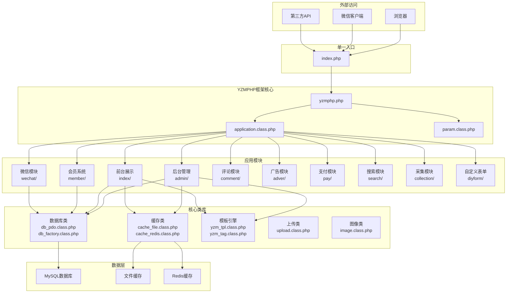
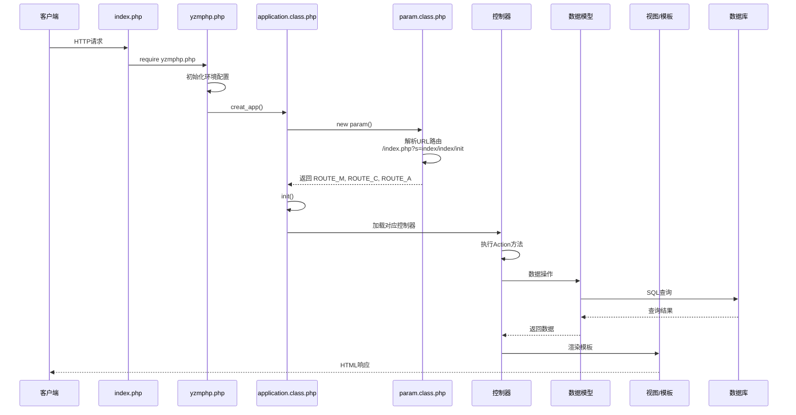
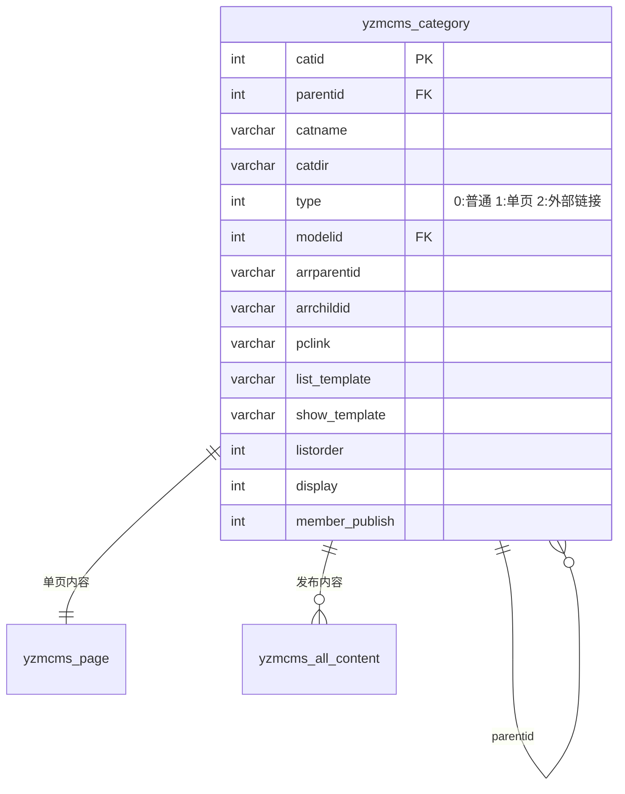
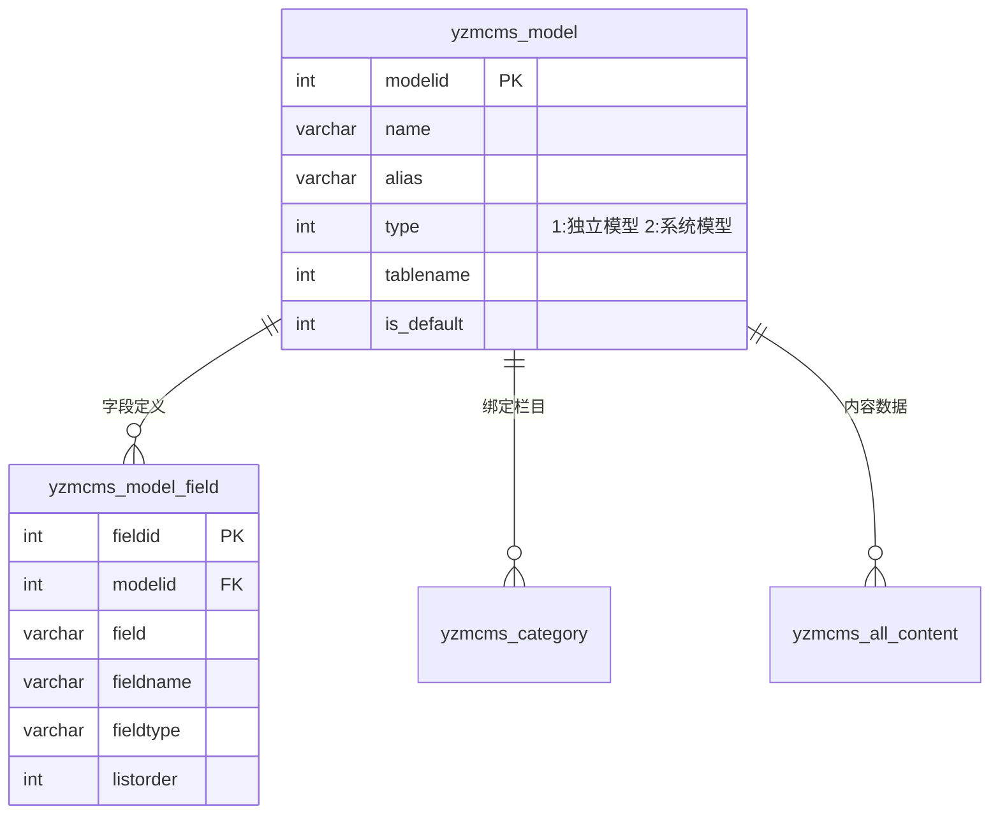
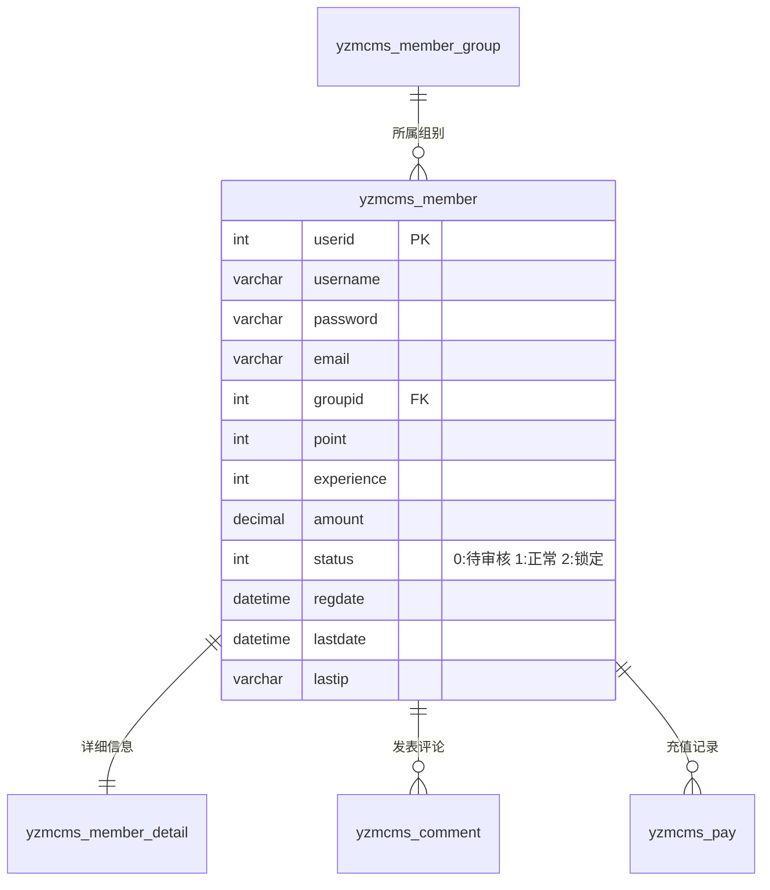
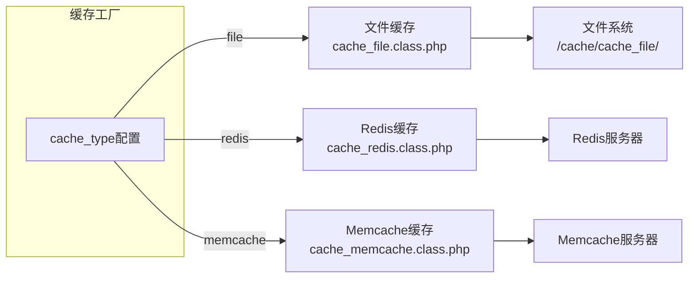

# YzmCMS 系统架构文档

## 概述

YzmCMS V7.5 是一款基于 YZMPHP 框架开发的轻量级开源内容管理系统，采用 PHP+Mysql 架构，并使用 MVC 框架式开发。该系统具有体积轻巧、功能强大、源码简洁、系统安全等特点，适用于构建企业网站、新闻网站、个人博客、门户网站、行业网站、电子商城等各种类型的网站。系统支持 SEO 优化、多语言、模板引擎、会员系统、评论系统、标签系统、关键词链接、站点地图、百度推送等功能，并提供了方便快捷的二次开发体系。

## 技术栈

**语言与运行时**
- PHP 5.2+（推荐 PHP7+，支持 PHP8）
- MySQL 5.0+（支持 PDO、Mysqli、Mysql 三种数据库扩展）

**框架**
- YZMPHP 2.9（自主研发的轻量级 PHP 框架）

**数据存储**
- MySQL（主数据库）
- 文件缓存（File）
- Redis（可选缓存）
- Memcache（可选缓存）

**模板引擎**
- YzmCMS 自定义模板引擎（类似 Smarty）

**基础设施**
- 支持 Nginx、Apache、IIS 等主流 Web 服务器
- 支持 Linux、Windows、MacOSX、Solaris 等各种平台

## 项目结构

```
/workspace/
├── index.php                    # 单一入口文件
├── yzmphp/                      # YZMPHP框架核心
│   ├── yzmphp.php              # 框架入口文件
│   ├── core/                    # 框架核心组件
│   │   ├── class/              # 核心类文件
│   │   │   ├── application.class.php    # 应用创建类
│   │   │   ├── param.class.php          # 参数处理类
│   │   │   ├── db_pdo.class.php         # PDO数据库类
│   │   │   ├── db_mysqli.class.php      # Mysqli数据库类
│   │   │   ├── db_mysql.class.php       # Mysql数据库类
│   │   │   ├── db_factory.class.php     # 数据库工厂类
│   │   │   ├── cache_file.class.php     # 文件缓存类
│   │   │   ├── cache_redis.class.php    # Redis缓存类
│   │   │   ├── cache_memcache.class.php # Memcache缓存类
│   │   │   ├── cache_factory.class.php  # 缓存工厂类
│   │   │   ├── yzm_tpl.class.php       # 模板引擎类
│   │   │   ├── yzm_tag.class.php        # 标签解析类
│   │   │   ├── page.class.php           # 分页类
│   │   │   ├── form.class.php           # 表单类
│   │   │   ├── upload.class.php          # 上传类
│   │   │   ├── image.class.php           # 图像处理类
│   │   │   ├── tree.class.php           # 树形结构类
│   │   │   ├── smtp.class.php           # 邮件发送类
│   │   │   ├── code.class.php           # 验证码类
│   │   │   ├── debug.class.php          # 调试类
│   │   │   ├── databack.class.php       # 数据备份类
│   │   │   └── collection.class.php     # 采集类
│   │   ├── function/             # 框架函数库
│   │   │   └── global.func.php   # 全局函数
│   │   └── tpl/                  # 模板文件
│   └── language/                 # 语言包
├── application/                   # 应用程序目录
│   ├── admin/                   # 后台管理模块
│   │   ├── controller/          # 控制器
│   │   │   ├── index.class.php    # 首页控制器
│   │   │   ├── common.class.php   # 公共控制器
│   │   │   ├── content.class.php  # 内容管理控制器
│   │   │   ├── category.class.php # 栏目管理控制器
│   │   │   ├── module.class.php   # 模型管理控制器
│   │   │   ├── model_field.class.php  # 字段管理控制器
│   │   │   ├── admin_manage.class.php # 管理员控制器
│   │   │   ├── role.class.php     # 角色权限控制器
│   │   │   ├── member.class.php   # 会员管理控制器
│   │   │   ├── menu.class.php     # 菜单管理控制器
│   │   │   ├── tag.class.php      # 标签控制器
│   │   │   ├── urlrule.class.php  # URL规则控制器
│   │   │   ├── system_manage.class.php # 系统设置控制器
│   │   │   ├── database.class.php # 数据库管理控制器
│   │   │   ├── sitemodel.class.php # 站点模型控制器
│   │   │   └── ...               # 其他控制器
│   │   ├── model/               # 数据模型
│   │   │   ├── admin.class.php
│   │   │   └── content_model.class.php
│   │   ├── view/                # 视图模板
│   │   ├── common/              # 公共资源
│   │   │   ├── lib/             # 公共类库
│   │   │   ├── function/        # 公共函数
│   │   │   └── language/        # 语言包
│   │   └── ...
│   ├── index/                   # 前台站点模块
│   │   ├── controller/
│   │   │   └── index.class.php  # 首页、列表页、内容页控制器
│   │   ├── model/
│   │   │   └── content.class.php # 内容模型
│   │   ├── view/                # 前台模板
│   │   │   └── default/         # 默认主题
│   │   └── common/              # 公共资源
│   ├── member/                  # 会员模块
│   │   ├── controller/
│   │   │   ├── member.class.php  # 会员管理（后台）
│   │   │   ├── member_pay.class.php  # 支付相关
│   │   │   ├── member_content.class.php  # 会员内容
│   │   │   └── ...
│   │   └── ...
│   ├── wechat/                  # 微信模块
│   │   ├── controller/
│   │   │   ├── menu.class.php      # 微信菜单
│   │   │   ├── message.class.php   # 消息管理
│   │   │   ├── reply.class.php     # 自动回复
│   │   │   ├── material.class.php  # 素材管理
│   │   │   └── ...
│   │   └── model/
│   │       └── wechat.class.php
│   ├── comment/                  # 评论模块
│   ├── adver/                   # 广告模块
│   ├── link/                    # 友情链接模块
│   ├── guestbook/              # 留言板模块
│   ├── pay/                    # 支付模块
│   ├── search/                 # 搜索模块
│   ├── collection/             # 采集模块
│   ├── diyform/                # 自定义表单模块
│   ├── attachment/             # 附件模块
│   ├── banner/                 # Banner模块
│   ├── api/                    # API模块
│   ├── mobile/                 # 移动端模块
│   └── install/                # 安装程序
├── common/                     # 全局公共资源
│   └── config/
│       └── config.php         # 主配置文件
├── cache/                     # 缓存目录
├── uploads/                    # 上传文件目录
└── README.md                   # 项目说明
```

**入口点**
- `index.php` - 应用单一入口，定义 URL 模式和调试开关
- `yzmphp/yzmphp.php` - 框架入口，加载核心类和配置

## 子系统

### 1. 框架核心子系统（YZMPHP）

**目的**: 提供应用程序运行的基础框架，包括类自动加载、路由分发、数据库操作、缓存处理、模板渲染等核心功能

**位置**: `yzmphp/core/class/`

**关键文件**:
- `application.class.php` - 应用创建和请求分发
- `param.class.php` - URL 参数解析和路由处理
- `db_pdo.class.php` - PDO 数据库操作封装
- `yzm_tpl.class.php` - 模板引擎

**依赖**: 底层 PHP 扩展（PDO、Session 等）

**被依赖**: 所有上层应用模块

### 2. 内容管理子系统（CMS Core）

**目的**: 实现网站内容的创建、编辑、发布、删除等全生命周期管理，支持多模型、栏目分级、模板绑定

**位置**: `application/admin/controller/content.class.php`, `application/index/controller/index.class.php`

**关键文件**:
- `content.class.php` - 内容管理（后台）
- `category.class.php` - 栏目管理
- `index.class.php` - 前台内容展示
- `content_model.class.php` - 内容模型处理

**依赖**: YZMPHP 框架、数据库、缓存系统

**被依赖**: 前台展示、会员系统、评论系统

### 3. 会员管理系统（Member）

**目的**: 提供用户注册、登录、个人资料管理、积分系统、会员组权限管理等功能

**位置**: `application/member/`

**关键文件**:
- `member.class.php` - 会员管理（后台）
- `member_group.class.php` - 会员组管理
- `member_pay.class.php` - 支付管理
- `order.class.php` - 订单管理

**依赖**: 内容管理、支付系统

**被依赖**: 前台展示、评论系统

### 4. 微信集成子系统（WeChat）

**目的**: 与微信公众平台集成，提供菜单管理、消息处理、素材管理、用户管理等功能

**位置**: `application/wechat/`

**关键文件**:
- `menu.class.php` - 微信菜单管理
- `message.class.php` - 消息管理
- `reply.class.php` - 自动回复配置
- `material.class.php` - 素材管理
- `wechat.class.php` - 微信 API 封装

**依赖**: YZMPHP 框架

**被依赖**: 外部微信 API

### 5. 模板引擎子系统（Template）

**目的**: 提供灵活的模板解析机制，支持模板缓存、标签解析、模板继承

**位置**: `yzmphp/core/class/yzm_tpl.class.php`, `yzmphp/core/class/yzm_tag.class.php`

**关键文件**:
- `yzm_tpl.class.php` - 模板主类
- `yzm_tag.class.php` - 标签解析器
- `form.class.php` - 表单生成

**依赖**: 框架核心

**被依赖**: 所有需要页面输出的模块

### 6. 权限与认证子系统（Auth）

**目的**: 提供后台管理员认证、角色权限控制、CSRF 防护等功能

**位置**: `application/admin/controller/common.class.php`, `application/admin/controller/role.class.php`

**关键文件**:
- `common.class.php` - 管理员基础控制器（权限验证）
- `admin_manage.class.php` - 管理员管理
- `role.class.php` - 角色权限管理

**依赖**: YZMPHP 框架

**被依赖**: 后台所有功能模块

## 系统架构图



## 请求流程图



## 数据库设计核心概念

### 栏目结构（Category）



### 内容模型（Model & Content）



### 会员系统（Member）



## URL 路由模式

YzmCMS 支持 5 种 URL 模式，通过 `index.php` 中的 `URL_MODEL` 定义：

| 模式 | 值 | URL 示例 | 说明 |
|------|-----|---------|------|
| MCA兼容模式 | 0 | `?m=index&c=index&a=init` | 默认兼容模式 |
| S简化模式 | 1 | `?s=index/index/init` | 简化参数 |
| REWRITE模式 | 2 | `/index/index/init.html` | 需要服务器配置 |
| SEO模式 | 3 | `/index/init.html` | 默认推荐模式 |
| PATHINFO模式 | 4 | `/index.php/index/init` | 兼容性PATHINFO |

## 缓存机制



## 安全机制

1. **CSRF 防护**: 使用 `yzm_csrf_token` 令牌验证
2. **XSS 防护**: `new_html_special_chars()` 函数处理输入
3. **SQL 注入防护**: 使用 PDO 预编译和 `addslashes` 转义
4. **密码加密**: `password()` 函数使用 hash 算法
5. **权限验证**: 后台控制器继承 `common` 类进行权限检查
6. **模板安全**: 模板引擎自动过滤危险标签

---

# AI员工系统架构

## 概述

AI员工系统是一个多租户 SaaS 平台，提供 11 个 AI 智能体，覆盖从热点追踪、内容创作、数字人直播、私域获客到电销转化的全链路自动化营销场景。

## 技术栈

**语言与运行时**
- Python 3.11+

**Web 框架**
- FastAPI 0.115+
- Uvicorn (ASGI 服务器)

**数据存储**
- PostgreSQL (主数据库，生产环境)
- SQLite (测试环境)
- Redis (缓存、会话、队列)

**ORM 与迁移**
- SQLAlchemy 2.0 (async)
- Alembic (数据库迁移)

**认证与安全**
- python-jose (JWT)
- passlib + bcrypt (密码哈希)

**AI 引擎** (后续集成)
- DeepSeek-V3 / GPT-4o (大语言模型)
- BGE (向量化)
- CosyVoice / OpenVoice (TTS)
- Wav2Lip / SadTalker (数字人)

**部署**
- Docker + Kubernetes
- APISIX (API 网关)

## 项目结构

```
ai-employee-backend/
├── src/ai_employee/
│   ├── main.py              # FastAPI 应用入口
│   ├── config.py            # Pydantic Settings 配置
│   ├── dependencies.py      # FastAPI 依赖注入
│   ├── api/
│   │   ├── router.py        # 路由聚合
│   │   └── v1/endpoints/    # v1 版本端点
│   │       ├── auth.py      # 认证端点
│   │       ├── tenants.py   # 租户管理端点
│   │       └── users.py     # 用户管理端点
│   ├── core/
│   │   ├── security.py      # JWT 安全、密码哈希
│   │   └── exceptions.py    # 自定义 HTTP 异常
│   ├── models/
│   │   ├── base.py          # 基础模型 (tenant_id, 软删除)
│   │   ├── tenant.py        # 租户模型
│   │   ├── user.py          # 用户模型
│   │   └── audit_log.py     # 审计日志模型
│   ├── schemas/
│   │   ├── base.py          # 统一响应格式 ApiResponse[T]
│   │   ├── tenant.py        # 租户 Schema
│   │   └── user.py          # 用户 Schema
│   ├── services/
│   │   ├── tenant_service.py
│   │   └── user_service.py
│   ├── db/
│   │   ├── session.py       # 异步 SQLAlchemy 会话
│   │   └── redis.py         # Redis 连接池
│   └── utils/
├── tests/
├── alembic/                 # 数据库迁移
└── pyproject.toml
```

## 分层架构

```
┌──────────────────────────────────────────────────┐
│                    API 层                         │
│  FastAPI Endpoints (auth, tenants, users...)     │
└──────────────────┬───────────────────────────────┘
                   │
┌──────────────────┴───────────────────────────────┐
│                  业务服务层                        │
│  TenantService, UserService, ...                 │
└──────────────────┬───────────────────────────────┘
                   │
┌──────────────────┴───────────────────────────────┐
│                  数据访问层                        │
│  SQLAlchemy Models + AsyncSession                │
└──────────────────┬───────────────────────────────┘
                   │
┌──────────────────┴───────────────────────────────┐
│                  基础设施层                        │
│  PostgreSQL · Redis · Milvus · MinIO             │
└──────────────────────────────────────────────────┘
```

## 数据模型

### 核心表

| 表名 | 描述 | 关键字段 |
|------|------|---------|
| tenants | 租户 | id, name, status, quota, usage |
| users | 用户 | id, tenant_id, email, password_hash, role |
| audit_logs | 审计日志 | id, tenant_id, user_id, action, details |

### 共享字段

所有业务表继承 BaseModel：
- `id` (UUID, 主键)
- `tenant_id` (UUID, 租户隔离)
- `created_at` (自动填充)
- `updated_at` (自动更新)
- `is_deleted` (软删除)

## 认证流程

```
用户登录 → 验证邮箱/密码 → 生成 JWT (access + refresh) → 返回 Token
                                                ↓
后续请求 → 携带 Authorization: Bearer <token> → 验证 Token → 获取用户信息
```

## 统一响应格式

```json
{
  "code": 0,
  "message": "success",
  "data": {...},
  "request_id": "req_abc123",
  "timestamp": 1704067200000
}
```

## 错误码

| 错误码 | 说明 |
|--------|------|
| 0 | 成功 |
| 400 | 请求参数错误 |
| 401 | 未认证/Token 无效 |
| 403 | 权限不足 |
| 404 | 资源不存在 |
| 429 | 请求频率超限 |
| 1001 | 配额不足 |

## 安全机制

1. **JWT 认证**: 基于 python-jose 的 Token 认证
2. **密码加密**: passlib + bcrypt 哈希
3. **软删除**: is_deleted 字段，逻辑删除
4. **操作审计**: audit_logs 记录所有关键操作
5. **CORS**: FastAPI CORS 中间件
6. **输入验证**: Pydantic 严格类型验证