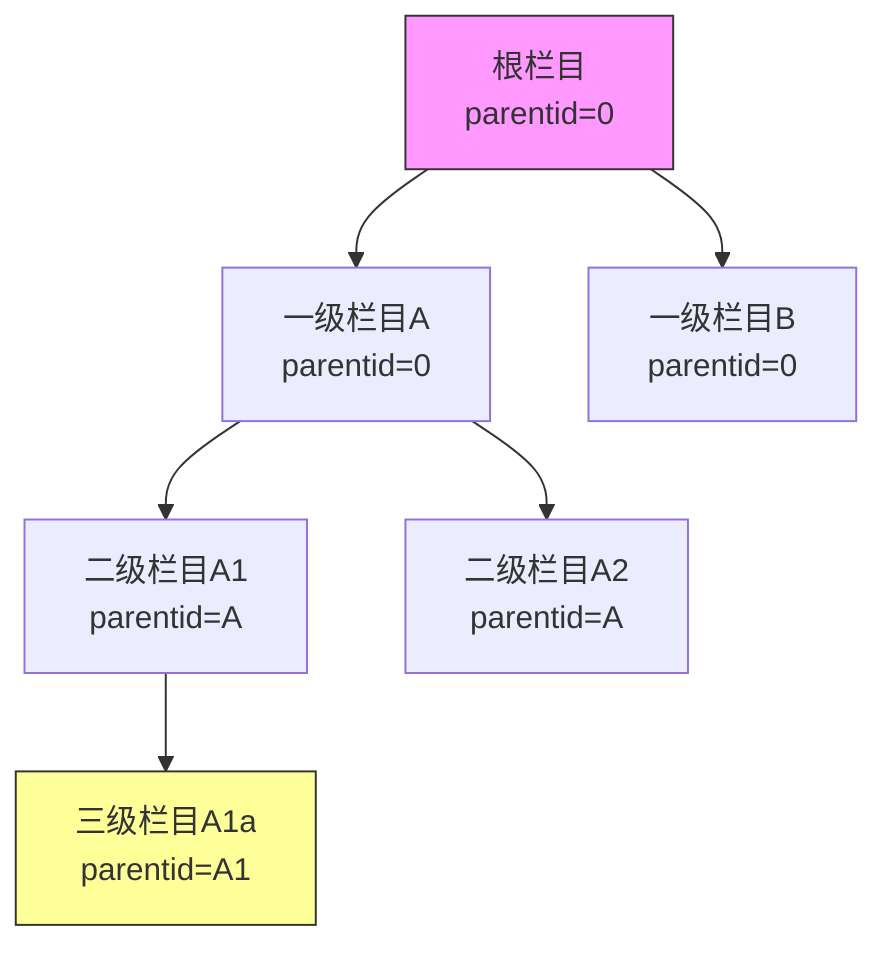
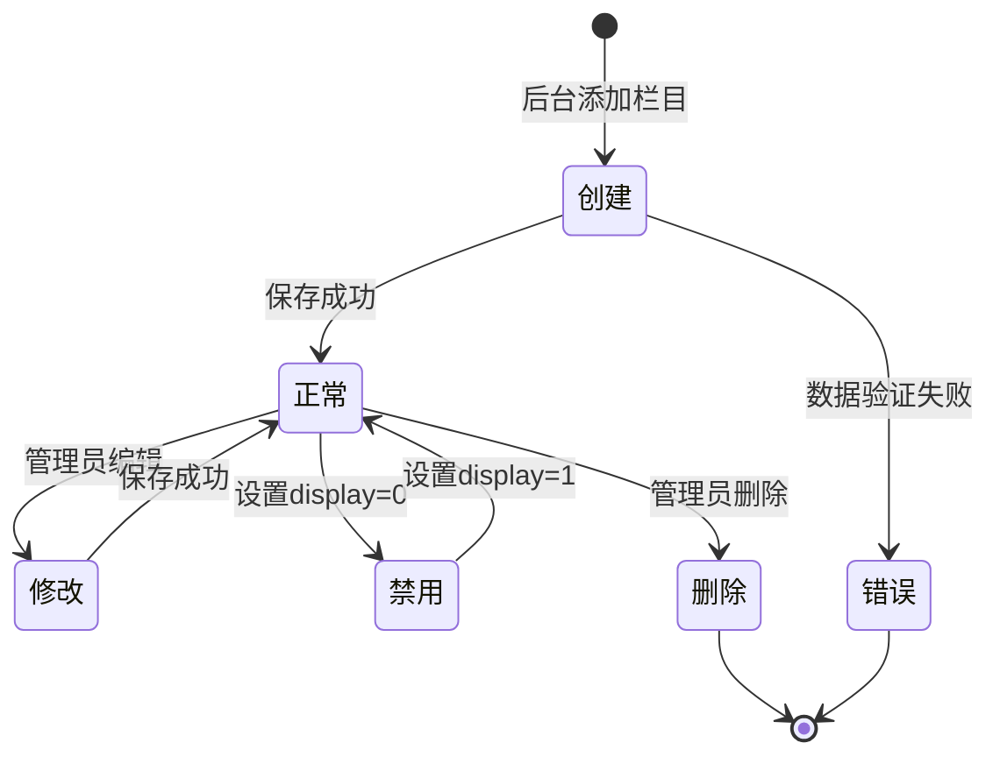
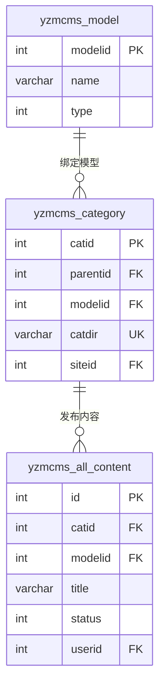

# 栏目（Category）

栏目是 YzmCMS 内容管理系统中组织内容的基础结构，类似于树形目录，用于对网站内容进行分类管理。

## 什么是栏目？

栏目（Category）是用于组织和管理网站内容的分类结构，支持多级树形嵌套。每个栏目可以绑定特定的内容模型，决定该栏目下发布内容的字段结构。

**关键特征**:
- 支持最多 3 级树形结构（可通过修改代码扩展）
- 三种栏目类型：普通栏目、单页面、外部链接
- 支持栏目别名（URL 友好）
- 支持绑定不同内容模型
- 支持会员投稿权限设置
- 支持自定义模板（列表页模板、内容页模板）

## 代码位置

| 方面 | 位置 |
|------|------|
| 控制器 | `application/admin/controller/category.class.php` |
| 模型 | `D('category')` |
| 前台控制器 | `application/index/controller/index.class.php` |
| 缓存处理 | `application/admin/controller/category.class.php:delcache()` |
| 视图 | `application/admin/view/category_*.html` |

## 数据库结构

```sql
yzmcms_category (
  catid              INT PRIMARY KEY AUTO_INCREMENT,  -- 栏目ID
  parentid           INT DEFAULT 0,                 -- 父栏目ID
  catname            VARCHAR(100) NOT NULL,          -- 栏目名称
  catdir             VARCHAR(100),                  -- 栏目目录
  type               TINYINT DEFAULT 0,            -- 类型: 0普通 1单页 2外部链接
  modelid            INT,                             -- 绑定的模型ID
  arrparentid        VARCHAR(255),                   -- 所有祖先栏目ID
  arrchildid         VARCHAR(255),                   -- 所有子栏目ID
  pclink            VARCHAR(255),                   -- PC端链接
  moblink           VARCHAR(255),                   -- 移动端链接
  domain            VARCHAR(255),                   -- 绑定域名
  list_template     VARCHAR(50),                    -- 列表页模板
  category_template VARCHAR(50),                    -- 栏目页模板
  show_template     VARCHAR(50),                    -- 内容页模板
  seo_title         VARCHAR(255),                   -- SEO标题
  seo_description   VARCHAR(500),                  -- SEO描述
  seo_keywords      VARCHAR(255),                   -- SEO关键词
  listorder         INT DEFAULT 0,                  -- 排序
  display           TINYINT DEFAULT 1,               -- 是否显示
  member_publish    TINYINT DEFAULT 0,               -- 是否允许会员投稿
  siteid            INT DEFAULT 1                   -- 站点ID
)
```

## 栏目类型

| 类型 | 值 | 说明 | 用途 |
|------|-----|------|------|
| 普通栏目 | 0 | 普通列表栏目 | 新闻、文章、产品等 |
| 单页栏目 | 1 | 单独页面 | 关于我们、联系方式等 |
| 外部链接 | 2 | 跳转外部URL | 合作网站、外链等 |

## 栏目的层级关系

栏目的层级关系通过以下字段维护：



### arrparentid 和 arrchildid 示例

假设有如下栏目结构：
- 栏目1（根）
  - 栏目2
    - 栏目3

| 栏目 | arrparentid | arrchildid |
|------|-------------|------------|
| 栏目1 | 0 | 1,2,3 |
| 栏目2 | 0,1 | 2,3 |
| 栏目3 | 0,1,2 | 3 |

## 关键方法

### 获取栏目信息

```php
// 获取单个栏目信息
$catinfo = get_category($catid);
// 返回: array('catid' => 1, 'catname' => '新闻', 'type' => 0, ...)

// 获取栏目某个字段
$catname = get_category($catid, 'catname');

// 检查栏目是否存在
$exists = get_category($catid, '', true);  // 返回 catid 或 false
```

### 判断是否子栏目

```php
// 判断 catid 是否为 parentid 的子栏目
function is_childid($catinfo, $parentid = 0)
```

### 获取栏目标签

```html
<!-- 调用指定栏目 -->
{yzm:category catid="1" type="son" loop="10"}
  <a href="{$category.url}">{$category.catname}</a>
{/yzm:category}

<!-- 调用顶级栏目 -->
{yzm:category catid="0" type="top" loop="10"}
  <a href="{$category.url}">{$category.catname}</a>
{/yzm:category}
```

### 栏目的 URL 生成规则

```php
// 伪静态模式 (URL_MODEL = 3)
$pclink = SITE_URL . $catdir . '/';

// 普通模式 (URL_MODEL = 1)
$pclink = SITE_URL . 'index.php?s=' . $catdir . '/';

// 完整URL规则
// 列表页: /catdir/ 或 /index/lists/catid/1
// 内容页: /catdir/id.html 或 /index/show/catid/1/id/1
```

## 栏目的不变量

1. **父子关系一致性**: `arrchildid` 中的栏目，其 `arrparentid` 必须包含当前栏目
2. **目录唯一性**: 同一站点下，`catdir` 必须唯一
3. **模型绑定**: 普通栏目必须绑定一个已存在的模型
4. **删除保护**: 存在子栏目或内容的栏目不允许直接删除

## 栏目的生命周期



## 栏目与内容的关系

