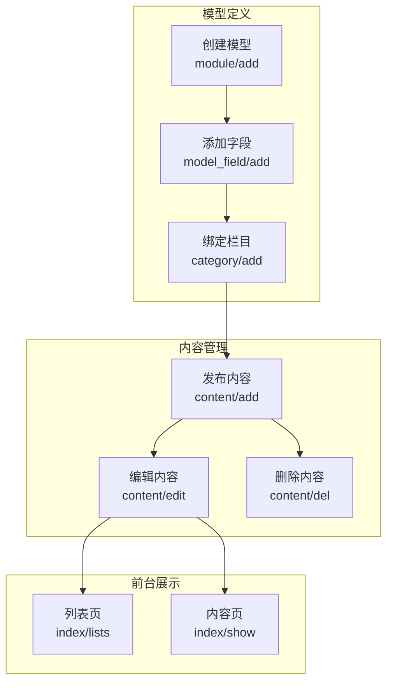
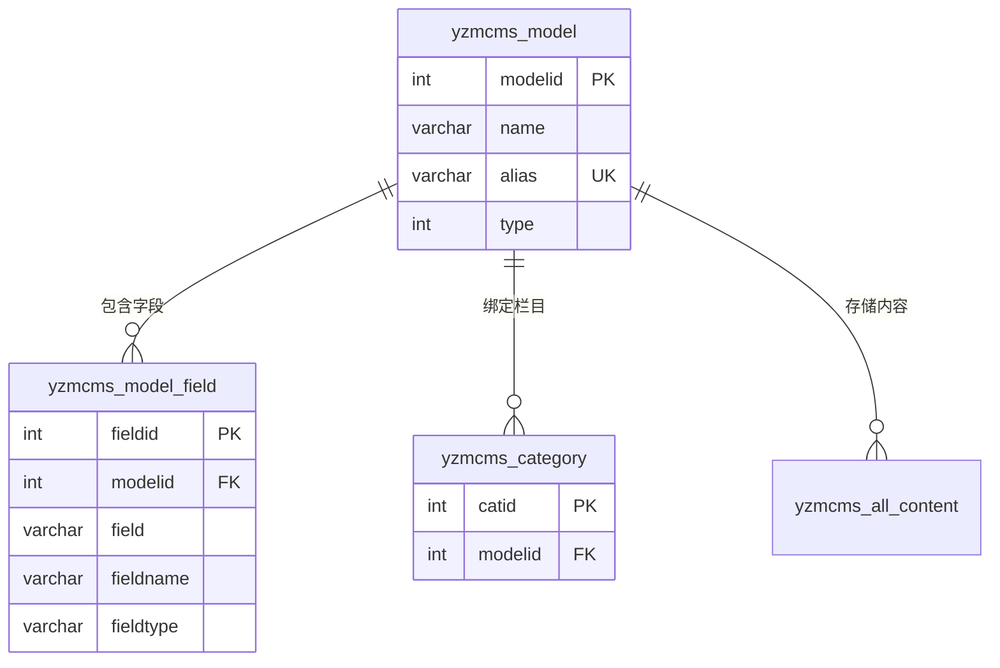

# 内容模型（Model）

内容模型是 YzmCMS 中用于定义不同类型内容数据结构的核心概念，允许系统支持多种类型的内容（如文章、产品、下载等），每种类型有自己独立的字段结构。

## 什么是内容模型？

内容模型（Model）是 YzmCMS 用于抽象和定义不同内容类型数据结构的概念。系统内置了"文章模型"作为默认模型，用户可以创建自定义模型来满足不同业务需求。

**关键特征**:
- 每种内容模型有独立的数据表
- 模型字段可自定义添加
- 支持多种字段类型（文本、编辑器、图片、选择框等）
- 模型可绑定到多个栏目
- 支持模型导入/导出

## 代码位置

| 方面 | 位置 |
|------|------|
| 模型管理控制器 | `application/admin/controller/module.class.php` |
| 字段管理控制器 | `application/admin/controller/model_field.class.php` |
| 内容模型类 | `application/admin/model/content_model.class.php` |
| 站点模型信息 | `get_site_modelinfo()` 函数 |
| 视图 | `application/admin/view/module_*.html` |

## 数据库结构

### 模型表 (yzmcms_model)

```sql
yzmcms_model (
  modelid          INT PRIMARY KEY AUTO_INCREMENT,  -- 模型ID
  name             VARCHAR(50) NOT NULL,           -- 模型名称
  alias            VARCHAR(50) NOT NULL,            -- 模型别名（用于表名）
  description      VARCHAR(255),                   -- 模型描述
  type             TINYINT DEFAULT 1,              -- 类型: 1独立模型 2系统模型
  tablename        VARCHAR(50),                    -- 数据表名（不含前缀）
  is_default       TINYINT DEFAULT 0,               -- 是否默认模型
  siteid           INT DEFAULT 1,                  -- 站点ID
  template         VARCHAR(255)                     -- 自定义模板
)
```

### 字段表 (yzmcms_model_field)

```sql
yzmcms_model_field (
  fieldid          INT PRIMARY KEY AUTO_INCREMENT, -- 字段ID
  modelid          INT NOT NULL,                   -- 所属模型ID
  field            VARCHAR(50) NOT NULL,           -- 字段名
  fieldname        VARCHAR(50) NOT NULL,           -- 字段别名
  fieldtype        VARCHAR(50) NOT NULL,           -- 字段类型
  tips             VARCHAR(255),                   -- 字段提示
  relation         VARCHAR(50),                    -- 关联表/值
  maxlength        VARCHAR(50),                    -- 最大长度
  minlength        VARCHAR(50),                    -- 最小长度
  regx             VARCHAR(255),                   -- 验证正则
  errortips        VARCHAR(255),                   -- 错误提示
  defaultvalue     VARCHAR(255),                   -- 默认值
  is_required      TINYINT DEFAULT 0,              -- 是否必填
  is_unique        TINYINT DEFAULT 0,              -- 是否唯一
  is_search        TINYINT DEFAULT 0,               -- 是否搜索
  is_filter        TINYINT DEFAULT 0,              -- 是否作为筛选条件
  is_show          TINYINT DEFAULT 1,              -- 是否显示
  is_system        TINYINT DEFAULT 0,              -- 是否系统字段
  listorder        INT DEFAULT 0,                  -- 排序
  PRIMARY KEY (modelid, field)
)
```

## 内置系统字段

所有内容模型都包含以下系统字段（不可删除）：

| 字段名 | 类型 | 说明 |
|--------|------|------|
| id | INT | 内容ID |
| catid | INT | 所属栏目ID |
| title | VARCHAR | 标题 |
| thumb | VARCHAR | 缩略图 |
| keywords | VARCHAR | 关键词 |
| description | TEXT | 描述 |
| flag | VARCHAR | 属性标签（置顶、推荐等） |
| url | VARCHAR | 自定义链接 |
| listorder | INT | 排序 |
| click | INT | 点击数 |
| status | TINYINT | 状态（0待审 1通过） |
| username | VARCHAR | 发布者用户名 |
| userid | INT | 发布者用户ID |
| inputtime | INT | 发布时间 |
| updatetime | INT | 更新时间 |
| is_push | TINYINT | 是否已推送百度 |

## 字段类型

| 类型名称 | 标识 | 说明 | 对应配置 |
|---------|------|------|----------|
| 输入框 | text | 单行文本 | maxlength, defaultvalue |
| 文本域 | textarea | 多行文本 | maxlength, defaultvalue |
| 编辑器 | editor | 富文本编辑器 | tips |
| 编辑器(简) | editor_mini | 简化富文本 | tips |
| 下拉框 | select | 单选下拉 | relation |
| 下拉框(多) | selectmore | 多选下拉 | relation |
| 单选框 | radio | 单选 | relation |
| 复选框 | checkbox | 多选 | relation |
| 开关 | box | 开关选择 | relation |
| 图片 | image | 单张图片 | upload_maxsize, upload_accept |
| 图片(多) | images | 多张图片 | upload_maxsize |
| 文件 | file | 单个文件 | upload_maxsize, upload_accept |
| 文件(多) | files | 多个文件 | upload_maxsize |
| 日期时间 | datetime | 日期+时间选择 | dateformat, format |
| 日期 | date | 日期选择 | dateformat |
| 整数 | number | 整数输入 | maxlength, defaultvalue |
| 小数 | decimal | 小数输入 | decimaldigits |
| 价格 | float | 价格输入 | decimaldigits |
| 万能标签 | tag | 关联调用 | tips |
| 联动菜单 | linkagedata | 联动选择 | parentid, arggroup |

## 模型的工作流程



## 模型的关系



## 创建自定义模型示例

### 1. 创建"产品"模型

```
名称：产品模型
别名：product
描述：用于发布产品信息
```

### 2. 添加自定义字段

| 字段名 | 字段别名 | 字段类型 | 配置 |
|--------|---------|---------|------|
| product_code | 产品编号 | text | maxlength=50 |
| price | 价格 | float | decimaldigits=2 |
| spec | 规格 | textarea | maxlength=500 |
| images | 产品图片 | images | - |
| brand | 品牌 | select | relation=品牌数据 |

### 3. 生成的数据库表结构

```sql
CREATE TABLE `yzmcms_product` (
  `id` int(10) unsigned NOT NULL AUTO_INCREMENT,
  `catid` int(10) unsigned NOT NULL DEFAULT 0,
  `title` varchar(255) NOT NULL,
  `thumb` varchar(255) DEFAULT NULL,
  `keywords` varchar(255) DEFAULT NULL,
  `description` text,
  `flag` varchar(50) DEFAULT NULL,
  `url` varchar(255) DEFAULT NULL,
  `listorder` int(10) unsigned DEFAULT 0,
  `click` int(10) unsigned DEFAULT 0,
  `status` tinyint(1) unsigned DEFAULT 1,
  `username` varchar(50) DEFAULT NULL,
  `userid` int(10) unsigned DEFAULT 0,
  `inputtime` int(10) unsigned DEFAULT 0,
  `updatetime` int(10) unsigned DEFAULT 0,
  `is_push` tinyint(1) unsigned DEFAULT 0,
  -- 自定义字段
  `product_code` varchar(50) DEFAULT NULL,
  `price` decimal(10,2) DEFAULT NULL,
  `spec` varchar(500) DEFAULT NULL,
  `images` text,
  `brand` varchar(50) DEFAULT NULL,
  PRIMARY KEY (`id`),
  KEY `catid` (`catid`),
  KEY `status` (`status`)
) ENGINE=MyISAM DEFAULT CHARSET=utf8;
```

## 模板中调用自定义字段

```html
{yzm:content catid="5" loop="10"}
<div class="product">
    
    <h3>{$content.title}</h3>
    <p>编号: {$content.product_code}</p>
    <p>价格: ¥{$content.price}</p>
    <p>规格: {$content.spec}</p>
    <p>品牌: {$content.brand}</p>
</div>
{/yzm:content}
```

## 模型的不变量

1. **表名唯一**: 同一站点下，模型别名（表名）必须唯一
2. **字段名唯一**: 同一模型下，字段名必须唯一
3. **系统字段保护**: 系统字段（is_system=1）不可删除和修改
4. **删除前检查**: 删除模型前必须确保无栏目绑定且无内容