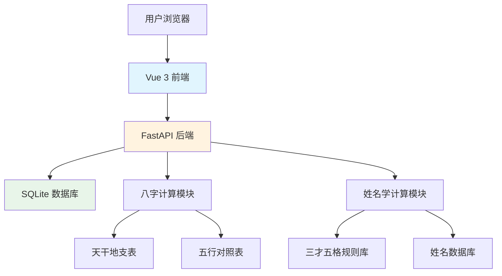

# 宝宝起名分析系统技术设计

Feature Name: baby-name-analysis
Updated: 2026-03-22

## Description

宝宝起名分析系统是一款面向新生儿家长的在线起名工具。前端采用 Vue 3 + Vite 构建现代化单页应用，后端采用 Python FastAPI 提供 RESTful API 服务。系统核心功能包括生辰八字五行分析、姓名学音形意分析、三才五格数理计算及综合姓名打分。

## Architecture



## Technology Stack

### Frontend

- **Framework**: Vue 3 (Composition API)
- **Build Tool**: Vite
- **HTTP Client**: Axios
- **UI Components**: 自定义组件 + CSS Variables
- **Date Picker**: Vant 3 (移动端友好)
- **Charts**: ECharts (五行可视化)

### Backend

- **Framework**: Python FastAPI
- **Database**: SQLite + SQLAlchemy
- **CORS**: FastAPI CORS Middleware
- **Server**: Uvicorn

## API Endpoints

### 1. 八字分析 API

```
POST /api/bazi/analyze
```

**Request:**
```json
{
  "birth_year": 2024,
  "birth_month": 1,
  "birth_day": 15,
  "birth_hour": 10,
  "gender": "male"
}
```

**Response:**
```json
{
  "bazi": {
    "year": "甲辰",
    "month": "辛丑",
    "day": "戊子",
    "hour": "戊午"
  },
  "wuxing": {
    "metal": 2,
    "wood": 1,
    "water": 2,
    "fire": 1,
    "earth": 2
  },
  "missing": ["木", "金"],
  "suggestions": ["宜补木", "宜补金"]
}
```

### 2. 姓名分析 API

```
POST /api/name/analyze
```

**Request:**
```json
{
  "surname": "李",
  "given_name": "子墨",
  "bazi": {
    "missing": ["木", "金"]
  }
}
```

**Response:**
```json
{
  "pinyin": "li zi mo",
  "shengmu": ["l", "z", "m"],
  "yunmu": ["i", "i", "o"],
  "shengdiao": [4, 3, 2],
  "yinyun_score": 85,
  
  "bihua": [7, 3, 5],
  "zixing_score": 78,
  
  "hanyi_score": 92,
  "hanzi_meanings": [
    {"char": "子", "meaning": "儿子、种子", "source": "古代称谓"},
    {"char": "墨", "meaning": "笔墨、文学", "source": "文房四宝"}
  ],
  
  "wuge": {
    "tiange": 8,
    "renge": 10,
    "dige": 8,
    "waige": 6,
    "zongge": 15
  },
  "sancai_score": 88,
  
  "base_score": 85,
  "wuxing_bonus": 10,
  "final_score": 93,
  "grade": "优",
  "evaluation": "名字音形意俱佳，配合八字五行配置优良"
}
```

### 3. 名字推荐 API

```
POST /api/name/recommend
```

**Request:**
```json
{
  "surname": "李",
  "gender": "male",
  "missing": ["木", "金"],
  "limit": 10
}
```

**Response:**
```json
{
  "recommendations": [
    {
      "name": "子木",
      "pinyin": "zi mu",
      "bihua": [3, 4],
      "wuxing": ["水", "木"],
      "score": 88
    }
  ]
}
```

### 4. 名字大全 API

```
GET /api/names?gender=male&wuxing=木&limit=20
```

## Data Models

### Name (名字表)

| Field | Type | Description |
|-------|------|-------------|
| id | INTEGER | 主键 |
| char | VARCHAR(1) | 汉字 |
| pinyin | VARCHAR(10) | 拼音 |
| bihua | INTEGER | 笔画数 |
| wuxing | VARCHAR(1) | 五行属性 |
| gender | VARCHAR(1) | 适用性别 M/F |
| meaning | TEXT | 含义解释 |
| source | VARCHAR(100) | 出处/来源 |

###姓李名字大全

| 字段 | 类型 | 说明 |
|------|------|------|
| id | INTEGER | 主键 |
| char | VARCHAR(1) | 汉字 |
| pinyin | VARCHAR(10) | 拼音 |
| bihua | INTEGER | 笔画数 |
| wuxing | VARCHAR(1) | 五行属性 |
| gender | VARCHAR(1) | 适用性别 M/F |
| meaning | TEXT | 含义解释 |
| source | VARCHAR(100) | 出处/来源 |

## Core Algorithms

### 1. 八字计算算法

```
输入: 年、月、日、时
输出: 八字天干地支

算法步骤:
1. 根据万年历表获取年柱天干地支
2. 根据月令表获取月柱天干地支
3. 根据日柱查表法计算日柱天干地支
4. 根据时柱表获取时柱天干地支
5. 根据八字统计五行数量
6. 计算五行缺失和补足建议
```

### 2. 三才五格计算算法

```
输入: 姓氏、名字
输出: 天格、人格、地格、外格、总格

单姓计算:
- 天格 = 姓笔画数 + 1
- 人格 = 姓笔画数 + 名第一字笔画数
- 地格 = 名第一字笔画数 + 名第二字笔画数
- 外格 = 人格尾数 + 地格尾数
- 总格 = 姓笔画数 + 名笔画数

复姓计算:
- 天格 = 复姓笔画数
- 人格 = 复姓前字 + 名第一字
- 地格 = 名笔画数
- 外格 = 总格 - 人格 + 1
- 总格 = 全部笔画数
```

### 3. 五格数理吉凶判断

| 数理 | 吉凶 | 说明 |
|------|------|------|
| 1,3,5,8,11,13,15,16,21,23,24,25,29,31,32,33,37,39,41,45,47,48,52,63,65,67,68,81 | 吉 | 多得贵人相助 |
| 6,7,17,18,20,27,28,36,38,47,58 | 半吉 | 波澜重叠，沉浮万状 |
| 2,4,9,10,12,14,19,22,26,30,34,40,42,43,44,49,50,53,54,56,57,60,62,64,66,69,70,71,72,73,74,75,76,77,78,79,80 | 凶 | 遇逆境、灾害 |

### 4. 综合评分算法

```
基础分 = (音韵分 * 0.3 + 字形分 * 0.2 + 含义分 * 0.3 + 三才分 * 0.2)

八字加成:
  FOR each missing wuxing IN bazi.missing:
    IF name.wuxing CONTAINS missing:
      base_score += 5
    ELSE:
      base_score -= 2

最终分 = MIN(100, base_score)

评分等级:
  90-100: 优
  75-89: 良
  60-74: 中
  <60: 差
```

## Project Structure

```
/workspace
├── frontend/                 # Vue 3 前端项目
│   ├── src/
│   │   ├── components/      # 组件
│   │   │   ├── BazaiForm.vue
│   │   │   ├── NameAnalyzer.vue
│   │   │   ├── WuxingChart.vue
│   │   │   └── ScoreDisplay.vue
│   │   ├── views/          # 页面
│   │   │   ├── Home.vue
│   │   │   ├── Analysis.vue
│   │   │   └── NamesList.vue
│   │   ├── api/             # API 调用
│   │   │   └── index.ts
│   │   ├── utils/          # 工具函数
│   │   │   └── pinyin.ts
│   │   ├── App.vue
│   │   └── main.ts
│   ├── index.html
│   ├── vite.config.ts
│   └── package.json
│
├── backend/                  # Python FastAPI 后端
│   ├── app/
│   │   ├── main.py          # FastAPI 入口
│   │   ├── routers/         # 路由
│   │   │   ├── bazi.py
│   │   │   ├── name.py
│   │   │   └── names.py
│   │   ├── services/       # 业务逻辑
│   │   │   ├── bazi_service.py
│   │   │   └── name_service.py
│   │   ├── models/         # 数据模型
│   │   │   └── database.py
│   │   └── utils/          # 工具函数
│   │       ├── tiangan.py
│   │       ├── dizhi.py
│   │       └── wuxing.py
│   ├── data/
│   │   └── names.db        # SQLite 数据库
│   ├── requirements.txt
│   └── run.py
│
└── SPEC.md                   # 需求规格
```

## Error Handling

| Error Code | HTTP Status | Description | Response |
|------------|-------------|-------------|----------|
| INVALID_DATE | 400 | 日期格式错误 | {"error": "不支持的日期"} |
| INVALID_HOUR | 400 | 时间格式错误 | {"error": "时辰范围应为0-23"} |
| NAME_NOT_FOUND | 404 | 名字不在数据库中 | {"error": "未找到该名字"} |
| SERVER_ERROR | 500 | 服务器内部错误 | {"error": "服务暂不可用"} |

## Test Strategy

### Backend Tests

```python
# tests/test_bazi.py
def test_bazi_calculation():
    # 测试八字计算正确性
    
def test_wuxing_analysis():
    # 测试五行分析
    
# tests/test_name.py
def test_sancai_calculation():
    # 测试三才五格计算
    
def test_score_calculation():
    # 测试综合评分
```

### Frontend Tests

- 组件单元测试 (Vitest)
- API 集成测试
- E2E 测试 (Playwright)

## Implementation Tasks

1. 创建前后端项目结构
2. 实现八字计算模块
3. 实现三才五格计算模块
4. 实现姓名评分算法
5. 构建名字数据库
6. 开发前端界面
7. 前后端联调
8. 部署测试
