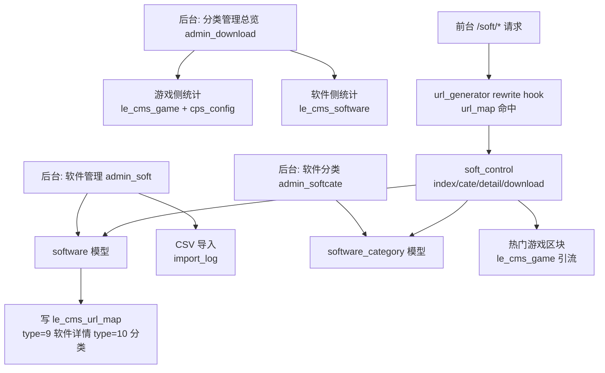

# 分类管理（双行业下载站扩展）技术设计

Feature Name: dual-download-category
Updated: 2026-09-18

## Description

新增 `software_center` 插件，将现有游戏下载站扩展为「游戏下载 + 软件下载」双行业下载站：

- **分类管理总览**（后台新菜单）：游戏/软件两大行业数据统计、CPS 游戏覆盖情况、软件收录量、新手引导步骤
- **软件管理**：软件 CRUD、上下架、CSV 模板下载与批量导入（自动去重、自动建分类）、导入日志
- **软件分类**：预置 8 个常见软件大类（办公/影音/系统工具/网络/安全/图像/编程/其它），支持自定义增删改、SEO 配置
- **前台软件站**：`/soft/` 软件首页、`/soft/cate-{alias}.html` 分类页、`/soft/{id}.html` 详情页、`/soft/download-{id}.html` 下载跳转（计数）
- **游戏带动软件**：软件前台页内嵌热门游戏区块反向引流；软件 URL 全部登记进 `le_cms_url_map`，复用 url_generator 的 rewrite hook 路由与收录统计

## Architecture



关键决策：

1. **复用 url_generator 路由**：软件 URL 写入 `le_cms_url_map`（type=9 软件详情、type=10 软件分类、type=11 软件首页），现有 `parseurl_control_index_rewrite_before` hook 按 url_hash 命中后转发 control/action/params，无需新增路由 hook。hook 的控制器存在性校验会遍历 `PLUGIN_PATH/*/control/`，可发现 `software_center/control/soft_control.class.php`
2. **url_hash 算法**：`substr(strtolower(hash('sha256', $full_url)), 0, 40)`，与 url_generator_model::make_url_hash 及 url_map char(40) 列一致（历史教训：64 位哈希永不命中）
3. **插件控制器布局**：后台控制器 `admin_*_control.class.php` 放插件根目录，前台控制器 `soft_control.class.php` 放 `control/` 子目录（core::get_original_file 查找顺序兼容两者）
4. **模板引擎约束**：模板内禁止动态下标插值（用 `{@ }` 表达式）与闭包；复杂计算在控制器/模型完成

## Components and Interfaces

### 后台控制器（插件根目录）

| 控制器 | action | 职责 |
|--------|--------|------|
| `admin_download_control` | index | 分类管理总览：游戏统计（总数/CPS 关联数/点击数）、软件统计（总数/分类数/下载次数/今日导入）、url_map 收录统计、新手引导 |
| `admin_soft_control` | index | 软件列表：分类/平台/状态筛选、关键词搜索、分页、上下架切换 |
| | add / edit / add_post / edit_post | 软件表单与保存（保存后写 url_map） |
| | del / toggle | 删除（连带 url_map 置失效）/ 上下架 |
| | import | 批量导入页（模板下载 + 上传表单 + 最近导入日志） |
| | import_post | CSV 解析导入：按 site_id+name 去重、分类自动匹配创建、逐条写 url_map、写导入日志 |
| | csvtemplate | 输出 CSV 模板（UTF-8 BOM，含示例行） |
| `admin_softcate_control` | index / set / add_post / edit_post / del | 软件分类管理（列表/表单/删除，删除前置校验分类下软件数） |

### 前台控制器（control/ 子目录）

`soft_control extends base_control`（获得 CURRENT_SITE_ID 站群识别）：

| action | URL | 职责 |
|--------|-----|------|
| index | `/soft/` | 分类导航 + 最新软件 + 下载排行 + 热门游戏引流区块 |
| cate | `/soft/cate-{alias}.html` | 按分类别名列表分页 |
| detail | `/soft/{id}.html` | 软件详情：基本信息/简介/下载按钮/同分类推荐/热门游戏 |
| download | `/soft/download-{id}.html` | downloads+1 后 302 跳转 download_url；无地址时提示页 |

### 菜单 Hook

`admin_admin_control_init_nav_after.php`：插件菜单下新增「分类管理」「软件管理」「软件分类」「批量导入」四项。

## Data Models

```sql
-- 软件表
CREATE TABLE IF NOT EXISTS `{$tablepre}cms_software` (
    `id` INT PRIMARY KEY AUTO_INCREMENT,
    `site_id` INT NOT NULL DEFAULT 0,
    `cat_id` INT NOT NULL DEFAULT 0,
    `name` VARCHAR(200) NOT NULL,
    `version` VARCHAR(50) DEFAULT '',
    `size` VARCHAR(50) DEFAULT '',
    `platform` VARCHAR(100) DEFAULT '',
    `download_url` VARCHAR(500) DEFAULT '',
    `cover` VARCHAR(500) DEFAULT '',
    `intro` VARCHAR(1000) DEFAULT '',
    `content` TEXT,
    `tags` VARCHAR(500) DEFAULT '',
    `downloads` INT UNSIGNED DEFAULT 0,
    `status` TINYINT DEFAULT 1 COMMENT '1上架 0下架',
    `dateline` INT UNSIGNED DEFAULT 0,
    `updated_at` INT UNSIGNED DEFAULT 0,
    KEY idx_site_cat (site_id, cat_id),
    KEY idx_site_status (site_id, status)
) ENGINE=InnoDB DEFAULT CHARSET=utf8mb4;

-- 软件分类表
CREATE TABLE IF NOT EXISTS `{$tablepre}cms_software_category` (
    `id` INT PRIMARY KEY AUTO_INCREMENT,
    `site_id` INT NOT NULL DEFAULT 0,
    `name` VARCHAR(100) NOT NULL,
    `alias` VARCHAR(100) DEFAULT '',
    `orderby` INT DEFAULT 0,
    `seo_title` VARCHAR(255) DEFAULT '',
    `seo_keywords` VARCHAR(255) DEFAULT '',
    `seo_description` VARCHAR(500) DEFAULT '',
    `enabled` TINYINT DEFAULT 1,
    KEY idx_site (site_id)
) ENGINE=InnoDB DEFAULT CHARSET=utf8mb4;

-- 导入日志表
CREATE TABLE IF NOT EXISTS `{$tablepre}cms_software_import_log` (
    `id` INT PRIMARY KEY AUTO_INCREMENT,
    `site_id` INT NOT NULL DEFAULT 0,
    `filename` VARCHAR(200) DEFAULT '',
    `total` INT DEFAULT 0,
    `success` INT DEFAULT 0,
    `failed` INT DEFAULT 0,
    `detail` TEXT,
    `dateline` INT UNSIGNED DEFAULT 0
) ENGINE=InnoDB DEFAULT CHARSET=utf8mb4;
```

模型文件（插件 model/ 目录，类名 = 文件名去 `_model.class.php`）：

- `software_model.class.php` → class software：get/get_list/count/create/update/find 去重检查、inc_download、url_map 同步写
- `software_category_model.class.php` → class software_category：get_by_alias/get_all_enabled/count_software
- `software_import_log_model.class.php` → class software_import_log：create/list_recent

安装时预置 8 个软件分类（办公软件 bangong、影音娱乐 yinpin、系统工具 xitong、网络工具 wangluo、安全软件 anquan、图像处理 tuxiang、编程开发 biancheng、其它工具 qita）。

## URL Map 登记

| type | URL 模式 | control | action | params |
|------|---------|---------|--------|--------|
| 9 | `/soft/{id}.html` | soft | detail | `{"id":N}` |
| 10 | `/soft/cate-{alias}.html` | soft | cate | `{"alias":"x"}` |
| 11 | `/soft/` | soft | index | `{}` |

写入时机：软件保存/导入成功后（type=9）；分类保存后（type=10）；install 与首次访问总览页时确保 type=11 存在。status 置 2（已使用）。删除/下架时置 3（已失效）。

## Correctness Properties

1. url_map 的 url_hash 一律为 SHA256 截断 40 位小写，读写两端一致
2. 软件名称在站点内唯一：导入与手动添加按 `site_id + name` 去重，重复跳过并计入 failed
3. 删除分类前置校验：分类下存在软件时拒绝删除
4. 前台仅展示 `status=1`（上架）软件；下架后详情 URL 在 url_map 置失效但仍可直接 404
5. 下载计数原子递增（`downloads = downloads + 1`），避免读改写竞态
6. CSV 解析容错：列数不足/空行跳过并计数，UTF-8 BOM 自动剥离

## Error Handling

| 场景 | 处理 |
|------|------|
| CSV 无有效行 | E(1,'未解析到有效数据行')，不写日志成功数 |
| 导入的 software_url 写入失败 | 忽略 url_map 失败，软件仍入库（url_map 可后续补建） |
| 下载地址为空 | 前台下载按钮置灰提示「暂无下载地址」 |
| 分类 alias 重复 | 保存时按 site_id+alias 查重，重复则自动追加 -2 后缀 |
| 前台访问不存在软件 | 404 状态码 + 提示页（与 game_control 行为一致） |

## Test Strategy

1. **安装**：`php -l` 全部新文件；触发 install.php 建表；确认预置分类 8 条
2. **后台**：str_auth token 访问 admin_download-index / admin_soft-index / admin_softcate-index，校验渲染无错误；mv 对应 runcache 缓存重编译
3. **导入**：构造 3 行 CSV（1 重复）经 import_post 导入，断言 success=2 failed=1、url_map 新增 2 条 type=9
4. **前台**：访问 /soft/、/soft/cate-bangong.html、/soft/{id}.html、/soft/download-{id}.html，断言 200 与关键内容、下载计数 +1、302 跳转
5. **回归**：游戏站 /game/{id}.html、url 列表页不受影响

## References

[^1]: (lecms/plugin/url_generator/hook/parseurl_control_index_rewrite_before.php) - URL 路由 hook，url_map 命中转发机制
[^2]: (lecms/xiunophp/lib/core.class.php#L470-L483) - 插件控制器/模型文件查找顺序
[^3]: (lecms/plugin/url_generator/model/game_model.class.php) - 游戏模型参照实现
[^4]: (lecms/plugin/cps_integration/install.php) - 插件建表 install 模式
