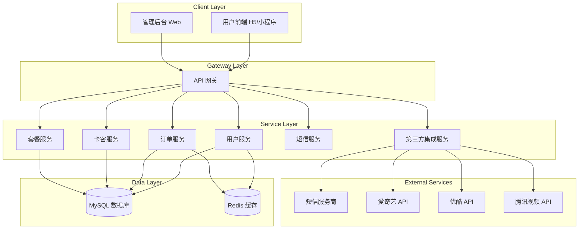
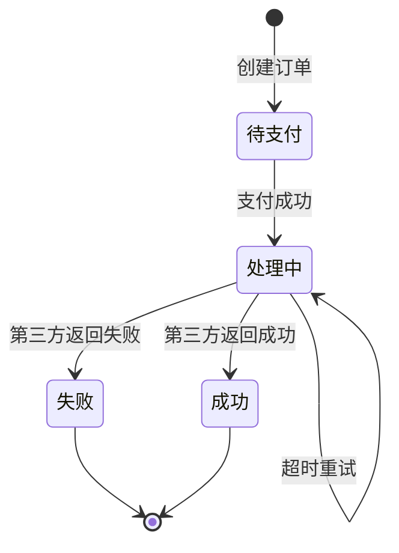

# 会员兑换系统

Feature Name: membership-redemption-system
Updated: 2026-03-21

## Description

本系统为移动号码会员兑换平台，支持用户通过手机验证码或卡密方式兑换爱奇艺、优酷、腾讯视频等国内主流视频平台会员。系统采用前后端分离架构，提供用户前端和管理后台两个客户端，后端服务负责业务逻辑处理和数据管理。

## Architecture



## System Components

### 1. 用户端 (User Frontend)

用户使用的客户端应用，支持以下功能：

| 功能模块 | 描述 |
|---------|------|
| 登录注册 | 手机号验证码登录/注册 |
| 套餐浏览 | 展示可用会员套餐列表 |
| 手机兑换 | 手机验证码方式兑换会员 |
| 卡密充值 | 输入卡密进行充值 |
| 订单查询 | 查看兑换历史和状态 |
| 个人中心 | 账户信息管理 |

### 2. 管理后台 (Admin Backend)

管理员使用的Web管理界面，支持以下功能：

| 功能模块 | 描述 |
|---------|------|
| 登录认证 | 管理员账号密码登录 |
| 仪表盘 | 业务数据统计概览 |
| 卡密管理 | 卡密生成、导出、查询、作废 |
| 套餐管理 | 套餐创建、编辑、上下架 |
| 订单管理 | 订单查询、处理、统计 |
| 财务报表 | 销售数据统计和导出 |
| 系统配置 | 短信服务商、第三方平台配置 |
| 操作日志 | 管理员操作记录查询 |

### 3. 后端服务 (Backend Service)

提供RESTful API服务，采用微服务架构，主要模块包括：

| 服务模块 | 端口 | 描述 |
|---------|------|------|
| 用户服务 | 8001 | 用户注册、登录、认证 |
| 订单服务 | 8002 | 订单创建、状态管理 |
| 卡密服务 | 8003 | 卡密生成、验证、使用 |
| 套餐服务 | 8004 | 套餐配置管理 |
| 短信服务 | 8005 | 短信发送和模板管理 |
| 集成服务 | 8006 | 第三方平台对接 |

## Data Models

### 用户表 (users)

| 字段名 | 类型 | 描述 |
|--------|------|------|
| id | BIGINT | 主键 |
| phone | VARCHAR(11) | 手机号，唯一索引 |
| password_hash | VARCHAR(255) | 密码哈希 |
| status | TINYINT | 状态：0-禁用，1-正常 |
| created_at | DATETIME | 创建时间 |
| updated_at | DATETIME | 更新时间 |

### 管理员表 (admins)

| 字段名 | 类型 | 描述 |
|--------|------|------|
| id | BIGINT | 主键 |
| username | VARCHAR(50) | 用户名，唯一索引 |
| password_hash | VARCHAR(255) | 密码哈希 |
| role | VARCHAR(20) | 角色：super_admin, admin |
| status | TINYINT | 状态：0-禁用，1-正常 |
| last_login_at | DATETIME | 最后登录时间 |
| created_at | DATETIME | 创建时间 |
| updated_at | DATETIME | 更新时间 |

### 套餐表 (products)

| 字段名 | 类型 | 描述 |
|--------|------|------|
| id | BIGINT | 主键 |
| platform | VARCHAR(20) | 平台：iqiyi, youku, tencent |
| name | VARCHAR(100) | 套餐名称 |
| duration_days | INT | 时长（天） |
| price | DECIMAL(10,2) | 价格 |
| stock | INT | 库存 |
| status | TINYINT | 状态：0-下架，1-上架 |
| created_at | DATETIME | 创建时间 |
| updated_at | DATETIME | 更新时间 |

### 卡密批次表 (card_batches)

| 字段名 | 类型 | 描述 |
|--------|------|------|
| id | BIGINT | 主键 |
| batch_no | VARCHAR(32) | 批次号，唯一索引 |
| product_id | BIGINT | 关联套餐ID |
| prefix | VARCHAR(10) | 卡密前缀 |
| total_count | INT | 生成数量 |
| used_count | INT | 已使用数量 |
| valid_from | DATETIME | 有效期开始 |
| valid_until | DATETIME | 有效期结束 |
| created_by | BIGINT | 创建管理员ID |
| created_at | DATETIME | 创建时间 |

### 卡密表 (cards)

| 字段名 | 类型 | 描述 |
|--------|------|------|
| id | BIGINT | 主键 |
| card_no | VARCHAR(32) | 卡密号，唯一索引 |
| batch_id | BIGINT | 关联批次ID |
| password | VARCHAR(64) | 卡密密码（加密存储） |
| product_id | BIGINT | 关联套餐ID |
| status | TINYINT | 状态：0-未使用，1-已使用，2-已作废 |
| used_by | BIGINT | 使用用户ID |
| used_at | DATETIME | 使用时间 |
| created_at | DATETIME | 创建时间 |

### 订单表 (orders)

| 字段名 | 类型 | 描述 |
|--------|------|------|
| id | BIGINT | 主键 |
| order_no | VARCHAR(32) | 订单号，唯一索引 |
| user_id | BIGINT | 用户ID |
| product_id | BIGINT | 套餐ID |
| type | TINYINT | 类型：1-手机兑换，2-卡密充值 |
| card_id | BIGINT | 卡密ID（卡密充值时） |
| target_account | VARCHAR(100) | 目标充值账号 |
| amount | DECIMAL(10,2) | 订单金额 |
| status | TINYINT | 状态：0-待支付，1-处理中，2-成功，3-失败 |
| platform_order_no | VARCHAR(64) | 第三方平台订单号 |
| failure_reason | VARCHAR(255) | 失败原因 |
| processed_at | DATETIME | 处理完成时间 |
| created_at | DATETIME | 创建时间 |
| updated_at | DATETIME | 更新时间 |

### 短信记录表 (sms_logs)

| 字段名 | 类型 | 描述 |
|--------|------|------|
| id | BIGINT | 主键 |
| phone | VARCHAR(11) | 接收手机号 |
| type | VARCHAR(20) | 类型：verify_code, notification |
| content | TEXT | 短信内容 |
| status | TINYINT | 状态：0-待发送，1-成功，2-失败 |
| send_at | DATETIME | 发送时间 |
| response | TEXT | 第三方返回结果 |
| created_at | DATETIME | 创建时间 |

### 操作日志表 (operation_logs)

| 字段名 | 类型 | 描述 |
|--------|------|------|
| id | BIGINT | 主键 |
| admin_id | BIGINT | 管理员ID |
| action | VARCHAR(50) | 操作类型 |
| target_type | VARCHAR(30) | 目标类型 |
| target_id | BIGINT | 目标ID |
| detail | JSON | 操作详情 |
| ip | VARCHAR(45) | IP地址 |
| created_at | DATETIME | 操作时间 |

## API Interfaces

### 用户端 API

#### 认证模块

| 接口 | 方法 | 描述 |
|------|------|------|
| /api/v1/user/send-code | POST | 发送验证码 |
| /api/v1/user/login | POST | 手机号登录 |
| /api/v1/user/logout | POST | 退出登录 |
| /api/v1/user/info | GET | 获取用户信息 |

#### 套餐模块

| 接口 | 方法 | 描述 |
|------|------|------|
| /api/v1/products | GET | 获取套餐列表 |
| /api/v1/products/{id} | GET | 获取套餐详情 |

#### 兑换模块

| 接口 | 方法 | 描述 |
|------|------|------|
| /api/v1/exchange/mobile | POST | 手机号兑换会员 |
| /api/v1/exchange/card | POST | 卡密充值 |
| /api/v1/exchange/verify | POST | 兑换结果验证 |

#### 订单模块

| 接口 | 方法 | 描述 |
|------|------|------|
| /api/v1/orders | GET | 获取订单列表 |
| /api/v1/orders/{id} | GET | 获取订单详情 |

### 管理后台 API

#### 管理员认证

| 接口 | 方法 | 描述 |
|------|------|------|
| /api/v1/admin/login | POST | 管理员登录 |
| /api/v1/admin/logout | POST | 管理员退出 |

#### 卡密管理

| 接口 | 方法 | 描述 |
|------|------|------|
| /api/v1/admin/cards/batch | POST | 生成卡密批次 |
| /api/v1/admin/cards | GET | 查询卡密列表 |
| /api/v1/admin/cards/export | GET | 导出卡密 |
| /api/v1/admin/cards/{id}/disable | POST | 作废卡密 |

#### 套餐管理

| 接口 | 方法 | 描述 |
|------|------|------|
| /api/v1/admin/products | GET | 获取套餐列表 |
| /api/v1/admin/products | POST | 创建套餐 |
| /api/v1/admin/products/{id} | PUT | 更新套餐 |
| /api/v1/admin/products/{id} | DELETE | 删除套餐 |
| /api/v1/admin/products/{id}/status | PUT | 更新套餐状态 |

#### 订单管理

| 接口 | 方法 | 描述 |
|------|------|------|
| /api/v1/admin/orders | GET | 查询订单列表 |
| /api/v1/admin/orders/{id} | GET | 订单详情 |
| /api/v1/admin/orders/{id}/retry | POST | 重试充值 |

#### 统计报表

| 接口 | 方法 | 描述 |
|------|------|------|
| /api/v1/admin/stats/dashboard | GET | 仪表盘数据 |
| /api/v1/admin/stats/sales | GET | 销售统计 |
| /api/v1/admin/stats/export | GET | 导出统计数据 |

#### 系统配置

| 接口 | 方法 | 描述 |
|------|------|------|
| /api/v1/admin/config/sms | PUT | 配置短信服务商 |
| /api/v1/admin/config/platform | PUT | 配置第三方平台 |
| /api/v1/admin/config/sms/test | POST | 测试短信发送 |

### 渠道商 API

| 接口 | 方法 | 描述 |
|------|------|------|
| /api/v1/partner/card/redeem | POST | 卡密充值接口 |
| /api/v1/partner/query | POST | 订单查询接口 |

## Correctness Properties

### 业务规则

1. **卡密唯一性**：每张卡密号在系统中唯一，不可重复
2. **卡密一次性**：卡密一旦使用，状态不可变更
3. **订单原子性**：订单状态变更和卡密状态变更必须在同一事务中完成
4. **验证码时效性**：验证码有效期5分钟，每个手机号60秒内只能发送一次
5. **套餐库存同步**：订单创建时扣减库存，订单失败时回补库存

### 充值流程状态机



### 安全性规则

1. **密码存储**：用户密码使用BCRYPT加密存储
2. **敏感数据**：卡密密码使用AES-256加密存储
3. **API限流**：用户端API每分钟100次，管理员API每分钟60次
4. **令牌有效期**：访问令牌有效期24小时
5. **验证码限制**：同一手机号5分钟内错误3次锁定

## Error Handling

### 错误码定义

| 错误码 | 描述 | 处理策略 |
|--------|------|----------|
| 10001 | 验证码发送失败 | 重试发送，记录日志 |
| 10002 | 验证码错误 | 提示用户，错误计数 |
| 10003 | 验证码已过期 | 提示用户重新获取 |
| 20001 | 订单创建失败 | 记录日志，退款处理 |
| 20002 | 第三方充值失败 | 更新订单状态，通知用户 |
| 20003 | 充值超时 | 标记处理中，自动重试 |
| 30001 | 卡密无效 | 提示用户检查输入 |
| 30002 | 卡密已使用 | 提示用户卡密已被使用 |
| 30003 | 卡密已过期 | 提示用户卡密有效期 |
| 40001 | 套餐库存不足 | 提示用户选择其他套餐 |
| 50001 | 系统繁忙 | 返回友好提示，稍后重试 |

### 异常处理流程

1. **短信发送异常**：记录失败日志，触发重试队列
2. **第三方平台超时**：标记订单为处理中，延迟重试
3. **数据库连接失败**：切换备用库，发送告警
4. **接口限流触发**：返回429状态码，提示用户稍后重试

## Test Strategy

### 单元测试

| 模块 | 测试覆盖目标 |
|------|--------------|
| 用户服务 | 注册、登录、验证码逻辑 |
| 订单服务 | 订单创建、状态流转、库存扣减 |
| 卡密服务 | 卡密生成、验证、使用 |
| 短信服务 | 模板渲染、限流控制 |

### 集成测试

| 测试场景 | 描述 |
|----------|------|
| 手机号兑换流程 | 完整从验证码到充值完成的流程 |
| 卡密充值流程 | 卡密验证、订单创建、状态更新 |
| 管理后台流程 | 卡密生成、套餐配置、订单处理 |

### 第三方集成测试

| 平台 | 测试内容 |
|------|----------|
| 短信服务商 | 验证码发送、状态回调 |
| 爱奇艺 | 会员充值、订单查询 |
| 优酷 | 会员充值、订单查询 |
| 腾讯视频 | 会员充值、订单查询 |

## Project Structure

```
membership-redemption-system/
├── user-frontend/              # 用户前端
│   ├── src/
│   │   ├── api/               # API调用
│   │   ├── views/             # 页面组件
│   │   ├── store/             # 状态管理
│   │   └── utils/             # 工具函数
│   └── package.json
├── admin-backend/              # 管理后台
│   ├── src/
│   │   ├── api/               # API调用
│   │   ├── views/             # 页面组件
│   │   ├── store/             # 状态管理
│   │   └── utils/             # 工具函数
│   └── package.json
├── backend/                    # 后端服务
│   ├── src/
│   │   ├── services/          # 业务服务
│   │   ├── controllers/       # 控制器
│   │   ├── models/            # 数据模型
│   │   ├── middleware/        # 中间件
│   │   ├── routes/            # 路由配置
│   │   ├── utils/             # 工具函数
│   │   └── config/            # 配置文件
│   └── package.json
├── docs/                      # 文档
│   ├── api/                   # API文档
│   └── database/              # 数据库文档
└── README.md
```

## Technology Stack

| 层级 | 技术选型 | 说明 |
|------|----------|------|
| 用户前端 | Vue3 + Vite | H5应用 |
| 管理后台 | Vue3 + Element Plus | PC Web应用 |
| 后端框架 | Node.js + Express | RESTful API |
| 数据库 | MySQL 8.0 | 主数据库 |
| 缓存 | Redis 6.0 | 缓存和会话 |
| 短信服务 | 阿里云短信 | 验证码和通知 |
| 部署 | Docker + Nginx | 容器化部署 |
