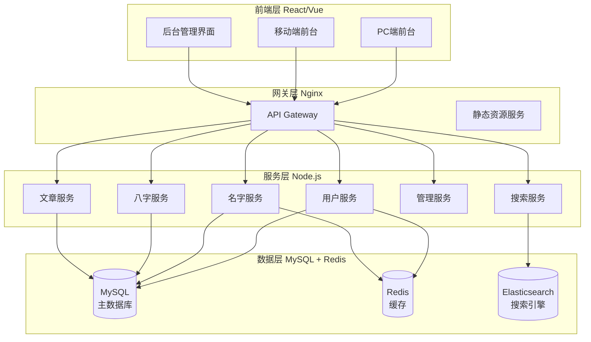
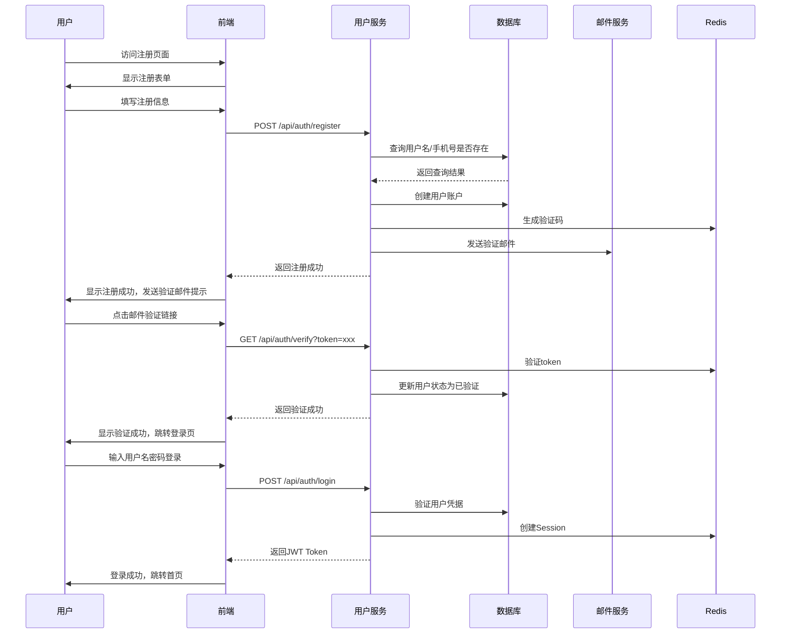
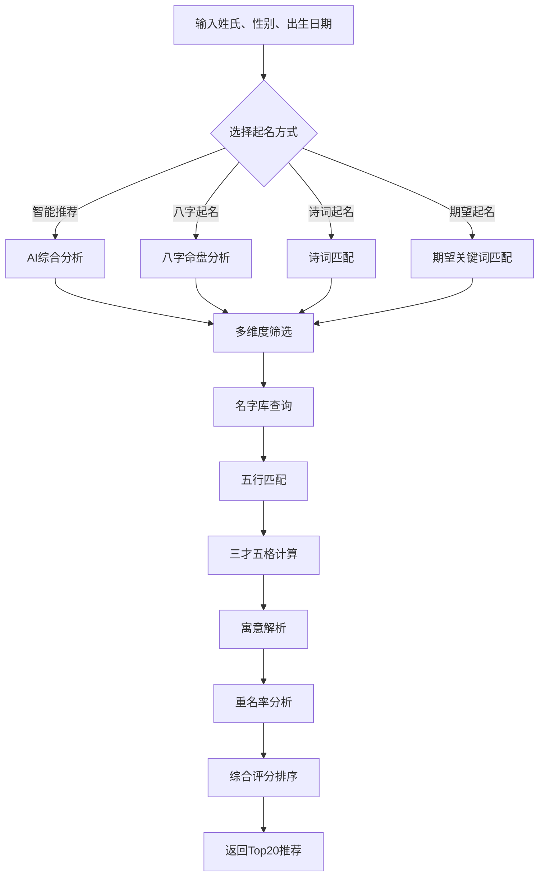
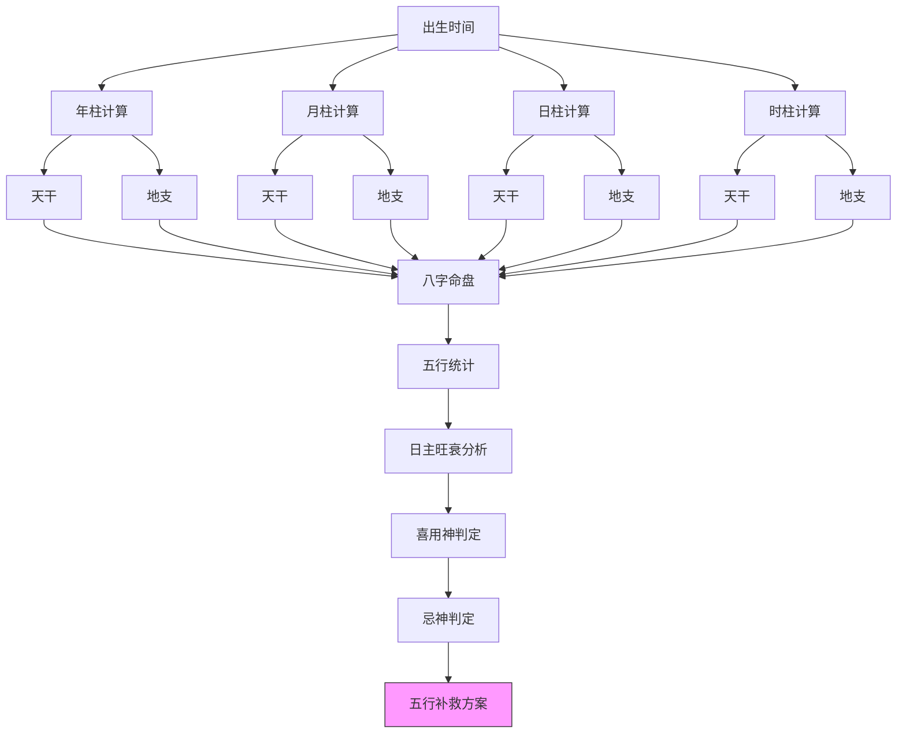
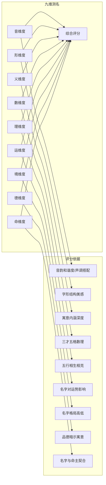
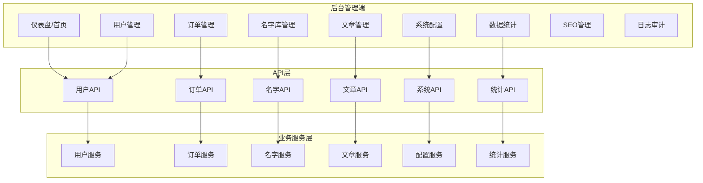
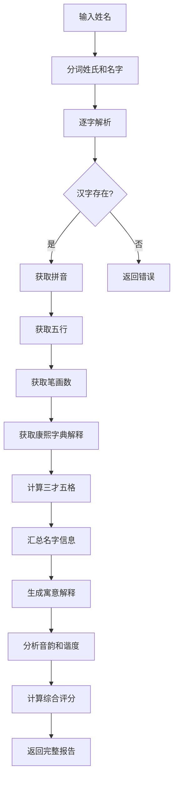
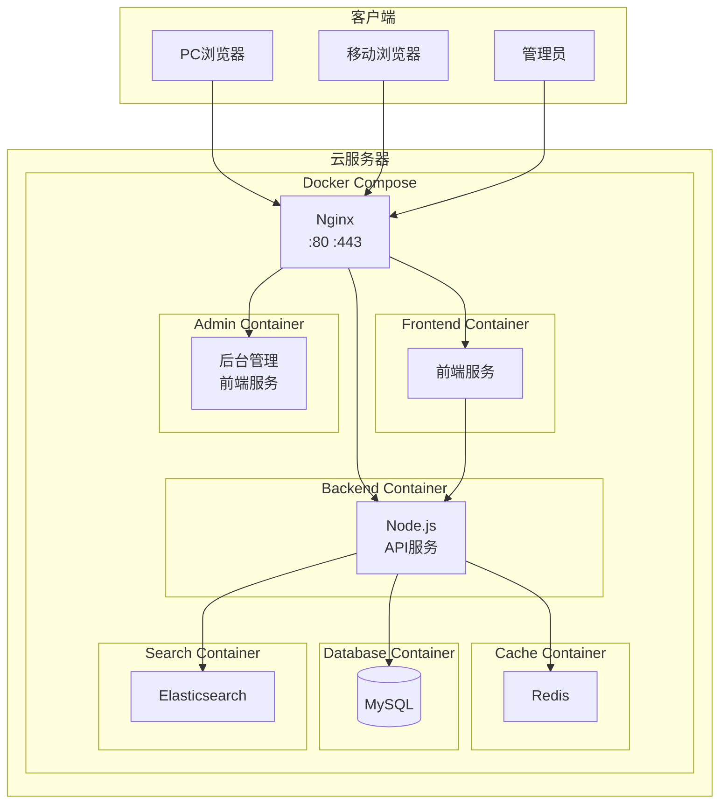

# 起名平台系统技术设计规格说明书

## 1. 系统概述

### 1.1 项目背景

起名平台系统（qiming-name-platform）是一个融合传统国学智慧与现代AI技术的智能起名服务平台，为用户提供宝宝起名、八字起名、诗词起名、周易起名、姓名测试打分等多种命名服务，同时提供完整的后台管理系统供管理员进行数据维护和业务管理。

### 1.2 系统架构



### 1.3 技术栈

| 层级 | 技术选型 | 说明 |
|------|----------|------|
| 前端框架 | React 18 / Vue 3 | 响应式单页应用 |
| UI组件库 | Ant Design / Element Plus | 企业级组件 |
| 状态管理 | Redux Toolkit / Pinia | 全局状态管理 |
| 后端框架 | Node.js + Express/Koa | RESTful API |
| 数据库 | MySQL 8.0 | 关系型数据库 |
| 缓存 | Redis 6.0 | Session/数据缓存 |
| 搜索引擎 | Elasticsearch 8.0 | 全文搜索 |
| 进程管理 | PM2 | Node.js进程管理 |
| 容器化 | Docker | 环境一致性问题 |

## 2. 前台用户端功能模块

### 2.1 用户注册登录模块

#### 2.1.1 模块概述

提供用户注册、登录、密码找回、身份验证等功能，确保用户数据安全和个性化服务。

#### 2.1.2 业务流程



#### 2.1.3 数据模型

```sql
-- 用户表
CREATE TABLE `users` (
  `id` BIGINT UNSIGNED PRIMARY KEY AUTO_INCREMENT COMMENT '用户ID',
  `username` VARCHAR(50) NOT NULL UNIQUE COMMENT '用户名',
  `password_hash` VARCHAR(255) NOT NULL COMMENT '密码哈希',
  `phone` VARCHAR(20) UNIQUE COMMENT '手机号',
  `email` VARCHAR(100) UNIQUE COMMENT '邮箱',
  `nickname` VARCHAR(50) COMMENT '昵称',
  `avatar` VARCHAR(255) COMMENT '头像URL',
  `gender` TINYINT DEFAULT 0 COMMENT '性别 0未知 1男 2女',
  `birth_date` DATE COMMENT '出生日期',
  `birth_time` VARCHAR(10) COMMENT '出生时辰',
  `status` TINYINT DEFAULT 1 COMMENT '状态 0禁用 1正常 2待验证',
  `last_login_time` DATETIME COMMENT '最后登录时间',
  `last_login_ip` VARCHAR(45) COMMENT '最后登录IP',
  `created_at` DATETIME DEFAULT CURRENT_TIMESTAMP,
  `updated_at` DATETIME DEFAULT CURRENT_TIMESTAMP ON UPDATE CURRENT_TIMESTAMP,
  INDEX `idx_phone` (`phone`),
  INDEX `idx_email` (`email`),
  INDEX `idx_status` (`status`)
) ENGINE=InnoDB DEFAULT CHARSET=utf8mb4 COMMENT='用户表';

-- 登录日志表
CREATE TABLE `login_logs` (
  `id` BIGINT UNSIGNED PRIMARY KEY AUTO_INCREMENT,
  `user_id` BIGINT UNSIGNED NOT NULL,
  `ip` VARCHAR(45) NOT NULL,
  `user_agent` VARCHAR(500),
  `login_status` TINYINT NOT NULL COMMENT '0失败 1成功',
  `fail_reason` VARCHAR(100),
  `created_at` DATETIME DEFAULT CURRENT_TIMESTAMP,
  INDEX `idx_user_id` (`user_id`),
  INDEX `idx_created_at` (`created_at`)
) ENGINE=InnoDB DEFAULT CHARSET=utf8mb4 COMMENT='登录日志表';
```

#### 2.1.4 API接口

| 方法 | 路径 | 描述 | 请求体/参数 |
|------|------|------|-------------|
| POST | /api/auth/register | 用户注册 | `{username, password, phone?, email}` |
| POST | /api/auth/login | 用户登录 | `{username, password}` |
| POST | /api/auth/logout | 用户登出 | - |
| GET | /api/auth/verify | 邮箱验证 | `?token=xxx` |
| POST | /api/auth/send-code | 发送验证码 | `{phone, type}` |
| POST | /api/auth/reset-password | 重置密码 | `{phone, code, newPassword}` |
| GET | /api/auth/userinfo | 获取用户信息 | - |
| PUT | /api/auth/userinfo | 更新用户信息 | `{nickname, avatar, gender, birthDate, birthTime}` |

### 2.2 宝宝起名模块

#### 2.2.1 模块概述

以先进AI技术和大数据融合千年传统起名智慧，为用户提供独一无二、寓意深远的宝宝名字方案。

#### 2.2.2 业务流程



#### 2.2.3 数据模型

```sql
-- 名字库表
CREATE TABLE `names` (
  `id` BIGINT UNSIGNED PRIMARY KEY AUTO_INCREMENT,
  `surname` VARCHAR(10) NOT NULL COMMENT '姓',
  `given_name` VARCHAR(10) NOT NULL COMMENT '名',
  `full_name` VARCHAR(20) NOT NULL COMMENT '全名',
  `gender` TINYINT NOT NULL COMMENT '1男 2女 0通用',
  `pinyin` VARCHAR(100) NOT NULL COMMENT '拼音',
  `pinyin_initial` VARCHAR(50) COMMENT '拼音首字母',
  `stroke_count` INT NOT NULL COMMENT '总笔画数',
  `five_element` VARCHAR(10) COMMENT '五行属性',
  `wu_ge_tian` INT COMMENT '天格数',
  `wu_ge_di` INT COMMENT '地格数',
  `wu_ge_ren` INT COMMENT '人格数',
  `wu_ge_wai` INT COMMENT '外格数',
  `wu_ge_zong` INT COMMENT '总格数',
  `wu_ge_lucky` VARCHAR(50) COMMENT '三才五格吉凶',
  `shape_score` INT COMMENT '形美评分 1-100',
  `sound_score` INT COMMENT '音顺评分 1-100',
  `meaning_score` INT COMMENT '义深评分 1-100',
  `wu_xing_score` INT COMMENT '五行评分 1-100',
  `total_score` INT COMMENT '综合评分 1-100',
  `meaning` TEXT COMMENT '寓意解释',
  `usage_count` INT DEFAULT 0 COMMENT '使用次数',
  `source_type` VARCHAR(20) COMMENT '来源类型 poetry/bazi/zhouyi/custom',
  `source_detail` VARCHAR(255) COMMENT '来源详情',
  `kanxi_explain` TEXT COMMENT '康熙字典解释',
  `is_popular` TINYINT DEFAULT 0 COMMENT '是否热门',
  `status` TINYINT DEFAULT 1 COMMENT '状态 0下架 1上架',
  `created_at` DATETIME DEFAULT CURRENT_TIMESTAMP,
  `updated_at` DATETIME DEFAULT CURRENT_TIMESTAMP ON UPDATE CURRENT_TIMESTAMP,
  INDEX `idx_full_name` (`full_name`),
  INDEX `idx_gender` (`gender`),
  INDEX `idx_five_element` (`five_element`),
  INDEX `idx_total_score` (`total_score` DESC),
  INDEX `idx_pinyin_initial` (`pinyin_initial`)
) ENGINE=InnoDB DEFAULT CHARSET=utf8mb4 COMMENT='名字库表';

-- 名字期望标签关联表
CREATE TABLE `name_expect_tags` (
  `id` BIGINT UNSIGNED PRIMARY KEY AUTO_INCREMENT,
  `name_id` BIGINT UNSIGNED NOT NULL,
  `tag` VARCHAR(50) NOT NULL COMMENT '期望标签 如:聪明,勇敢,善良',
  `created_at` DATETIME DEFAULT CURRENT_TIMESTAMP,
  INDEX `idx_name_id` (`name_id`),
  INDEX `idx_tag` (`tag`)
) ENGINE=InnoDB DEFAULT CHARSET=utf8mb4 COMMENT='名字期望标签表';

-- 起名记录表
CREATE TABLE `name_records` (
  `id` BIGINT UNSIGNED PRIMARY KEY AUTO_INCREMENT,
  `user_id` BIGINT UNSIGNED COMMENT '用户ID',
  `session_id` VARCHAR(64) COMMENT '会话ID 匿名用户',
  `surname` VARCHAR(10) NOT NULL COMMENT '姓氏',
  `gender` TINYINT NOT NULL COMMENT '性别 1男 2女',
  `birth_date` DATE COMMENT '出生日期',
  `birth_time` VARCHAR(10) COMMENT '出生时辰',
  `name_type` VARCHAR(20) COMMENT '起名类型 bazi/poetry/zhouyi/normal',
  `expect_tags` VARCHAR(255) COMMENT '期望标签',
  `search_params` JSON COMMENT '搜索参数',
  `result_names` JSON COMMENT '返回的名字列表',
  `selected_name_id` BIGINT UNSIGNED COMMENT '用户选择的名字ID',
  `created_at` DATETIME DEFAULT CURRENT_TIMESTAMP,
  INDEX `idx_user_id` (`user_id`),
  INDEX `idx_created_at` (`created_at`)
) ENGINE=InnoDB DEFAULT CHARSET=utf8mb4 COMMENT='起名记录表';

-- 用户收藏名字表
CREATE TABLE `name_favorites` (
  `id` BIGINT UNSIGNED PRIMARY KEY AUTO_INCREMENT,
  `user_id` BIGINT UNSIGNED NOT NULL,
  `name_id` BIGINT UNSIGNED NOT NULL,
  `created_at` DATETIME DEFAULT CURRENT_TIMESTAMP,
  UNIQUE KEY `uk_user_name` (`user_id`, `name_id`),
  INDEX `idx_user_id` (`user_id`)
) ENGINE=InnoDB DEFAULT CHARSET=utf8mb4 COMMENT='用户收藏名字表';
```

#### 2.2.4 界面原型描述

**宝宝起名首页布局：**

```
┌─────────────────────────────────────────────────────────────────┐
│                        网站导航栏                                │
│  [首页] [宝宝起名] [八字起名] [诗词起名] [成人改名] [姓名测试]... │
├─────────────────────────────────────────────────────────────────┤
│                                                                 │
│   ┌─────────────────────────────────────────────────────────┐   │
│   │                    宝宝起名Banner                        │   │
│   │           AI智能起名 · 大数据 · 国学智慧                  │   │
│   └─────────────────────────────────────────────────────────┘   │
│                                                                 │
│   ┌──────────────────────┐  ┌──────────────────────┐           │
│   │  姓氏输入框          │  │  性别选择  [男] [女]  │           │
│   └──────────────────────┘  └──────────────────────┘           │
│                                                                 │
│   ┌──────────────────────┐  ┌──────────────────────┐           │
│   │  出生日期选择器      │  │  出生时辰 [请选择▼]  │           │
│   └──────────────────────┘  └──────────────────────┘           │
│                                                                 │
│   ┌──────────────────────────────────────────────────────┐      │
│   │  期望输入：如：聪明、勇敢、学识渊博...                 │      │
│   └──────────────────────────────────────────────────────┘      │
│                                                                 │
│              [        立即起名        ]                         │
│                                                                 │
├─────────────────────────────────────────────────────────────────┤
│                                                                 │
│   起名六大维度                                                   │
│   ┌────────┐ ┌────────┐ ┌────────┐ ┌────────┐ ┌────────┐ ┌────────┐ │
│   │ 国学起名 │ │ 音形义  │ │ 期望起名 │ │ 大数据  │ │ 诗词起名 │ │ 生肖起名 │ │
│   └────────┘ └────────┘ └────────┘ └────────┘ └────────┘ └────────┘ │
│                                                                 │
├─────────────────────────────────────────────────────────────────┤
│                                                                 │
│   名字潜移默化的影响                                             │
│   ┌────────┐ ┌────────┐ ┌────────┐ ┌────────┐ ┌────────┐ ┌────────┐ │
│   │ 塑造气质 │ │ 培养自信 │ │ 影响人际 │ │ 好运相持 │ │ 美好祝福 │ │ 非凡人生 │ │
│   └────────┘ └────────┘ └────────┘ └────────┘ └────────┘ └────────┘ │
│                                                                 │
├─────────────────────────────────────────────────────────────────┤
│                                                                 │
│   今日黄历卡片                                                   │
│   ┌─────────────────────────────────────────────────────┐      │
│   │ 2026年3月22日 星期日 白羊座                          │      │
│   │ 农历二月初四 丙午年【马】辛卯月·乙未日              │      │
│   │ ─────────────────────────────────────────────────── │      │
│   │ 宜: 嫁娶 祭祀 开光 祈福 求嗣 出行                    │      │
│   │ 忌: 动土 伐木 安葬 行丧                              │      │
│   │ ─────────────────────────────────────────────────── │      │
│   │ 财神: 东北 | 喜神: 西北 | 福神: 西南                │      │
│   └─────────────────────────────────────────────────────┘      │
│                                                                 │
└─────────────────────────────────────────────────────────────────┘
```

**起名结果页布局：**

```
┌─────────────────────────────────────────────────────────────────┐
│  [返回] 宝宝起名结果                              [收藏] [分享]  │
├─────────────────────────────────────────────────────────────────┤
│                                                                 │
│   为您找到 128 个符合条件的好名字                                │
│   筛选条件：姓氏:李 | 性别:男 | 五行:金木                        │
│                                                                 │
│   ┌─────────────────────────────────────────────────────────┐  │
│   │ 排序: [综合评分▼] [五行评分] [重名率] [笔画数]           │  │
│   └─────────────────────────────────────────────────────────┘  │
│                                                                 │
│   ┌─────────────────────────────────────────────────────────┐  │
│   │ ★ 李俊豪 (98分)                                         │  │
│   │ 拼音: lǐ jùn háo  |  笔画: 7-9  |  五行: 火金          │  │
│   │ 三才五格: 天12(吉) 地10(吉) 人16(吉) 外11(吉) 总16(吉) │  │
│   │ 寓意: 俊表示超越寻常、才学出众；豪表示豪迈大气、英雄    │  │
│   │ 豪情。整体寓意事业成功、财运亨通。                       │  │
│   │ 重名指数: ★★★☆☆ (全国约2.3万人使用)                  │  │
│   │                                           [查看详情]    │  │
│   └─────────────────────────────────────────────────────────┘  │
│                                                                 │
│   ┌─────────────────────────────────────────────────────────┐  │
│   │ ★ 李煜晨 (96分)                                         │  │
│   │ ...                                                     │  │
│   └─────────────────────────────────────────────────────────┘  │
│                                                                 │
│   ┌─────────────────────────────────────────────────────────┐  │
│   │ 手动起名: 输入您喜欢的字组合                             │  │
│   │ 首字: [____]  末字: [____]  [开始筛选]                 │  │
│   └─────────────────────────────────────────────────────────┘  │
│                                                                 │
└─────────────────────────────────────────────────────────────────┘
```

### 2.3 八字起名模块

#### 2.3.1 模块概述

汇聚多位国内权威易学大师，以深厚经验精准解析八字，结合心理学，量身打造帮扶一生的优质好名。

#### 2.3.2 八字命盘计算流程



#### 2.3.3 八字起名数据模型

```sql
-- 八字命盘表
CREATE TABLE `bazi_charts` (
  `id` BIGINT UNSIGNED PRIMARY KEY AUTO_INCREMENT,
  `user_id` BIGINT UNSIGNED,
  `birth_date` DATE NOT NULL COMMENT '出生日期',
  `birth_time` VARCHAR(10) NOT NULL COMMENT '出生时辰',
  `gender` TINYINT NOT NULL COMMENT '性别',
  `solar_date` DATE NOT NULL COMMENT '阳历日期',
  `lunar_date` VARCHAR(50) NOT NULL COMMENT '农历日期',
  `year_gan` VARCHAR(10) NOT NULL COMMENT '年干',
  `year_zhi` VARCHAR(10) NOT NULL COMMENT '年支',
  `year_branch` VARCHAR(20) NOT NULL COMMENT '年柱 如:丙午',
  `month_gan` VARCHAR(10) NOT NULL COMMENT '月干',
  `month_zhi` VARCHAR(10) NOT NULL COMMENT '月支',
  `month_branch` VARCHAR(20) NOT NULL COMMENT '月柱',
  `day_gan` VARCHAR(10) NOT NULL COMMENT '日干',
  `day_zhi` VARCHAR(10) NOT NULL COMMENT '日支',
  `day_branch` VARCHAR(20) NOT NULL COMMENT '日柱',
  `hour_gan` VARCHAR(10) NOT NULL COMMENT '时干',
  `hour_zhi` VARCHAR(10) NOT NULL COMMENT '时支',
  `hour_branch` VARCHAR(20) NOT NULL COMMENT '时柱',
  `day_master` VARCHAR(10) NOT NULL COMMENT '日主',
  `five_elements` JSON NOT NULL COMMENT '五行统计 {金:2,木:1,水:2,火:1,土:1}',
  `day_master_strength` INT NOT NULL COMMENT '日主旺衰 -100到100',
  `xi_yong_sheng` VARCHAR(10) COMMENT '喜用神',
  `ji_shen` VARCHAR(10) COMMENT '忌神',
  `chart_data` JSON COMMENT '完整命盘数据JSON',
  `created_at` DATETIME DEFAULT CURRENT_TIMESTAMP,
  INDEX `idx_user_id` (`user_id`),
  INDEX `idx_birth_date` (`birth_date`)
) ENGINE=InnoDB DEFAULT CHARSET=utf8mb4 COMMENT='八字命盘表';

-- 五行字典表
CREATE TABLE `five_elements_dict` (
  `id` INT UNSIGNED PRIMARY KEY AUTO_INCREMENT,
  `character` VARCHAR(10) NOT NULL COMMENT '汉字',
  `element` VARCHAR(10) NOT NULL COMMENT '五行 metal/wood/water/fire/earth',
  `pinyin` VARCHAR(50) NOT NULL COMMENT '拼音',
  `stroke_count` INT NOT NULL COMMENT '笔画数',
  `radical` VARCHAR(10) COMMENT '部首',
  `basic_meaning` VARCHAR(255) COMMENT '基本含义',
  `kanxi_meaning` TEXT COMMENT '康熙字典解释',
  `shuo_wen` TEXT COMMENT '说文解字',
  `origin_char` VARCHAR(10) COMMENT '古字形',
  `created_at` DATETIME DEFAULT CURRENT_TIMESTAMP,
  UNIQUE KEY `uk_character` (`character`),
  INDEX `idx_element` (`element`)
) ENGINE=InnoDB DEFAULT CHARSET=utf8mb4 COMMENT='五行字典表';
```

### 2.4 诗词起名模块

#### 2.4.1 模块概述

结合孩子出生信息和父母期盼，从二十多万诗词古文中取字，确保每个名字意蕴优美、诗情画意。

#### 2.4.2 数据模型

```sql
-- 诗词库表
CREATE TABLE `poems` (
  `id` BIGINT UNSIGNED PRIMARY KEY AUTO_INCREMENT,
  `title` VARCHAR(100) NOT NULL COMMENT '诗词标题',
  `author` VARCHAR(50) NOT NULL COMMENT '作者',
  `dynasty` VARCHAR(20) NOT NULL COMMENT '朝代',
  `content` TEXT NOT NULL COMMENT '诗词全文',
  `content_clean` VARCHAR(2000) COMMENT '去除标点的诗词内容',
  `tags` VARCHAR(255) COMMENT '标签 山水/思乡/爱情/战争...',
  `theme` VARCHAR(50) COMMENT '主题',
  `emotion` VARCHAR(50) COMMENT '情感 豪放/婉约/悲壮...',
  `difficulty` TINYINT COMMENT '难度 1-5',
  `annotations` TEXT COMMENT '注解',
  `interpretation` TEXT COMMENT '译文赏析',
  `source_book` VARCHAR(100) COMMENT '出处典籍',
  `usage_count` INT DEFAULT 0 COMMENT '被用于起名的次数',
  `created_at` DATETIME DEFAULT CURRENT_TIMESTAMP,
  INDEX `idx_author` (`author`),
  INDEX `idx_dynasty` (`dynasty`),
  INDEX `idx_tags` (`tags`),
  FULLTEXT INDEX `ft_content` (`content_clean`)
) ENGINE=InnoDB DEFAULT CHARSET=utf8mb4 COMMENT='诗词库表';

-- 诗词名句表
CREATE TABLE `poem_sentences` (
  `id` BIGINT UNSIGNED PRIMARY KEY AUTO_INCREMENT,
  `poem_id` BIGINT UNSIGNED NOT NULL,
  `sentence` VARCHAR(200) NOT NULL COMMENT '名句',
  `sentence_clean` VARCHAR(200) COMMENT '去除标点',
  `start_char` VARCHAR(10) COMMENT '起始字',
  `end_char` VARCHAR(10) COMMENT '结束字',
  `meaning` TEXT COMMENT '句子含义',
  `emotion_analysis` VARCHAR(100) COMMENT '情感分析',
  `suitable_for_naming` TINYINT DEFAULT 1 COMMENT '是否适合起名 0否 1是',
  `naming_char` VARCHAR(50) COMMENT '适合起名的字列表 JSON',
  `usage_count` INT DEFAULT 0 COMMENT '使用次数',
  `created_at` DATETIME DEFAULT CURRENT_TIMESTAMP,
  INDEX `idx_poem_id` (`poem_id`),
  INDEX `idx_sentence` (`sentence`(100)),
  FULLTEXT INDEX `ft_sentence` (`sentence_clean`)
) ENGINE=InnoDB DEFAULT CHARSET=utf8mb4 COMMENT='诗词名句表';

-- 起名诗词关联表
CREATE TABLE `name_poem_relation` (
  `id` BIGINT UNSIGNED PRIMARY KEY AUTO_INCREMENT,
  `name_id` BIGINT UNSIGNED NOT NULL COMMENT '名字ID',
  `poem_id` BIGINT UNSIGNED COMMENT '诗词ID',
  `sentence_id` BIGINT UNSIGNED COMMENT '名句ID',
  `char_position` VARCHAR(20) COMMENT '字在名中的位置 first/last',
  `source_sentence` VARCHAR(200) COMMENT '出处原句',
  `interpretation` TEXT COMMENT '名字解释',
  `created_at` DATETIME DEFAULT CURRENT_TIMESTAMP,
  INDEX `idx_name_id` (`name_id`),
  INDEX `idx_poem_id` (`poem_id`)
) ENGINE=InnoDB DEFAULT CHARSET=utf8mb4 COMMENT='名字诗词关联表';
```

### 2.5 周易起名模块

#### 2.5.1 模块概述

汲取千年国学智慧，融汇《周易》精髓，结合现代科学理念，为用户提供文化深厚、寓意吉祥的好名字。

#### 2.5.2 八卦数据模型

```sql
-- 八卦周易表
CREATE TABLE `zhouyi_hexagrams` (
  `id` INT UNSIGNED PRIMARY KEY AUTO_INCREMENT,
  `name` VARCHAR(20) NOT NULL COMMENT '卦名 如:乾',
  `other_names` VARCHAR(100) COMMENT '别名',
  `symbol` VARCHAR(10) NOT NULL COMMENT '卦象 如:☰',
  `trigrams` VARCHAR(10) NOT NULL COMMENT '上下卦 如:乾乾',
  `upper_trigram` VARCHAR(10) NOT NULL COMMENT '上卦',
  `lower_trigram` VARCHAR(10) NOT NULL COMMENT '下卦',
  `wu_xing` VARCHAR(10) NOT NULL COMMENT '五行',
  `gua_ci` TEXT NOT NULL COMMENT '卦辞',
  `xiang_ci` TEXT COMMENT '象辞',
  `yao_meanings` JSON COMMENT '六爻含义 JSON数组',
  `fortune` TEXT COMMENT '运势分析',
  `career` TEXT COMMENT '事业分析',
  `love` TEXT COMMENT '感情分析',
  `health` TEXT COMMENT '健康分析',
  `wealth` TEXT COMMENT '财富分析',
  `suitable_industry` VARCHAR(255) COMMENT '适合行业',
  `avoid_industry` VARCHAR(255) COMMENT '避免行业',
  `lucky_color` VARCHAR(50) COMMENT '幸运颜色',
  `lucky_number` VARCHAR(50) COMMENT '幸运数字',
  `lucky_direction` VARCHAR(50) COMMENT '幸运方位',
  `mutagenic_element` VARCHAR(10) COMMENT '增运元素',
  `created_at` DATETIME DEFAULT CURRENT_TIMESTAMP,
  UNIQUE KEY `uk_name` (`name`),
  INDEX `idx_wu_xing` (`wu_xing`)
) ENGINE=InnoDB DEFAULT CHARSET=utf8mb4 COMMENT='周易八卦表';

-- 姓名卦象关联表
CREATE TABLE `name_hexagram_relation` (
  `id` BIGINT UNSIGNED PRIMARY KEY AUTO_INCREMENT,
  `name_id` BIGINT UNSIGNED NOT NULL COMMENT '名字ID',
  `hexagram_id` INT UNSIGNED NOT NULL COMMENT '卦象ID',
  `hexagram_name` VARCHAR(20) NOT NULL COMMENT '卦名',
  `analysis` TEXT COMMENT '卦象分析',
  `fitness_score` INT COMMENT '契合度 1-100',
  `created_at` DATETIME DEFAULT CURRENT_TIMESTAMP,
  INDEX `idx_name_id` (`name_id`),
  INDEX `idx_hexagram_id` (`hexagram_id`)
) ENGINE=InnoDB DEFAULT CHARSET=utf8mb4 COMMENT='姓名卦象关联表';
```

### 2.6 姓名测试打分模块

#### 2.6.1 模块概述

基于九维测名法进行全方位姓名评测，通过AI智能分析系统为用户提供精准的姓名评分以及详尽的解读报告。

#### 2.6.2 九维评分算法



#### 2.6.3 测名数据模型

```sql
-- 测名记录表
CREATE TABLE `name_tests` (
  `id` BIGINT UNSIGNED PRIMARY KEY AUTO_INCREMENT,
  `user_id` BIGINT UNSIGNED COMMENT '用户ID',
  `session_id` VARCHAR(64) COMMENT '会话ID',
  `name` VARCHAR(20) NOT NULL COMMENT '姓名',
  `surname` VARCHAR(10) NOT NULL COMMENT '姓氏',
  `given_name` VARCHAR(10) NOT NULL COMMENT '名字',
  `gender` TINYINT COMMENT '性别',
  `birth_date` DATE COMMENT '出生日期',
  `pinyin` VARCHAR(100) NOT NULL COMMENT '拼音',
  
  -- 九维评分
  `yin_score` INT COMMENT '音维度评分',
  `xing_score` INT COMMENT '形维度评分',
  `yi_score` INT COMMENT '义维度评分',
  `shu_score` INT COMMENT '数维度评分',
  `li_score` INT COMMENT '理维度评分',
  `yun_score` INT COMMENT '运维度评分',
  `jing_score` INT COMMENT '境维度评分',
  `de_score` INT COMMENT '德维度评分',
  `ming_score` INT COMMENT '命维度评分',
  `total_score` INT NOT NULL COMMENT '综合评分',
  
  -- 三才五格
  `wu_ge_tian` INT COMMENT '天格',
  `wu_ge_di` INT COMMENT '地格',
  `wu_ge_ren` INT COMMENT '人格',
  `wu_ge_wai` INT COMMENT '外格',
  `wu_ge_zong` INT COMMENT '总格',
  `wu_ge_lucky` VARCHAR(50) COMMENT '吉凶',
  
  -- 五行分析
  `five_element` VARCHAR(10) COMMENT '五行属性',
  `five_element_analysis` TEXT COMMENT '五行分析',
  
  -- 星座匹配
  `zodiac_sign` VARCHAR(20) COMMENT '星座',
  `zodiac_score` INT COMMENT '星座匹配度',
  `zodiac_analysis` TEXT COMMENT '星座分析',
  
  -- 生肖匹配
  `chinese_zodiac` VARCHAR(20) COMMENT '生肖',
  `chinese_zodiac_score` INT COMMENT '生肖匹配度',
  `chinese_zodiac_analysis` TEXT COMMENT '生肖分析',
  
  -- 重名数据
  `popularity_count` INT COMMENT '全国重名人数',
  `popularity_level` TINYINT COMMENT '重名等级 1-5',
  
  -- 详细报告
  `report` JSON COMMENT '完整报告JSON',
  
  `created_at` DATETIME DEFAULT CURRENT_TIMESTAMP,
  INDEX `idx_name` (`name`),
  INDEX `idx_user_id` (`user_id`),
  INDEX `idx_total_score` (`total_score` DESC)
) ENGINE=InnoDB DEFAULT CHARSET=utf8mb4 COMMENT='测名记录表';
```

### 2.7 公司起名模块

#### 2.7.1 数据模型

```sql
-- 公司名字库表
CREATE TABLE `company_names` (
  `id` BIGINT UNSIGNED PRIMARY KEY AUTO_INCREMENT,
  `name` VARCHAR(100) NOT NULL COMMENT '公司名',
  `pinyin` VARCHAR(200) COMMENT '拼音',
  `industry` VARCHAR(50) COMMENT '所属行业',
  `five_element` VARCHAR(10) COMMENT '五行属性',
  `name_score` INT COMMENT '公司名评分',
  `brand_score` INT COMMENT '品牌传播指数',
  `industry_fit` INT COMMENT '行业适配度',
  `meaning` TEXT COMMENT '名字寓意',
  `analysis` TEXT COMMENT '详细分析',
  `trademark_class` VARCHAR(100) COMMENT '商标分类',
  `is_available` TINYINT DEFAULT 1 COMMENT '是否可用 0不可用 1可注册',
  `domain_available` TINYINT DEFAULT 1 COMMENT '域名是否可注册',
  `usage_count` INT DEFAULT 0 COMMENT '使用次数',
  `created_at` DATETIME DEFAULT CURRENT_TIMESTAMP,
  INDEX `idx_name` (`name`),
  INDEX `idx_industry` (`industry`),
  INDEX `idx_five_element` (`five_element`)
) ENGINE=InnoDB DEFAULT CHARSET=utf8mb4 COMMENT='公司名字库表';

-- 行业分类表
CREATE TABLE `industries` (
  `id` INT UNSIGNED PRIMARY KEY AUTO_INCREMENT,
  `name` VARCHAR(50) NOT NULL COMMENT '行业名称',
  `parent_id` INT UNSIGNED COMMENT '父级ID',
  `keywords` VARCHAR(255) COMMENT '行业关键词',
  `suitable_elements` VARCHAR(100) COMMENT '适合的五行',
  `description` TEXT COMMENT '行业描述',
  `trademark_classes` VARCHAR(100) COMMENT '相关商标分类',
  `created_at` DATETIME DEFAULT CURRENT_TIMESTAMP,
  INDEX `idx_parent` (`parent_id`)
) ENGINE=InnoDB DEFAULT CHARSET=utf8mb4 COMMENT='行业分类表';
```

### 2.8 康熙字典查询模块

#### 2.8.1 数据模型

```sql
-- 康熙字典表
CREATE TABLE `kanxi_dict` (
  `id` BIGINT UNSIGNED PRIMARY KEY AUTO_INCREMENT,
  `character` VARCHAR(10) NOT NULL COMMENT '汉字',
  `unicode` VARCHAR(10) COMMENT 'Unicode编码',
  `radical` VARCHAR(10) NOT NULL COMMENT '部首',
  `radical_stroke` INT COMMENT '部首笔画',
  `total_stroke` INT NOT NULL COMMENT '总笔画',
  `pinyin` VARCHAR(100) NOT NULL COMMENT '拼音',
  `tone` VARCHAR(20) COMMENT '声调',
  `five_element` VARCHAR(10) COMMENT '五行 metal/wood/water/fire/earth',
  `basic_meaning` VARCHAR(255) COMMENT '基本释义',
  `detail_meaning` TEXT COMMENT '详细解释',
  `shuo_wen` TEXT COMMENT '说文解字',
  `origin` TEXT COMMENT '字源演变',
  `idioms` TEXT COMMENT '常用成语',
  `names_usage` VARCHAR(255) COMMENT '起名用法举例',
  `lucky_uses` VARCHAR(100) COMMENT '吉凶起名用法',
  `strokes_meaning` TEXT COMMENT '笔画数理含义',
  `created_at` DATETIME DEFAULT CURRENT_TIMESTAMP,
  UNIQUE KEY `uk_character` (`character`),
  INDEX `idx_pinyin` (`pinyin`),
  INDEX `idx_five_element` (`five_element`),
  INDEX `idx_radical` (`radical`),
  INDEX `idx_stroke` (`total_stroke`)
) ENGINE=InnoDB DEFAULT CHARSET=utf8mb4 COMMENT='康熙字典表';

-- 汉字五行分类表
CREATE TABLE `chars_by_element` (
  `id` INT UNSIGNED PRIMARY KEY AUTO_INCREMENT,
  `element` VARCHAR(10) NOT NULL COMMENT '五行',
  `character` VARCHAR(10) NOT NULL COMMENT '汉字',
  `stroke_count` INT NOT NULL COMMENT '笔画',
  `pinyin` VARCHAR(50) COMMENT '拼音',
  `meaning` VARCHAR(100) COMMENT '含义',
  `suitable` TINYINT DEFAULT 1 COMMENT '是否适合起名',
  `created_at` DATETIME DEFAULT CURRENT_TIMESTAMP,
  INDEX `idx_element` (`element`),
  INDEX `idx_stroke` (`stroke_count`)
) ENGINE=InnoDB DEFAULT CHARSET=utf8mb4 COMMENT='汉字五行分类表';
```

### 2.9 百家姓查询模块

#### 2.9.1 数据模型

```sql
-- 百家姓表
CREATE TABLE `surnames` (
  `id` INT UNSIGNED PRIMARY KEY AUTO_INCREMENT,
  `surname` VARCHAR(10) NOT NULL COMMENT '姓氏',
  `pinyin` VARCHAR(50) NOT NULL COMMENT '拼音',
  `origin` VARCHAR(100) COMMENT '姓氏来源',
  `historical_figures` TEXT COMMENT '历史名人',
  `population_rank` INT COMMENT '人口排名',
  `population_count` VARCHAR(50) COMMENT '人口数量',
  `distribution` JSON COMMENT '地域分布',
  `meaning` TEXT COMMENT '姓氏含义',
  `culture` TEXT COMMENT '姓氏文化',
  `created_at` DATETIME DEFAULT CURRENT_TIMESTAMP,
  UNIQUE KEY `uk_surname` (`surname`)
) ENGINE=InnoDB DEFAULT CHARSET=utf8mb4 COMMENT='百家姓表';

-- 姓氏名字大全表
CREATE TABLE `surname_names` (
  `id` BIGINT UNSIGNED PRIMARY KEY AUTO_INCREMENT,
  `surname_id` INT UNSIGNED NOT NULL COMMENT '姓氏ID',
  `surname` VARCHAR(10) NOT NULL COMMENT '姓氏',
  `full_name` VARCHAR(20) NOT NULL COMMENT '全名',
  `gender` TINYINT NOT NULL COMMENT '1男 2女',
  `name_id` BIGINT UNSIGNED COMMENT '关联名字ID',
  `popularity_rank` INT COMMENT '该姓氏下的热门排名',
  `usage_count` INT DEFAULT 0 COMMENT '使用统计',
  `created_at` DATETIME DEFAULT CURRENT_TIMESTAMP,
  INDEX `idx_surname` (`surname`),
  INDEX `idx_gender` (`gender`),
  INDEX `idx_rank` (`popularity_rank`)
) ENGINE=InnoDB DEFAULT CHARSET=utf8mb4 COMMENT='姓氏名字大全表';
```

### 2.10 起名知识文章模块

#### 2.10.1 数据模型

```sql
-- 文章分类表
CREATE TABLE `article_categories` (
  `id` INT UNSIGNED PRIMARY KEY AUTO_INCREMENT,
  `name` VARCHAR(50) NOT NULL COMMENT '分类名',
  `slug` VARCHAR(50) NOT NULL COMMENT 'URL别名',
  `parent_id` INT UNSIGNED DEFAULT 0 COMMENT '父级ID',
  `sort_order` INT DEFAULT 0 COMMENT '排序',
  `icon` VARCHAR(50) COMMENT '图标',
  `description` VARCHAR(255) COMMENT '分类描述',
  `created_at` DATETIME DEFAULT CURRENT_TIMESTAMP,
  INDEX `idx_slug` (`slug`),
  INDEX `idx_parent` (`parent_id`)
) ENGINE=InnoDB DEFAULT CHARSET=utf8mb4 COMMENT='文章分类表';

-- 文章表
CREATE TABLE `articles` (
  `id` BIGINT UNSIGNED PRIMARY KEY AUTO_INCREMENT,
  `title` VARCHAR(200) NOT NULL COMMENT '标题',
  `slug` VARCHAR(200) NOT NULL COMMENT 'URL别名',
  `category_id` INT UNSIGNED NOT NULL COMMENT '分类ID',
  `author` VARCHAR(50) COMMENT '作者',
  `summary` VARCHAR(500) COMMENT '摘要',
  `content` LONGTEXT NOT NULL COMMENT '正文 HTML/Markdown',
  `cover_image` VARCHAR(255) COMMENT '封面图',
  `tags` VARCHAR(255) COMMENT '标签',
  `view_count` INT DEFAULT 0 COMMENT '浏览量',
  `like_count` INT DEFAULT 0 COMMENT '点赞数',
  `comment_count` INT DEFAULT 0 COMMENT '评论数',
  `is_top` TINYINT DEFAULT 0 COMMENT '是否置顶',
  `is_recommend` TINYINT DEFAULT 0 COMMENT '是否推荐',
  `status` TINYINT DEFAULT 1 COMMENT '状态 0草稿 1已发布 2待审核',
  `published_at` DATETIME COMMENT '发布时间',
  `created_at` DATETIME DEFAULT CURRENT_TIMESTAMP,
  `updated_at` DATETIME DEFAULT CURRENT_TIMESTAMP ON UPDATE CURRENT_TIMESTAMP,
  INDEX `idx_category` (`category_id`),
  INDEX `idx_slug` (`slug`),
  INDEX `idx_status` (`status`),
  INDEX `idx_published_at` (`published_at`),
  FULLTEXT INDEX `ft_title_content` (`title`, `summary`, `content`)
) ENGINE=InnoDB DEFAULT CHARSET=utf8mb4 COMMENT='文章表';

-- 文章评论表
CREATE TABLE `article_comments` (
  `id` BIGINT UNSIGNED PRIMARY KEY AUTO_INCREMENT,
  `article_id` BIGINT UNSIGNED NOT NULL COMMENT '文章ID',
  `user_id` BIGINT UNSIGNED COMMENT '用户ID',
  `user_name` VARCHAR(50) COMMENT '用户名',
  `content` TEXT NOT NULL COMMENT '评论内容',
  `parent_id` BIGINT UNSIGNED DEFAULT 0 COMMENT '父评论ID',
  `like_count` INT DEFAULT 0 COMMENT '点赞数',
  `status` TINYINT DEFAULT 1 COMMENT '状态 0删除 1正常',
  `created_at` DATETIME DEFAULT CURRENT_TIMESTAMP,
  INDEX `idx_article_id` (`article_id`),
  INDEX `idx_user_id` (`user_id`),
  INDEX `idx_parent` (`parent_id`)
) ENGINE=InnoDB DEFAULT CHARSET=utf8mb4 COMMENT='文章评论表';
```

### 2.11 今日黄历模块

#### 2.11.1 数据模型

```sql
-- 黄历数据表
CREATE TABLE `almanac` (
  `id` BIGINT UNSIGNED PRIMARY KEY AUTO_INCREMENT,
  `date` DATE NOT NULL UNIQUE COMMENT '日期',
  `lunar_year` VARCHAR(20) COMMENT '农历年',
  `lunar_month` VARCHAR(20) COMMENT '农历月',
  `lunar_day` VARCHAR(20) COMMENT '农历日',
  `zodiac` VARCHAR(20) COMMENT '生肖',
  `solar_term` VARCHAR(50) COMMENT '节气',
  `solar_term_day` INT COMMENT '节气第几天',
  `next_solar_term` VARCHAR(50) COMMENT '下一节气',
  `next_solar_term_days` INT COMMENT '距下一节气天数',
  `constellation` VARCHAR(20) COMMENT '星座',
  `weekday` VARCHAR(20) COMMENT '星期',
  
  -- 宜忌
  `yi_list` TEXT COMMENT '宜事项列表',
  `ji_list` TEXT COMMENT '忌事项列表',
  
  -- 冲煞
  `chong_sha` VARCHAR(50) COMMENT '冲煞',
  `chong_zodiac` VARCHAR(20) COMMENT '冲生肖',
  `chong_direction` VARCHAR(20) COMMENT '冲方位',
  `sha_direction` VARCHAR(20) COMMENT '煞方位',
  
  -- 时辰吉凶
  `lucky_hours` VARCHAR(100) COMMENT '吉时',
  ` unlucky_hours` VARCHAR(100) COMMENT '凶时',
  
  -- 方位神
  `cai_shen` VARCHAR(20) COMMENT '财神方位',
  `xi_shen` VARCHAR(20) COMMENT '喜神方位',
  `fu_shen` VARCHAR(20) COMMENT '福神方位',
  `wu_wang` VARCHAR(20) COMMENT '五无方位',
  
  -- 彭祖百忌
  `peng_zu_bai_ji` TEXT COMMENT '彭祖百忌',
  
  `created_at` DATETIME DEFAULT CURRENT_TIMESTAMP,
  INDEX `idx_date` (`date`)
) ENGINE=InnoDB DEFAULT CHARSET=utf8mb4 COMMENT='黄历数据表';
```

### 2.12 搜索功能模块

#### 2.12.1 搜索索引设计

```json
{
  "settings": {
    "number_of_shards": 3,
    "number_of_replicas": 1,
    "analysis": {
      "analyzer": {
        "pinyin_analyzer": {
          "type": "custom",
          "tokenizer": "standard",
          "filter": ["lowercase", "pinyin_filter"]
        }
      },
      "filter": {
        "pinyin_filter": {
          "type": "pinyin",
          "keep_first_letter": true,
          "keep_full_pinyin": true
        }
      }
    }
  },
  "mappings": {
    "properties": {
      "type": { "type": "keyword" },
      "id": { "type": "keyword" },
      "name": { 
        "type": "text",
        "analyzer": "pinyin_analyzer",
        "fields": {
          "keyword": { "type": "keyword" }
        }
      },
      "pinyin": { 
        "type": "text",
        "analyzer": "pinyin_analyzer"
      },
      "meaning": { "type": "text" },
      "five_element": { "type": "keyword" },
      "gender": { "type": "keyword" },
      "score": { "type": "integer" },
      "popularity": { "type": "integer" },
      "created_at": { "type": "date" }
    }
  }
}
```

## 3. 后台管理端功能模块

### 3.1 后台架构



### 3.2 后台数据模型

```sql
-- 管理员表
CREATE TABLE `admins` (
  `id` BIGINT UNSIGNED PRIMARY KEY AUTO_INCREMENT,
  `username` VARCHAR(50) NOT NULL UNIQUE COMMENT '管理员用户名',
  `password_hash` VARCHAR(255) NOT NULL COMMENT '密码',
  `real_name` VARCHAR(50) COMMENT '真实姓名',
  `role` VARCHAR(20) NOT NULL COMMENT '角色 super_admin/admin/editor',
  `permissions` JSON COMMENT '权限列表',
  `status` TINYINT DEFAULT 1 COMMENT '状态 0禁用 1正常',
  `last_login_time` DATETIME COMMENT '最后登录时间',
  `last_login_ip` VARCHAR(45) COMMENT '最后登录IP',
  `created_at` DATETIME DEFAULT CURRENT_TIMESTAMP,
  `updated_at` DATETIME DEFAULT CURRENT_TIMESTAMP ON UPDATE CURRENT_TIMESTAMP,
  INDEX `idx_role` (`role`),
  INDEX `idx_status` (`status`)
) ENGINE=InnoDB DEFAULT CHARSET=utf8mb4 COMMENT='管理员表';

-- 操作日志表
CREATE TABLE `admin_logs` (
  `id` BIGINT UNSIGNED PRIMARY KEY AUTO_INCREMENT,
  `admin_id` BIGINT UNSIGNED NOT NULL COMMENT '管理员ID',
  `admin_name` VARCHAR(50) NOT NULL COMMENT '管理员用户名',
  `action` VARCHAR(50) NOT NULL COMMENT '操作类型',
  `target_type` VARCHAR(50) COMMENT '操作对象类型',
  `target_id` BIGINT UNSIGNED COMMENT '操作对象ID',
  `detail` JSON COMMENT '操作详情',
  `ip` VARCHAR(45) COMMENT 'IP地址',
  `user_agent` VARCHAR(500) COMMENT '浏览器UA',
  `created_at` DATETIME DEFAULT CURRENT_TIMESTAMP,
  INDEX `idx_admin_id` (`admin_id`),
  INDEX `idx_action` (`action`),
  INDEX `idx_created_at` (`created_at`)
) ENGINE=InnoDB DEFAULT CHARSET=utf8mb4 COMMENT='管理员操作日志表';

-- 订单表
CREATE TABLE `orders` (
  `id` BIGINT UNSIGNED PRIMARY KEY AUTO_INCREMENT,
  `order_no` VARCHAR(50) NOT NULL UNIQUE COMMENT '订单号',
  `user_id` BIGINT UNSIGNED NOT NULL COMMENT '用户ID',
  `service_type` VARCHAR(20) NOT NULL COMMENT '服务类型 bazi/shici/zhouyi/company/normal',
  `service_name` VARCHAR(100) NOT NULL COMMENT '服务名称',
  `price` DECIMAL(10,2) NOT NULL COMMENT '价格',
  `discount` DECIMAL(10,2) DEFAULT 0 COMMENT '优惠金额',
  `actual_price` DECIMAL(10,2) NOT NULL COMMENT '实付金额',
  `status` TINYINT DEFAULT 1 COMMENT '状态 1待付款 2已付款 3服务中 4已完成 5已取消 6已退款',
  `payment_method` VARCHAR(20) COMMENT '支付方式 wechat/alipay/manual',
  `payment_time` DATETIME COMMENT '支付时间',
  `complete_time` DATETIME COMMENT '完成时间',
  
  -- 服务信息
  `user_name` VARCHAR(50) COMMENT '被起名人姓名',
  `user_gender` TINYINT COMMENT '性别',
  `user_birth_date` DATE COMMENT '出生日期',
  `user_birth_time` VARCHAR(10) COMMENT '出生时辰',
  `requirements` TEXT COMMENT '用户需求描述',
  `service_result` JSON COMMENT '服务结果JSON',
  `selected_name_id` BIGINT UNSIGNED COMMENT '用户选择的名字ID',
  
  -- 备注
  `admin_remark` TEXT COMMENT '管理员备注',
  `customer_remark` TEXT COMMENT '客户备注',
  
  `created_at` DATETIME DEFAULT CURRENT_TIMESTAMP,
  `updated_at` DATETIME DEFAULT CURRENT_TIMESTAMP ON UPDATE CURRENT_TIMESTAMP,
  INDEX `idx_order_no` (`order_no`),
  INDEX `idx_user_id` (`user_id`),
  INDEX `idx_service_type` (`service_type`),
  INDEX `idx_status` (`status`),
  INDEX `idx_created_at` (`created_at`)
) ENGINE=InnoDB DEFAULT CHARSET=utf8mb4 COMMENT='订单表';

-- 系统配置表
CREATE TABLE `system_configs` (
  `id` INT UNSIGNED PRIMARY KEY AUTO_INCREMENT,
  `group` VARCHAR(50) NOT NULL COMMENT '配置分组',
  `key` VARCHAR(100) NOT NULL COMMENT '配置键',
  `value` TEXT COMMENT '配置值',
  `type` VARCHAR(20) DEFAULT 'string' COMMENT '类型 string/number/boolean/json',
  `name` VARCHAR(100) COMMENT '配置名称',
  `description` VARCHAR(255) COMMENT '配置描述',
  `sort_order` INT DEFAULT 0 COMMENT '排序',
  `created_at` DATETIME DEFAULT CURRENT_TIMESTAMP,
  `updated_at` DATETIME DEFAULT CURRENT_TIMESTAMP ON UPDATE CURRENT_TIMESTAMP,
  UNIQUE KEY `uk_group_key` (`group`, `key`)
) ENGINE=InnoDB DEFAULT CHARSET=utf8mb4 COMMENT='系统配置表';

-- 数据字典表
CREATE TABLE `data_dicts` (
  `id` INT UNSIGNED PRIMARY KEY AUTO_INCREMENT,
  `category` VARCHAR(50) NOT NULL COMMENT '字典分类',
  `code` VARCHAR(50) NOT NULL COMMENT '字典码',
  `name` VARCHAR(100) NOT NULL COMMENT '字典名称',
  `value` VARCHAR(255) COMMENT '字典值',
  `sort_order` INT DEFAULT 0 COMMENT '排序',
  `status` TINYINT DEFAULT 1 COMMENT '状态 0禁用 1启用',
  `remark` VARCHAR(255) COMMENT '备注',
  `created_at` DATETIME DEFAULT CURRENT_TIMESTAMP,
  INDEX `idx_category` (`category`),
  INDEX `idx_code` (`code`)
) ENGINE=InnoDB DEFAULT CHARSET=utf8mb4 COMMENT='数据字典表';
```

## 4. 核心引擎设计

### 4.1 名字详情解析器

#### 4.1.1 解析流程



#### 4.1.2 三才五格计算规则

```javascript
// 三才五格计算规则

// 天格计算
function calcTianGe(surname, isDoubleSurname) {
  if (isDoubleSurname) {
    return getStrokeCount(surname[0]) + getStrokeCount(surname[1]);
  }
  return getStrokeCount(surname) + 1;
}

// 地格计算
function calcDiGe(givenName) {
  let total = 0;
  for (let char of givenName) {
    total += getStrokeCount(char);
  }
  return total;
}

// 人格计算
function calcRenGe(surname, firstChar) {
  return getStrokeCount(surname) + getStrokeCount(firstChar);
}

// 外格计算
function calcWaiGe(surname, givenName) {
  const total = calcZongGe(surname, givenName);
  const ren = calcRenGe(surname, givenName[0]);
  return total - ren + 1;
}

// 总格计算
function calcZongGe(surname, givenName) {
  let total = getStrokeCount(surname);
  for (let char of givenName) {
    total += getStrokeCount(char);
  }
  return total;
}

// 吉凶判定表
const WUGE_LUCKY = {
  1: '吉', 3: '吉', 5: '吉', 6: '吉', 7: '吉', 8: '吉', 11: '吉', 13: '吉', 15: '吉', 16: '吉', 17: '吉', 18: '吉', 21: '吉', 23: '吉', 24: '吉', 25: '吉', 29: '吉', 31: '吉', 32: '吉', 33: '吉', 35: '吉', 37: '吉', 39: '吉', 41: '吉', 45: '吉', 47: '吉', 48: '吉', 52: '吉', 57: '吉', 61: '吉', 63: '吉', 65: '吉', 67: '吉', 68: '吉', 81: '吉',
  2: '凶', 4: '凶', 9: '凶', 10: '凶', 12: '凶', 14: '凶', 19: '凶', 20: '凶', 22: '凶', 26: '凶', 27: '凶', 28: '凶', 30: '凶', 34: '凶', 36: '凶', 38: '凶', 40: '凶', 42: '凶', 43: '凶', 44: '凶', 46: '凶', 49: '凶', 50: '凶', 51: '凶', 53: '凶', 54: '凶', 55: '凶', 56: '凶', 58: '凶', 59: '凶', 60: '凶', 62: '凶', 64: '凶', 66: '凶', 69: '凶', 70: '凶', 71: '凶', 72: '凶', 73: '凶', 74: '凶', 75: '凶', 76: '凶', 77: '凶', 78: '凶', 79: '凶', 80: '凶'
};
```

### 4.2 八字命盘计算器

#### 4.2.1 天干地支系统

```javascript
// 天干
const TIAN_GAN = ['甲', '乙', '丙', '丁', '戊', '己', '庚', '辛', '壬', '癸'];

// 地支
const DI_ZHI = ['子', '丑', '寅', '卯', '辰', '巳', '午', '未', '申', '酉', '戌', '亥'];

// 五行对应
const WU_XING_MAP = {
  '甲': '木', '乙': '木',
  '丙': '火', '丁': '火',
  '戊': '土', '己': '土',
  '庚': '金', '辛': '金',
  '壬': '水', '癸': '水',
  '子': '水', '丑': '土', '寅': '木', '卯': '木',
  '辰': '土', '巳': '火', '午': '火', '未': '土',
  '申': '金', '酉': '金', '戌': '土', '亥': '水'
};

// 日干对照表 (便于快速查找)
const RI_GAN_ZHI = [
  '甲子', '乙丑', '丙寅', '丁卯', '戊辰', '己巳', '庚午', '辛未', '壬申', '癸酉',
  '甲戌', '乙亥', '丙子', '丁丑', '戊寅', '己卯', '庚辰', '辛巳', '壬午', '癸未',
  '甲申', '乙酉', '丙戌', '丁亥', '戊子', '己丑', '庚寅', '辛卯', '壬辰', '癸巳',
  '甲午', '乙未', '丙申', '丁酉', '戊戌', '己亥', '庚子', '辛丑', '壬寅', '癸卯',
  '甲辰', '乙巳', '丙午', '丁未', '戊申', '己酉', '庚戌', '辛亥', '壬子', '癸丑',
  '甲寅', '乙卯', '丙辰', '丁巳', '戊午', '己未', '庚申', '辛酉', '壬戌', '癸亥'
];

// 计算八字
function calcBaZi(year, month, day, hour) {
  const yearGanZhi = calcYearGanZhi(year);
  const monthGanZhi = calcMonthGanZhi(year, month);
  const dayGanZhi = calcDayGanZhi(year, month, day);
  const hourGanZhi = calcHourGanZhi(dayGanZhi, hour);
  
  return {
    year: yearGanZhi,
    month: monthGanZhi,
    day: dayGanZhi,
    hour: hourGanZhi
  };
}

// 计算年柱
function calcYearGanZhi(year) {
  const offset = year - 1984; // 以1984年为基准（甲子年）
  const ganIndex = ((offset % 10) + 10) % 10;
  const zhiIndex = ((offset % 12) + 12) % 12;
  return TIAN_GAN[ganIndex] + DI_ZHI[zhiIndex];
}
```

### 4.3 测名打分引擎

#### 4.3.1 九维评分算法

```javascript
class NameScoringEngine {
  // 音维度评分 (0-100)
  scoreYin(name, pinyin) {
    let score = 100;
    
    // 声调搭配评分
    const tones = this.getTones(pinyin);
    const tonePatterns = this.analyzeTonePattern(tones);
    
    // 相同声调连续扣分
    if (tonePatterns.hasConsecutive) score -= 15;
    // 押韵不好扣分
    if (!tonePatterns.isRhythmic) score -= 10;
    // 声母相同过多扣分
    if (tonePatterns.sameInitialRatio > 0.5) score -= 15;
    
    return Math.max(0, score);
  }
  
  // 形维度评分 (0-100)
  scoreXing(name) {
    let score = 100;
    
    for (let char of name) {
      const structure = this.getCharStructure(char);
      // 左右结构+5, 上下结构+3, 包围结构-5, 独体结构+2
      if (structure === '左右') score += 5;
      else if (structure === '上下') score += 3;
      else if (structure === '包围') score -= 5;
      else if (structure === '独体') score += 2;
      
      // 笔画均匀度
      const strokeEvenness = this.checkStrokeEvenness(name);
      score *= strokeEvenness;
    }
    
    return Math.max(0, Math.min(100, score));
  }
  
  // 义维度评分 (0-100)
  scoreYi(name, meaning) {
    let score = 70;
    
    // 寓意美好程度
    if (meaning.positive) score += 20;
    if (meaning.literary) score += 10;
    if (meaning.classical) score += 10;
    
    // 是否有歧义
    if (meaning.hasAmbiguity) score -= 30;
    
    return Math.max(0, Math.min(100, score));
  }
  
  // 数维度评分 (0-100) - 基于三才五格
  scoreShu(wuGe) {
    let score = 60;
    
    const { tian, di, ren, wai, zong } = wuGe;
    const allNums = [tian, di, ren, wai, zong];
    
    // 全吉数加成
    if (allNums.every(n => this.isLuckyNumber(n))) {
      score = 100;
    }
    
    // 有人格凶数扣分
    if (!this.isLuckyNumber(ren)) score -= 30;
    
    // 三才相生加分
    if (this.isMutualGenerate(ren, tian) && this.isMutualGenerate(ren, di)) {
      score += 20;
    }
    
    return Math.max(0, Math.min(100, score));
  }
  
  // 综合评分
  calcTotalScore(scores) {
    const weights = {
      yin: 0.12,   // 音 12%
      xing: 0.10,  // 形 10%
      yi: 0.18,    // 义 18%
      shu: 0.15,   // 数 15%
      li: 0.15,    // 理 15%
      yun: 0.10,   // 运 10%
      jing: 0.08,  // 境 8%
      de: 0.07,    // 德 7%
      ming: 0.05   // 命 5%
    };
    
    let total = 0;
    for (let [key, weight] of Object.entries(weights)) {
      total += scores[key] * weight;
    }
    
    return Math.round(total);
  }
}
```

### 4.4 名字推荐算法

#### 4.4.1 多条件筛选引擎

```javascript
class NameRecommendationEngine {
  async recommend(params) {
    const {
      surname,
      gender,
      birthDate,
      birthTime,
      fiveElementPreference,  // 五行偏好
      expectTags,             // 期望标签
      poetryStyle,            // 诗词风格
      excludeNames = []       // 排除的名字
    } = params;
    
    // 1. 构建基础查询
    let query = this.buildBaseQuery(surname, gender);
    
    // 2. 八字五行筛选
    if (birthDate && birthTime) {
      const bazi = await this.calcBazi(birthDate, birthTime);
      const preferElement = this.determinePreferElement(bazi);
      query = this.applyElementFilter(query, preferElement, fiveElementPreference);
    }
    
    // 3. 期望标签匹配
    if (expectTags && expectTags.length > 0) {
      query = this.applyTagFilter(query, expectTags);
    }
    
    // 4. 诗词风格筛选
    if (poetryStyle) {
      query = this.applyPoetryFilter(query, poetryStyle);
    }
    
    // 5. 排除已有名字
    if (excludeNames.length > 0) {
      query = this.excludeNames(query, excludeNames);
    }
    
    // 6. 排序打分
    query = this.applyScoring(query);
    
    // 7. 分页返回
    return this.paginate(query, { page: 1, pageSize: 20 });
  }
  
  // 喜用神判定
  determinePreferElement(bazi) {
    const { fiveElements, dayMasterStrength, jiShen } = bazi;
    
    // 正常情况：补日主
    if (dayMasterStrength < -30) {
      // 日主太弱，需要生扶
      return this.findSupportingElement(fiveElements);
    } else if (dayMasterStrength > 30) {
      // 日主太强，需要抑制
      return this.findRestrainingElement(fiveElements);
    }
    
    // 日主平和，以八字整体最喜欢的神为喜用神
    return bazi.xiYongSheng;
  }
}
```

## 5. API接口规范

### 5.1 API路由结构

```
/api/v1/
├── auth/
│   ├── POST /register          # 用户注册
│   ├── POST /login            # 用户登录
│   ├── POST /logout           # 用户登出
│   ├── GET /verify            # 邮箱验证
│   ├── POST /send-code        # 发送验证码
│   └── POST /reset-password   # 重置密码
│
├── user/
│   ├── GET /info              # 获取用户信息
│   ├── PUT /info              # 更新用户信息
│   ├── GET /favorites         # 获取收藏列表
│   ├── POST /favorites        # 添加收藏
│   └── DELETE /favorites/:id # 删除收藏
│
├── names/
│   ├── GET /search            # 搜索名字
│   ├── GET /detail/:id        # 名字详情
│   ├── GET /ranks             # 名字排行榜
│   ├── GET /popular           # 热门名字
│   ├── POST /test             # 测试名字打分
│   └── GET /test/:id          # 获取测试结果
│
├── bazi/
│   ├── POST /calculate        # 计算八字
│   ├── GET /chart/:id         # 获取命盘
│   └── POST /suggest          # 八字起名建议
│
├── poems/
│   ├── GET /list              # 诗词列表
│   ├── GET /detail/:id        # 诗词详情
│   └── GET /sentences         # 名句列表
│
├── zhouyi/
│   ├── GET /hexagrams         # 八卦列表
│   └── GET /hexagram/:name   # 卦象详情
│
├── kanxi/
│   ├── GET /search            # 汉字搜索
│   └── GET /detail/:char     # 汉字详情
│
├── surnames/
│   ├── GET /list              # 姓氏列表
│   └── GET /:surname/names   # 姓氏名字大全
│
├── articles/
│   ├── GET /list              # 文章列表
│   ├── GET /:id               # 文章详情
│   └── GET /categories        # 文章分类
│
├── almanac/
│   └── GET /today             # 今日黄历
│
├── orders/
│   ├── POST /create           # 创建订单
│   ├── GET /list              # 订单列表
│   ├── GET /:id               # 订单详情
│   └── PUT /:id/cancel       # 取消订单
│
└── search/
    └── GET /suggest           # 搜索建议

# 管理后台API /api/admin/v1/
├── dashboard/
│   └── GET /stats             # 仪表盘统计
│
├── users/
│   ├── GET /list              # 用户列表
│   ├── GET /:id               # 用户详情
│   └── PUT /:id/status        # 修改用户状态
│
├── names/
│   ├── GET /list              # 名字列表
│   ├── POST /create           # 添加名字
│   ├── PUT /:id               # 编辑名字
│   ├── DELETE /:id            # 删除名字
│   └── POST /import           # 批量导入
│
├── articles/
│   ├── GET /list              # 文章列表
│   ├── POST /create           # 创建文章
│   ├── PUT /:id               # 编辑文章
│   └── DELETE /:id            # 删除文章
│
├── orders/
│   ├── GET /list              # 订单列表
│   ├── GET /:id               # 订单详情
│   └── PUT /:id/status        # 修改订单状态
│
├── configs/
│   ├── GET /list              # 配置列表
│   └── PUT /:key              # 更新配置
│
└── logs/
    └── GET /admin             # 管理员日志
```

### 5.2 统一响应格式

```javascript
// 成功响应
{
  "code": 200,
  "message": "success",
  "data": {
    // 业务数据
  },
  "pagination": {
    "page": 1,
    "pageSize": 20,
    "total": 100,
    "totalPages": 5
  }
}

// 错误响应
{
  "code": 400,
  "message": "参数错误",
  "error": {
    "field": "username",
    "message": "用户名已存在"
  }
}

// 错误码定义
const ERROR_CODES = {
  SUCCESS: 200,
  BAD_REQUEST: 400,
  UNAUTHORIZED: 401,
  FORBIDDEN: 403,
  NOT_FOUND: 404,
  SERVER_ERROR: 500,
  
  // 业务错误
  USER_NOT_FOUND: 1001,
  USER_ALREADY_EXISTS: 1002,
  INVALID_PASSWORD: 1003,
  NAME_NOT_FOUND: 2001,
  ORDER_NOT_FOUND: 3001,
  // ...
};
```

## 6. 项目目录结构

```
qiming-name-platform/
├── frontend/                    # 前台用户端
│   ├── public/
│   │   ├── index.html
│   │   └── static/
│   ├── src/
│   │   ├── api/                # API请求
│   │   │   ├── auth.js
│   │   │   ├── names.js
│   │   │   ├── bazi.js
│   │   │   └── ...
│   │   ├── assets/             # 静态资源
│   │   │   ├── images/
│   │   │   └── styles/
│   │   ├── components/         # 公共组件
│   │   │   ├── Header.vue
│   │   │   ├── Footer.vue
│   │   │   ├── SearchBar.vue
│   │   │   └── ...
│   │   ├── layouts/            # 布局组件
│   │   │   ├── Default.vue
│   │   │   └── Admin.vue
│   │   ├── pages/             # 页面组件
│   │   │   ├── home/
│   │   │   ├── baby-name/
│   │   │   ├── bazi-name/
│   │   │   ├── poetry-name/
│   │   │   ├── name-test/
│   │   │   ├── company-name/
│   │   │   ├── kanxi/
│   │   │   ├── surname/
│   │   │   ├── articles/
│   │   │   ├── user/
│   │   │   └── search/
│   │   ├── router/             # 路由配置
│   │   │   └── index.js
│   │   ├── store/              # 状态管理
│   │   │   ├── user.js
│   │   │   └── ...
│   │   ├── utils/              # 工具函数
│   │   │   ├── request.js
│   │   │   ├── auth.js
│   │   │   └── ...
│   │   ├── App.vue
│   │   └── main.js
│   ├── .env.production
│   ├── .env.development
│   ├── vite.config.js
│   ├── package.json
│   └── ...
│
├── backend/                     # 后端服务
│   ├── src/
│   │   ├── config/             # 配置文件
│   │   │   ├── index.js
│   │   │   ├── database.js
│   │   │   └── redis.js
│   │   ├── controllers/        # 控制器
│   │   │   ├── authController.js
│   │   │   ├── nameController.js
│   │   │   ├── baziController.js
│   │   │   └── ...
│   │   ├── services/          # 业务逻辑
│   │   │   ├── authService.js
│   │   │   ├── nameService.js
│   │   │   ├── baziService.js
│   │   │   ├── poemService.js
│   │   │   ├── zhouyiService.js
│   │   │   └── ...
│   │   ├── models/            # 数据模型
│   │   │   ├── User.js
│   │   │   ├── Name.js
│   │   │   ├── BaziChart.js
│   │   │   └── ...
│   │   ├── routes/            # 路由定义
│   │   │   ├── auth.js
│   │   │   ├── names.js
│   │   │   ├── bazi.js
│   │   │   └── ...
│   │   ├── middlewares/       # 中间件
│   │   │   ├── auth.js
│   │   │   ├── validator.js
│   │   │   ├── errorHandler.js
│   │   │   └── ...
│   │   ├── utils/             # 工具函数
│   │   │   ├── pinyin.js
│   │   │   ├── fiveElements.js
│   │   │   ├── wuge.js
│   │   │   └── ...
│   │   ├── engines/           # 核心引擎
│   │   │   ├── nameParser.js      # 名字解析器
│   │   │   ├── baziCalculator.js  # 八字计算器
│   │   │   ├── scoringEngine.js   # 测名打分引擎
│   │   │   └── recommendEngine.js # 推荐算法引擎
│   │   ├── jobs/              # 定时任务
│   │   │   └── syncAlmanac.js
│   │   ├── app.js             # 应用入口
│   │   └── server.js          # 服务启动
│   ├── tests/                 # 测试文件
│   │   ├── unit/
│   │   └── integration/
│   ├── scripts/               # 脚本
│   │   ├── initDb.js          # 数据库初始化
│   │   ├── importData.js      # 数据导入
│   │   └── ...
│   ├── package.json
│   └── ...
│
├── admin/                      # 后台管理端
│   ├── public/
│   ├── src/
│   │   ├── api/
│   │   ├── components/
│   │   ├── pages/
│   │   │   ├── dashboard/
│   │   │   ├── user/
│   │   │   ├── order/
│   │   │   ├── name/
│   │   │   ├── article/
│   │   │   ├── config/
│   │   │   └── log/
│   │   ├── router/
│   │   ├── store/
│   │   └── ...
│   ├── vite.config.js
│   ├── package.json
│   └── ...
│
├── docs/                        # 文档
│   ├── api/
│   ├── deploy/
│   └── ...
│
├── docker/                      # Docker配置
│   ├── Dockerfile.frontend
│   ├── Dockerfile.backend
│   ├── Dockerfile.admin
│   └── docker-compose.yml
│
├── scripts/                     # 项目脚本
│   ├── install.sh
│   ├── start.sh
│   └── ...
│
├── .env.example                 # 环境变量示例
├── .gitignore
├── README.md
├── package.json                 # 根目录package.json
└── ...
```

## 7. 部署架构



## 8. 安全性设计

### 8.1 认证授权

```javascript
// JWT Token结构
{
  "header": {
    "alg": "HS256",
    "typ": "JWT"
  },
  "payload": {
    "userId": "123456",
    "username": "john",
    "role": "user",
    "iat": 1709366400,
    "exp": 1709452800  // 24小时后过期
  }
}

// 权限等级
const ROLES = {
  SUPER_ADMIN: 100,  // 超级管理员
  ADMIN: 80,         // 管理员
  EDITOR: 60,        // 编辑
  USER: 10,          // 普通用户
  GUEST: 1           // 访客
};

// 权限中间件
const requirePermission = (permission) => {
  return async (ctx, next) => {
    const { user } = ctx.state;
    if (!user) {
      ctx.throw(401, '未登录');
    }
    
    const userRole = ROLES[user.role] || 0;
    const requiredRole = ROLES[permission] || 0;
    
    if (userRole < requiredRole) {
      ctx.throw(403, '权限不足');
    }
    
    await next();
  };
};
```

### 8.2 数据安全

- 密码使用bcrypt加密（cost factor: 12）
- SQL注入防护：参数化查询
- XSS防护：输入过滤 + 输出转义
- CSRF防护：Token验证
- 敏感数据加密存储

## 9. 性能优化

### 9.1 缓存策略

| 数据类型 | 缓存策略 | TTL |
|----------|----------|-----|
| 用户Session | Redis | 24小时 |
| 名字详情 | Redis | 7天 |
| 八字命盘 | Redis | 30天 |
| 黄历数据 | Redis | 当日有效 |
| 热门名字排行 | Redis | 1小时 |
| 搜索建议 | Redis | 5分钟 |
| 文章列表 | Redis | 10分钟 |

### 9.2 数据库优化

- 读写分离：主库写入，从库读取
- 分库分表：名字库按字母分表
- 索引优化：覆盖索引、复合索引
- 查询优化：避免全表扫描

### 9.3 CDN加速

- 静态资源（图片/CSS/JS）使用CDN
- 字体文件CDN加速
- 视频/大文件CDN分发

## 10. 开发规范

### 10.1 Git分支规范

```
master          # 主分支 (生产环境)
develop         # 开发分支
├── feature/xxx # 功能分支
├── fix/xxx     # 修复分支
└── release/xxx# 发布分支
```

### 10.2 代码风格

- 遵循 ESLint + Prettier 规范
- 使用 Standard/Google 命名规范
- 组件文件 PascalCase
- 工具函数 camelCase
- 常量大写蛇形

### 10.3 提交信息规范

```
feat: 新功能
fix: 修复bug
docs: 文档更新
style: 代码格式
refactor: 重构
test: 测试
chore: 构建/工具
```

## 11. 参考资料

[^1]: (起名网) - https://www.qiming.cn
[^2]: (康熙字典) - https://www.qiming.cn/kxzd/index.html
[^3]: (八字起名) - https://www.qiming.cn/bazi.html
[^4]: (姓名测试) - https://www.qiming.cn/xingmingceshi.html
