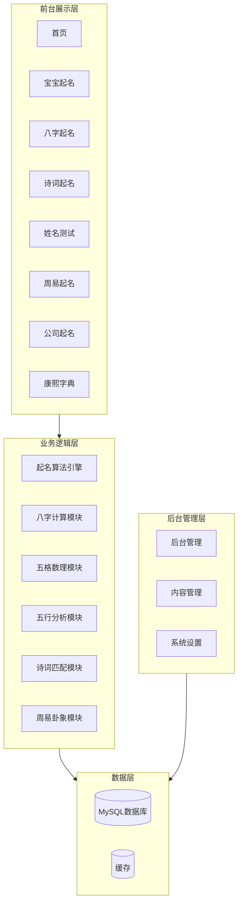
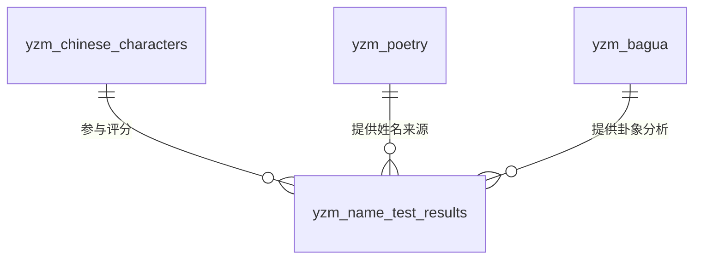
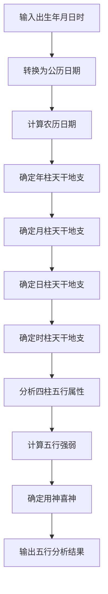

# 起名网站技术设计文档

## 基本信息

| 项目 | 内容 |
|------|------|
| **项目名称** | 起名网站系统 (QimingCMS) |
| **基于框架** | YzmCMS V7.5 |
| **版本** | 1.0.0 |
| **更新日期** | 2026-03-22 |

## 1. 系统架构

### 1.1 整体架构



### 1.2 目录结构

```
application/
├── qiming/                 # 起名系统模块
│   ├── controller/
│   │   ├── index.class.php       # 首页控制器
│   │   ├── baobao.class.php      # 宝宝起名控制器
│   │   ├── bazi.class.php        # 八字起名控制器
│   │   ├── shici.class.php       # 诗词起名控制器
│   │   ├── ceshi.class.php       # 姓名测试控制器
│   │   ├── zhouyi.class.php      # 周易起名控制器
│   │   ├── gongsi.class.php      # 公司起名控制器
│   │   ├── kxzd.class.php        # 康熙字典控制器
│   │   └── api.class.php         # API接口控制器
│   ├── model/
│   │   ├── character_model.class.php    # 汉字模型
│   │   ├── poetry_model.class.php        # 诗词模型
│   │   ├── bagua_model.class.php         # 八卦模型
│   │   └── name_model.class.php          # 姓名模型
│   └── view/
│       └── default/               # 默认模板
│           ├── index.html
│           ├── baobao.html
│           ├── bazi.html
│           ├── shici.html
│           ├── ceshi.html
│           ├── zhouyi.html
│           ├── gongsi.html
│           └── kxzd.html
```

## 2. 数据库设计

### 2.1 核心数据表

#### 汉字表 (yzm_chinese_characters)

| 字段名 | 类型 | 描述 |
|--------|------|------|
| id | int | 主键ID |
| char | varchar(10) | 汉字 |
| pinyin | varchar(50) | 拼音 |
| zhuyin | varchar(50) | 注音 |
| bushou | varchar(10) | 部首 |
| bihua | int | 总笔画 |
| wuxing | tinyint | 五行属性(1金2木3水4火5土) |
| jx | text | 康熙字典解释 |
| cy | text | 词语解释 |
| xmxy | text | 起名寓意 |

#### 诗词表 (yzm_poetry)

| 字段名 | 类型 | 描述 |
|--------|------|------|
| id | int | 主键ID |
| title | varchar(100) | 诗词标题 |
| author | varchar(50) | 作者 |
| type | tinyint | 类型(1唐诗2宋词3诗经4楚辞) |
| content | text | 诗词内容 |
| dynasty | varchar(20) | 朝代 |
| theme | varchar(50) | 主题分类 |

#### 八卦表 (yzm_bagua)

| 字段名 | 类型 | 描述 |
|--------|------|------|
| id | int | 主键ID |
| gua_name | varchar(20) | 卦名 |
| gua_ci | text | 卦辞 |
| tuan_ci | text | 彖辞 |
| xiang_ci | text | 象辞 |
| yao_ci | text | 爻辞 |
| wuxing | varchar(10) | 五行 |
| gua_image | varchar(100) | 卦象图 |

#### 姓名测试记录表 (yzm_name_test_results)

| 字段名 | 类型 | 描述 |
|--------|------|------|
| id | int | 主键ID |
| surname | varchar(10) | 姓氏 |
| name | varchar(20) | 名字 |
| tiange | int | 天格数理 |
| dice | int | 地格数理 |
| renge | int | 人格数理 |
| waige | int | 外格数理 |
| zongge | int | 总格数理 |
| total_score | int | 总分 |
| wuxing_analysis | text | 五行分析 |
| created_at | int | 创建时间 |

#### 黄历表 (yzm_horoscope)

| 字段名 | 类型 | 描述 |
|--------|------|------|
| id | int | 主键ID |
| date | date | 日期 |
| lunar_date | varchar(50) | 农历日期 |
| zodiac | varchar(10) | 生肖 |
| zodiac_year | varchar(10) | 干支年 |
| zodiac_month | varchar(10) | 干支月 |
| zodiac_day | varchar(10) | 干支日 |
| yi | text | 宜事项 |
| ji | text | 忌事项 |
| jishi | varchar(100) | 吉时 |
| caishen | varchar(20) | 财神方位 |
| xishen | varchar(20) | 喜神方位 |
| fushen | varchar(20) | 福神方位 |
| chongsha | varchar(50) | 冲煞信息 |

#### 热门排行表 (yzm_name_rankings)

| 字段名 | 类型 | 描述 |
|--------|------|------|
| id | int | 主键ID |
| char_or_name | varchar(50) | 汉字或姓名 |
| type | tinyint | 类型(1男用字2女用字3男名4女名) |
| ranking | int | 排名 |
| month | int | 统计月份 |
| search_count | int | 搜索次数 |

### 2.2 ER关系图



## 3. 核心算法设计

### 3.1 八字五行计算算法

**算法流程：**



**天干计算公式：**
```
年干 = (年份 - 3) % 10  对应天干表
年支 = (年份 - 3) % 12  对应地支表
```

**月干计算公式：**
```
月干 = (年干序号 * 2 + 月份) % 10
```

**日柱计算：**
使用蔡勒公式（Zeller's congruence）计算儒略日，再转换为干支

**时支计算：**
```
时支 = (小时 + 1) % 24 / 2  取整
```

### 3.2 五格数理算法

**计算规则：**

| 格名 | 计算方法 | 说明 |
|------|----------|------|
| 天格 | 姓笔画+1（单姓） | 祖先留下的 |
| 地格 | 名各字笔画数相加 | 名字组成的 |
| 人格 | 姓笔画+名第一字笔画 | 主人格 |
| 外格 | 总格-人格+1 | 外部影响 |
| 总格 | 姓名所有笔画相加 | 一生运势 |

**吉凶判定表（部分）：**

| 数理 | 吉凶 | 说明 |
|------|------|------|
| 1 | 大吉 | 宇宙起源，天地开泰 |
| 2 | 凶 | 根基不固，摇摇欲坠 |
| 3 | 大吉 | 进取如意， 名利双收 |
| ... | ... | ... |

### 3.3 汉字五行判定算法

**判定优先级：**

1. **部首偏旁法**（最高优先级）
   - 木部（如：林、枝、东、森）：属木
   - 火部（如：炎、焰、煜、煌）：属火
   - 土部（如：坤、培、坠、垣）：属土
   - 金部（如：铁、铜、银、锡）：属金
   - 水部（如：江、河、泉、溪）：属水

2. **字形法**
   - 方形为土（如：圆、围、国）
   - 尖锐为金（如：刀、刃、剑）
   - 曲直为木（如：曲、直）
   - 流动为水（如：流、泳、泛）
   - 燃烧为火（如：赤、炎、焱）

3. **音韵法**（辅助判定）
   - 音调平仄
   - 韵母特性

## 4. 核心组件设计

### 4.1 八字计算类 (BaziCalculator)

```php
class BaziCalculator {
    // 计算八字
    public function calculate($year, $month, $day, $hour);
    
    // 获取天干地支
    public function getGanzhi($type);
    
    // 分析五行
    public function analyzeWuxing();
    
    // 确定用神
    public function getYongshen();
}
```

### 4.2 五格计算类 (WugeCalculator)

```php
class WugeCalculator {
    // 计算五格
    public function calculate($surname, $name);
    
    // 获取笔画数
    private function getBihua($char);
    
    // 评估数理吉凶
    public function evaluate($num);
}
```

### 4.3 起名引擎 (NameEngine)

```php
class NameEngine {
    // 生成候选姓名
    public function generateNames($surname, $gender, $params);
    
    // 筛选汉字
    private function filterChars($wuxing_needed);
    
    // 组合姓名
    private function combineName($chars);
    
    // 评估姓名
    public function evaluateName($name);
}
```

## 5. 模板设计

### 5.1 首页模板结构

```html
<!-- 导航栏 -->
<header>{include file="header.html"}</header>

<!-- 搜索区域 -->
<section class="search-area">{m:include file="search.html" /}</section>

<!-- 今日黄历 -->
<section class="huangli">{m:widget action="horoscope" /}</section>

<!-- 服务入口 -->
<section class="services">{m:widget action="services" /}</section>

<!-- 热门排行 -->
<section class="rankings">{m:widget action="name_rankings" /}</section>

<!-- 知识文章 -->
<section class="articles">{m:lists modelid="5" limit="6" /}</section>

<!-- 页脚 -->
<footer>{include file="footer.html"}</footer>
```

### 5.2 起名表单模板

```html
<form class="naming-form" method="post" action="{U('qiming/bazi/submit')}">
    <div class="form-group">
        <label>姓氏</label>
        <input type="text" name="surname" required />
    </div>
    <div class="form-group">
        <label>性别</label>
        <select name="gender">
            <option value="1">男</option>
            <option value="2">女</option>
        </select>
    </div>
    <div class="form-group">
        <label>出生日期</label>
        <input type="date" name="birthdate" required />
    </div>
    <div class="form-group">
        <label>出生时辰</label>
        <select name="birthhour">
            <option value="0">子时(23-01)</option>
            <option value="1">丑时(01-03)</option>
            <!-- ... -->
        </select>
    </div>
    <button type="submit">立即起名</button>
</form>
```

## 6. 安全性设计

### 6.1 输入验证

- 所有用户输入必须经过 `safe_replace()` 和 `remove_xss()` 过滤
- 姓名输入限制为汉字
- 日期输入格式验证
- 表单令牌防止CSRF攻击

### 6.2 SQL注入防护

- 使用PDO预处理语句
- 字段名、表名白名单验证

### 6.3 文件上传安全

- 图片上传仅允许 jpg、png、gif 格式
- 上传文件重命名
- 禁止执行上传的文件

## 7. 性能优化

### 7.1 缓存策略

- 黄历数据：每日更新，缓存1天
- 热门排行：每小时更新，缓存1小时
- 汉字数据：静态数据，永久缓存
- 诗词数据：静态数据，永久缓存

### 7.2 数据库优化

- 汉字表、诗词表添加索引
- 分页查询限制每次最多100条
- 避免全表扫描

### 7.3 静态资源优化

- CSS、JS 文件合并压缩
- 图片懒加载
- CDN 加速

## 8. 开发任务清单

### 阶段一：基础搭建

| 任务 | 优先级 | 预计工时 |
|------|--------|----------|
| 创建qiming模块目录结构 | 高 | 2h |
| 创建汉字表及导入数据 | 高 | 4h |
| 创建诗词表及导入数据 | 高 | 8h |
| 创建八卦表及导入数据 | 中 | 4h |
| 创建黄历表及数据接口 | 中 | 4h |

### 阶段二：核心算法

| 任务 | 优先级 | 预计工时 |
|------|--------|----------|
| 实现八字计算类 | 高 | 8h |
| 实现五格数理计算类 | 高 | 6h |
| 实现五行分析类 | 高 | 6h |
| 实现起名引擎 | 高 | 8h |

### 阶段三：功能开发

| 任务 | 优先级 | 预计工时 |
|------|--------|----------|
| 首页开发 | 高 | 4h |
| 宝宝起名功能 | 高 | 6h |
| 八字起名功能 | 高 | 8h |
| 诗词起名功能 | 中 | 6h |
| 姓名测试功能 | 高 | 4h |
| 周易起名功能 | 中 | 6h |
| 公司起名功能 | 中 | 4h |
| 康熙字典功能 | 中 | 4h |
| 起名知识功能 | 低 | 4h |

### 阶段四：后台管理

| 任务 | 优先级 | 预计工时 |
|------|--------|----------|
| 汉字管理 | 中 | 4h |
| 诗词管理 | 中 | 4h |
| 热门排行管理 | 低 | 2h |
| 黄历数据更新 | 低 | 2h |

## 9. 测试计划

### 9.1 单元测试

- 八字计算结果准确性测试
- 五格数理计算结果准确性测试
- 汉字五行判定测试

### 9.2 功能测试

- 各功能模块表单提交测试
- 结果展示页面测试
- 搜索功能测试

### 9.3 性能测试

- 首页加载时间测试
- 起名计算响应时间测试
- 数据库查询效率测试
