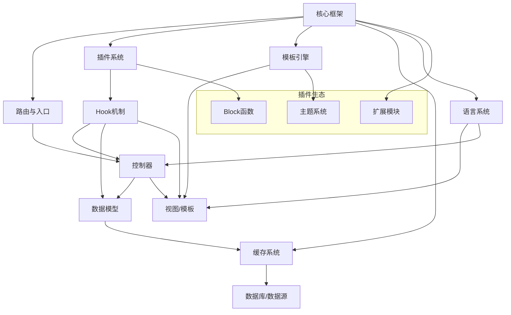
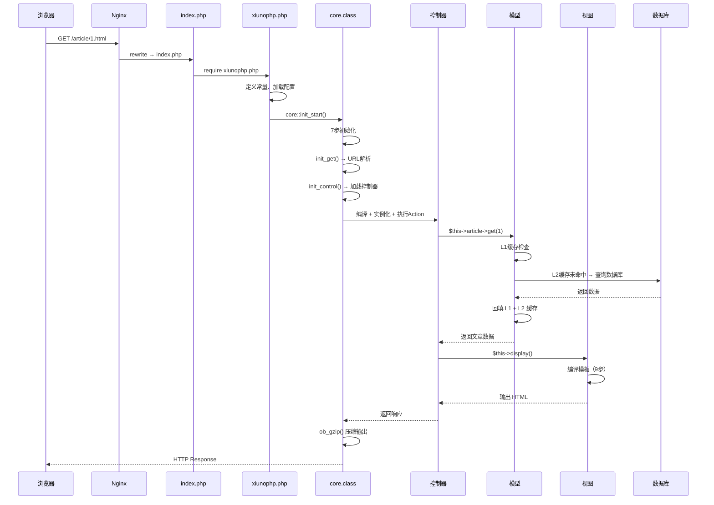
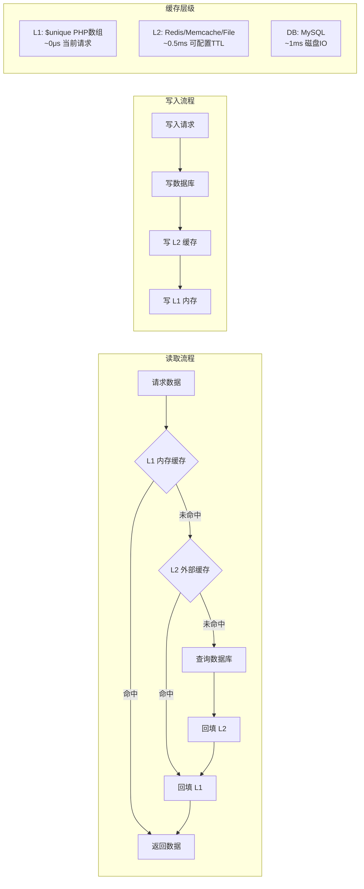
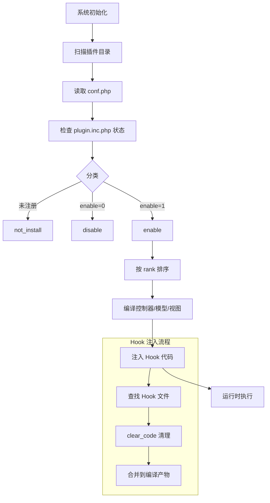

# LeCMS 开发知识库 — 附录
> 对应原文档：第 十四 篇

> **版本**: 1.0
> **更新日期**: 2026-07-25
> **框架版本**: LeCMS 3.0.3 + XiunoPHP 1.0.0
> **PHP 版本**: 5.4.0 - 8.2.x
> **数据库**: MySQL 5.6+ / MariaDB
> **协议**: MIT License

---

## 本章包含章节

- 97. 常见问题 FAQ
- 98. 学习路径建议
- 98.1 新手入门（1-2 周）
- 98.2 进阶学习（2-4 周）
- 98.3 高级提升（1-3 个月）
- 98.4 精通之路（3-6 个月）
- 99. 扩展学习资源
- 99.1 官方资源
- 99.2 推荐技术栈学习
- 99.3 开发工具推荐
- 100. 完整文件路径速查
- 100.1 核心框架文件
- 100.2 前台控制器文件
- 100.3 后台控制器文件
- 100.4 模型文件
- 100.5 Block 文件
- 100.6 配置与语言文件
- 100.7 缓存目录
- 101. 系统常量速查
- 101.1 路径常量
- 101.2 请求常量
- 101.3 功能常量
- 102. 内置模型列表
- 103. 前台控制器列表
- 104. 后台控制器列表
- 105. Block 模块完整列表
- 106. 数据库表结构
- 106.1 系统表
- 106.2 用户表
- 106.3 内容模型表结构
- 106.4 内置数据表清单

---

## 附录

---

## 97. 常见问题 FAQ

### Q1: 修改模板后不生效？

**排查步骤**:

1. 检查模板文件名是否正确（注意大小写）
2. 清理缓存目录: `runcache/lecms_view/{主题名}/`
3. 确保 DEBUG 模式已开启（开发环境设为 1）
4. 检查后台是否启用了该主题（后台 → 模板管理）
5. 检查模板路径: `view/{主题名}/{control}_{action}.htm`
6. 确认 `config.inc.php` 中的 `front_static` 路径正确

```php
// 手动清理视图缓存
_rmdir(RUNTIME_PATH.'lecms_view/'.$theme, 1);
```

### Q2: Hook 不生效？

**排查步骤**:

1. 检查插件是否已启用（后台 → 插件管理 → 确保 `enable` 为 1）
2. 清理编译缓存: `runcache/lecms_control/` 和 `runcache/lecms_model/`
3. 检查 Hook 文件名是否正确（参考命名规范）
4. 确认 Hook 文件位置：
   - 根目录: `plugin/{插件名}/{location}_{timing}.php`
   - Hook 目录: `plugin/{插件名}/hook/{location}_{timing}.php`
5. 确认核心文件中有对应的 `// hook xxx.php` 标记
6. 检查插件 `conf.php` 中的 `rank` 优先级（数字越小越先加载）
7. 确认 `plugin_disable` 配置项为 0

### Q3: 404 错误？

**排查步骤**:

1. 检查 Nginx/Apache 重写规则是否正确
2. 确认控制器文件存在且命名正确：`xxx_control.class.php`
3. 检查 Action 方法名是否正确（默认为 `index`）
4. 确认 `lecms_parseurl` 配置是否为 1（伪静态模式）
5. 检查 `config/route.inc.php` 路由规则（如果启用了 `route_open`）
6. 查看日志: `log/php_error404.php`

```php
// Nginx 伪静态规则示例
location / {
    if (!-e $request_filename){
        rewrite ^/(.*)$ /index.php last;
    }
}
```

### Q4: 类不存在错误？

```php
// 确保模型文件在 lecms/model/ 目录
// 确保文件名正确: my_model.class.php
// 确保类名正确: class my_model extends model
// 清理 runcache/lecms_model/ 目录

// 自动加载查找顺序:
// 1. 插件目录: plugin/{插件名}/model/{name}_model.class.php
// 2. 核心目录: lecms/model/{name}_model.class.php

// 如果模型在插件中，需要确保插件已启用
$this->my = core::model('my');  // 会查找 my_model
```

### Q5: 如何开启调试？

```php
// config/config.inc.php
$_ENV['_config']['debug'] = 1;        // 前台调试模式
$_ENV['_config']['debug_admin'] = 1;  // 后台调试模式

// 三种调试模式:
// DEBUG = 0: 生产模式（默认）- 关闭错误显示，记录日志
// DEBUG = 1: 开发模式 - 显示错误信息和堆栈追踪
// DEBUG = 2: 深度调试 - 开发模式 + 显示性能统计（时间、SQL、文件加载）
```

> **安全警告**: 生产环境绝对不能开启 DEBUG 模式，否则会暴露数据库配置和绝对路径。

### Q6: 缓存导致数据不更新？

```php
// 方法 1: 清理缓存目录
rm -rf runcache/lecms_view/*
rm -rf runcache/lecms_control/*

// 方法 2: 代码中清除（推荐）
$this->runtime->delete('cfg');          // 清除配置缓存
$this->runtime->truncate();             // 清空运行时缓存
$this->runtime->clear_filecache();      // 清空文件缓存
$this->runtime->clear_cache('all');     // 清空全部缓存

// 方法 3: 后台操作
// 后台 → 工具 → 清空缓存

// 方法 4: 删除特定 Block 缓存
$this->runtime->xdelete('block_list_' . md5($params));
```

### Q7: Cannot pass parameter by reference？

```php
// ❌ 错误：使用了字符串字面量
$input['title'] = form::get_text('title', '');

// ✅ 正确：先定义变量，再传入引用
$default_title = '';
$input['title'] = form::get_text('title', $default_title);
```

**原因**: PHP 不允许将函数返回值作为引用传递（从 PHP 5.4+ 开始）。

### Q8: Headers already sent 错误？

```
Warning: Cannot modify header information - headers already sent by...
```

**解决方案**:

1. 检查 PHP 文件末尾是否有 `?>` 及之后的空白字符
2. 检查文件编码是否为 UTF-8（无 BOM）
3. 检查是否有 `echo`、`print`、`var_dump` 在 header 之前
4. 使用 `ob_start()` 开启输出缓冲

```php
// 在文件开头添加输出缓冲
ob_start();
// ... 业务代码
ob_end_flush();
```

### Q9: 插件无法删除？

```php
// 原因: 系统内置插件有 system=1 标记
// 解决方案: 禁用即可，不要删除系统插件

// 检查是否是系统插件
$plugin = $this->kv->get('plugin_xxx');
if($plugin['system']) {
    // 系统插件只能禁用，不能删除
}
```

### Q10: 移动端模板不生效？

**排查步骤**:

1. 确认 `config.inc.php` 中已启用移动端检测
2. 确认移动端模板目录存在: `view/mobile/`
3. 检查 `runtime_model.xget()` 中的 `open_mobile_view` 配置
4. 确认移动端模板中包含必需的模板文件

```php
// 移动端模板切换逻辑（runtime_model::xget）
if(!empty($cfg['open_mobile_view']) && is_mobile()==1){
    $this->data['cfg']['theme'] = $cfg['mobile_view'] ?: 'mobile';
    $this->data['cfg']['tpl'] = $cfg['webdir'].'view/'.$this->data['cfg']['theme'].'/';
}
```

### Q11: 批量导入内容失败？

```php
// 常见原因:
// 1. PHP 最大执行时间限制 → 增加 max_execution_time
// 2. 内存不足 → 分批处理（每次 100 条）
// 3. MySQL 锁等待 → 调整事务隔离级别

// 推荐方案: 使用命令行
php cli/import.php --file=data.csv --batch=100
```

### Q12: 如何升级 LeCMS？

**升级步骤**:

1. 备份数据库和文件
2. 下载新版本
3. 保留 `config/config.inc.php` 和 `view/` 目录
4. 覆盖其他文件
5. 访问 `/install/` 执行数据库升级
6. 清理缓存: 后台 → 工具 → 清空缓存

---

## 97.5 术语表

| 术语 | 英文 | 详细定义 | 来源位置 |
|------|------|---------|---------|
| **LeCMS** | LeCMS | 基于 XiunoPHP 框架开发的内容管理系统，采用 MVC 架构和编译型模板引擎 | 项目整体 |
| **XiunoPHP** | XiunoPHP | LeCMS 底层框架，版本 1.0.0，提供核心类库（core/model/control/view/debug/log） | `lecms/xiunophp/` |
| **CMS** | Content Management System | 内容管理系统，用于创建、编辑、发布和管理数字内容的应用程序 | 系统定位 |
| **插件（Plugin）** | Plugin | 可选的外部模块，通过 Hook 编译时注入机制扩展系统能力，位于 `lecms/plugin/` 目录 | `lecms/plugin/` |
| **钩子（Hook）** | Hook | 系统预定义的扩展点，通过 `// hook xxx.php` 注释标记，编译时注入插件代码 | `core.class.php` |
| **过滤器（Filter）** | Filter | 一种 Hook 形式，对数据进行修改处理（LeCMS 中与 Hook 统一实现） | Hook 机制 |
| **动作（Action）** | Action | 一种 Hook 形式，在事件触发时执行自定义动作（LeCMS 中与 Hook 统一实现） | Hook 机制 |
| **模板引擎** | Template Engine | 将模板语言（inc/hook/block/loop/if/lang）编译为 PHP 代码并渲染的组件 | `view.class.php` |
| **模板（Template）** | Template | 以 `.htm` 为扩展名的模板文件，包含占位变量与自定义标签指令 | `view/{theme}/` |
| **主题（Theme）** | Theme | 一组模板和资源的集合，定义站点外观与布局，位于 `view/` 目录下 | `view/default/` |
| **视图（View）** | View | 负责模板渲染和变量注入的组件，将 .htm 编译为 PHP 并执行 | `view.class.php` |
| **控制器（Controller）** | Controller | 处理用户请求、协调模型与视图的入口点，URL 格式为 `ctrl-act` | `control/` |
| **模型（Model）** | Model | 封装数据访问和业务规则的组件，提供统一 CRUD 接口和二级缓存 | `model.class.php` |
| **路由（Routing）** | Routing | 将 URL 请求映射到控制器与动作的机制，支持自定义路由规则 | `core.class.php` |
| **伪静态（Pretty URL）** | Pretty URL | 将动态 URL（如 `index.php?article-1.html`）重写为易读形式 | `config.inc.php` |
| **运行时缓存（Runtime Cache）** | Runtime Cache | 将编译后的控制器/模型/视图/语言包缓存到磁盘的目录 | `runcache/` |
| **二级缓存（L2 Cache）** | L2 Cache | 对复杂查询或数据集的第二层缓存，使用 Redis/Memcache/File，降低数据库访问 | `model.class.php` |
| **语言包（Language Pack）** | Language Pack | 存放于 `lecms/lang/` 的文本资源文件，用于多语言本地化 | `lecms/lang/` |
| **i18n（国际化）** | Internationalization | 国际化处理流程，包括语言包加载、运行时合并、模板文本替换 | `core::init_lang()` |
| **日志与观测（Observability）** | Observability | 系统日志、追踪、性能指标等用于监控与调试的能力 | `log.class.php` |
| **版本管理（CHANGELOG）** | CHANGELOG | 记录版本演进、变更内容、兼容性说明和回滚要点的文档 | 项目文档 |
| **KV 存储** | Key-Value Store | 基于 `only_alias` 表的键值对存储模型，通过 `kv_get()`/`kv_set()` 访问 | `kv_model.class.php` |
| **runtime_model** | Runtime Model | 运行时配置模型，通过 `xget()`/`xset()`/`xsave()` 读写配置，存储在 `runtime` 表 | `runtime_model.class.php` |
| **form_hash** | Form Hash | CSRF 防护令牌，表单提交时生成哈希值，防止跨站请求伪造 | `base.func.php` |
| **block** | Block | 模板数据标签系统，以 `block_xxx.lib.php` 形式提供，在模板中调用 | `lecms/block/` |
| **runcache** | Runtime Cache | 编译缓存目录，存放模板、语言包、控制器的编译后 PHP 文件 | `runcache/` |

---

## 98. 学习路径建议

### 98.1 新手入门（1-2 周）

```
第1周目标：了解 LeCMS 基础，能制作简单模板

第1-2天:
□ 了解 LeCMS 目录结构
□ 理解 MVC 分层架构
□ 熟悉入口文件 index.php 的执行流程

第3-4天:
□ 学习模板标签语法
  - 变量输出: {$title}
  - 循环标签: {loop $list $k $v} ... {/loop}
  - 条件标签: {if $condition} ... {/if}
  - 包含模板: {inc:header}
  - Block 调用: {block:list cid=1 limit=5} ... {/block}
  - Hook 标签: {hook:xxx}

第5-7天:
□ 创建第一个简单主题
□ 学习模板继承和复用
□ 使用 Block 模块调用数据

第2周目标：制作第一个插件

第8-10天:
□ 学习 le_links 插件源码（简单 Block 类型）
□ 学习 le_rand_pic 插件源码（Hook 类型）
□ 了解插件目录结构和配置文件

第11-14天:
□ 创建第一个简单插件
□ 理解 Hook 机制
□ 完成插件开发并安装启用
```

### 98.2 进阶学习（2-4 周）

```
第3-4周目标：开发功能完整的插件

第15-18天:
□ 学习 le_batch_reg_user 插件源码（Tool 类型）
□ 学习自定义路由系统（route.inc.php）
□ 开发一个完整的 Block 类型插件
□ 使用 Layui 开发后台管理界面

第19-21天:
□ 学习 KV 缓存和运行时缓存的使用
□ 学习模型扩展方法（xadd, xdelete）
□ 掌握 form 表单类

第22-28天:
□ 开发带后台管理的插件
□ 学习多语言支持
□ 提交第一个插件到社区
```

### 98.3 高级提升（1-3 个月）

```
第2-3个月目标：深入框架，开发复杂功能

第1个月:
□ 研究 le_site_group 插件源码（复杂 Hook + 多模块）
□ 开发 Control 类型插件（自定义控制器）
□ 深入学习 XiunoPHP 框架源码
  - core.class.php 框架启动流程
  - model.class.php ORM 机制
  - view.class.php 模板编译
□ 研究 LeCMS 核心文件
  - runtime_model 缓存机制
  - user_model 用户系统
  - urls_model URL 管理

第2-3个月:
□ 学习 URL 伪静态和自定义路由
□ 研究表单验证和安全机制
□ 学习性能优化技巧
  - 缓存策略
  - 数据库优化
  - 静态资源优化
□ 在实际项目中开发复杂功能
□ 为开源社区贡献代码
```

### 98.4 精通之路（3-6 个月）

```
第4-6个月目标：掌握框架精髓，能够二次开发

第4-5个月:
□ 深入研究框架编译机制
  - 控制器编译 (process_all)
  - 模型编译
  - 模板编译
  - Hook 处理 (process_hook)
□ 开发 UI 类型插件（完整的后台管理界面）
□ 学习数据库设计规范
□ 深入理解二级缓存机制

第6个月:
□ 二次开发核心功能
□ 优化系统性能（大流量场景）
□ 研究安全防护机制
□ 开发商业级插件
□ 撰写技术博客或教程
```

---

## 99. 扩展学习资源

### 99.1 官方资源

| 资源 | 地址 | 说明 |
|------|------|------|
| LeCMS 官方网站 | https://www.lecms.cc/ | 官方主页 |
| 官方论坛 | https://www.lecms.cc/?forum-4.htm | CMS 教程论坛 |
| 模板手册 | https://www.lecms.cc/?forum-7.htm | 前端模板制作教程 |
| 插件分享 | https://www.lecms.cc/?forum-6.htm | 插件下载与分享 |
| 问题交流 | https://www.lecms.cc/?forum-3.htm | 问题求助论坛 |
| QQ 交流群 | 797599080 | 开发者交流群 |
| GitHub | https://github.com/lecms/lecms | 源码仓库 |

### 99.2 推荐技术栈学习

| 技术 | 用途 | 学习优先级 | 建议学习资源 |
|------|------|-----------|-------------|
| PHP 7.x | 后端开发语言 | 必学 | PHP 官方文档、PHP: The Right Way |
| MySQL | 数据库 | 必学 | MySQL 官方文档、高性能 MySQL |
| SQL 优化 | 查询优化 | 必学 |  EXPLAIN 分析、索引优化 |
| jQuery | 前端交互 | 推荐 | jQuery 官方文档 |
| Layui | 后台 UI 框架 | 推荐 | Layui 官方文档 |
| HTML/CSS | 模板制作 | 推荐 | MDN Web Docs |
| JavaScript ES6+ | 前端逻辑 | 推荐 | JavaScript.info |
| Nginx | Web 服务器 | 推荐 | Nginx 官方文档 |
| Linux | 服务器运维 | 推荐 | Linux 命令大全 |
| Git | 版本控制 | 推荐 | Git 官方文档、Pro Git |
| Redis | 可选缓存 | 进阶 | Redis 官方文档 |

### 99.3 开发工具推荐

| 工具 | 用途 | 推荐度 | 说明 |
|------|------|--------|------|
| PhpStorm | PHP IDE | 五星 | 智能代码补全、调试、重构 |
| VS Code | 轻量编辑器 | 四星 | 插件丰富、免费 |
| Navicat | 数据库管理 | 四星 | 可视化数据库操作 |
| DBeaver | 数据库管理 | 四星 | 免费开源，支持多数据库 |
| Postman | API 测试 | 四星 | HTTP 请求测试 |
| Git | 版本控制 | 五星 | 必学 |
| Nginx | Web 服务器 | 五星 | 高并发场景首选 |
| XDebug | PHP 调试 | 五星 | 断点调试 |
| Composer | 依赖管理 | 四星 | PHP 包管理 |
| phpMyAdmin | 数据库管理 | 三星 | Web 端管理 |
| Beyond Compare | 文件对比 | 四星 | 代码对比工具 |
| ProcessOn | 流程图 | 三星 | 架构设计 |
| Markdown | 文档编写 | 四星 | Typora / VS Code |
| FileZilla | FTP 客户端 | 四星 | 文件上传 |
| Xshell + Xftp | SSH 终端 | 四星 | 远程服务器管理 |

---

## 100. 完整文件路径速查

### 100.1 核心框架文件

| 功能 | 相对路径 | 说明 |
|------|---------|------|
| 前台入口 | `index.php` | 前台程序入口 |
| 后台入口 | `admin/index.php` | 后台程序入口 |
| 框架入口 | `lecms/xiunophp/xiunophp.php` | XiunoPHP 框架入口，定义所有常量 |
| 合并文件 | `runcache/_lecms.php` | 框架核心合并文件（生产模式） |
| 核心类 | `lecms/xiunophp/lib/core.class.php` | 框架核心类（启动、编译、Hook） |
| 控制器基类 | `lecms/xiunophp/lib/control.class.php` | 前台/后台控制器基类 |
| 模型基类 | `lecms/xiunophp/lib/model.class.php` | ORM 模型基类（含二级缓存） |
| 视图类 | `lecms/xiunophp/lib/view.class.php` | 模板编译和渲染 |
| 调试类 | `lecms/xiunophp/lib/debug.class.php` | 错误处理和调试 |
| 日志类 | `lecms/xiunophp/lib/log.class.php` | 日志记录 |
| 基础函数 | `lecms/xiunophp/lib/base.func.php` | 全局工具函数集合 |
| 表单类 | `lecms/xiunophp/ext/form.class.php` | Layui 表单元素生成 |

### 100.2 前台控制器文件

| 控制器 | 文件路径 | 默认 Action | 说明 |
|--------|---------|------------|------|
| 前台基类 | `lecms/control/base_control.class.php` | - | 所有前台控制器的基类 |
| 首页 | `lecms/control/index_control.class.php` | index | 网站首页 |
| 内容详情 | `lecms/control/show_control.class.php` | index | 内容详情页 |
| 内容列表 | `lecms/control/cate_control.class.php` | index | 分类内容列表 |
| 搜索 | `lecms/control/search_control.class.php` | index | 搜索页面 |
| 标签 | `lecms/control/tag_control.class.php` | index | 标签列表 |
| 评论 | `lecms/control/comment_control.class.php` | index | 评论处理 |
| 附件 | `lecms/control/attach_control.class.php` | index | 文件下载 |
| 用户 | `lecms/control/user_control.class.php` | index | 用户注册/登录 |
| 会员中心 | `lecms/control/my_control.class.php` | index | 会员中心 |
| 个人空间 | `lecms/control/space_control.class.php` | index | 用户空间 |
| 站点地图 | `lecms/control/sitemap_control.class.php` | index | XML 站点地图 |
| 模型 | `lecms/control/model_control.class.php` | index | 模型管理路由 |
| 标签页 | `lecms/control/tag_control.class.php` | tag | 标签页面 |
| 浏览统计 | `lecms/control/views_control.class.php` | index | 浏览量处理 |
| 旗帜标记 | `lecms/control/flags_control.class.php` | index | 旗帜/标记 |
| 404页面 | `lecms/control/error404_control.class.php` | index | 404 错误页 |
| URL解析 | `lecms/control/parseurl_control.class.php` | index | 伪静态 URL 解析 |

### 100.3 后台控制器文件

| 控制器 | 文件路径 | 说明 |
|--------|---------|------|
| 后台基类 | `admin/control/admin_control.class.php` | 所有后台控制器的基类 |
| 后台首页 | `admin/control/index_control.class.php` | 后台仪表盘 |
| 系统设置 | `admin/control/setting_control.class.php` | 基本/SEO/链接/用户/安全等设置 |
| 分类管理 | `admin/control/category_control.class.php` | 分类增删改查 |
| 内容管理 | `admin/control/content_control.class.php` | 内容发布和管理 |
| 模型管理 | `admin/control/models_control.class.php` | 内容模型管理 |
| 页面管理 | `admin/control/cms_page_control.class.php` | 单页管理 |
| 标签管理 | `admin/control/tag_control.class.php` | 标签管理 |
| 评论管理 | `admin/control/comment_control.class.php` | 评论审核 |
| 用户管理 | `admin/control/user_control.class.php` | 用户管理 |
| 用户组管理 | `admin/control/user_group_control.class.php` | 用户组权限 |
| 会员中心 | `admin/control/my_control.class.php` | 后台个人中心 |
| 插件管理 | `admin/control/plugin_control.class.php` | 插件安装/卸载 |
| 模板管理 | `admin/control/theme_control.class.php` | 模板切换 |
| 导航管理 | `admin/control/navigate_control.class.php` | 导航链接管理 |
| 附件管理 | `admin/control/attach_manage_control.class.php` | 附件管理 |
| 工具 | `admin/control/tool_control.class.php` | 清缓存/重建统计 |
| 数据库字典 | `admin/control/db_control.class.php` | 数据表结构查看 |
| 旗帜管理 | `admin/control/flags_control.class.php` | 旗帜/标记管理 |

### 100.4 模型文件

| 模型 | 文件路径 | 表名 | 主键 | 自增字段 |
|------|---------|------|------|---------|
| 分类 | `lecms/model/category_model.class.php` | `category` | `cid` | `cid` |
| 内容 | `lecms/model/cms_content_model.class.php` | `cms_{table}` | `id` | `id` |
| 内容数据 | `lecms/model/cms_content_data_model.class.php` | `cms_{table}_data` | `id` | - |
| 内容附件 | `lecms/model/cms_content_attach_model.class.php` | `cms_{table}_attach` | `aid` | `aid` |
| 内容评论 | `lecms/model/cms_content_comment_model.class.php` | `cms_content_comment` | `cid` | `cid` |
| 评论分类 | `lecms/model/cms_content_comment_sort_model.class.php` | `cms_content_comment_sort` | `cid` | `cid` |
| 内容标记 | `lecms/model/cms_content_flag_model.class.php` | `cms_{table}_flag` | `flag,id` | - |
| 内容标签 | `lecms/model/cms_content_tag_model.class.php` | `cms_{table}_tag` | `tagid` | `tagid` |
| 标签数据 | `lecms/model/cms_content_tag_data_model.class.php` | `cms_{table}_tag_data` | `tagid,id` | - |
| 浏览统计 | `lecms/model/cms_content_views_model.class.php` | `cms_{table}_views` | `id` | - |
| 单页 | `lecms/model/cms_page_model.class.php` | `cms_page` | `id` | `id` |
| 自定义 | `lecms/model/custom_model.class.php` | `custom` | - | - |
| KV 存储 | `lecms/model/kv_model.class.php` | `kv` | `k` | - |
| 模型定义 | `lecms/model/models_model.class.php` | `models` | `mid` | `mid` |
| 别名 | `lecms/model/only_alias_model.class.php` | `only_alias` | - | - |
| 运行时缓存 | `lecms/model/runtime_model.class.php` | `runtime` | `k` | - |
| URL | `lecms/model/urls_model.class.php` | `urls` | - | - |
| 用户组 | `lecms/model/user_group_model.class.php` | `user_group` | `groupid` | `groupid` |
| 用户 | `lecms/model/user_model.class.php` | `user` | `uid` | `uid` |

### 100.5 Block 文件

| Block 名称 | 文件路径 | 说明 |
|-----------|---------|------|
| 内容列表 | `lecms/block/block_list.lib.php` | 通用内容列表 |
| 内容列表（多个） | `lecms/block/block_lists.lib.php` | 多个列表 |
| 逐条内容 | `lecms/block/block_listeach.lib.php` | 逐条遍历 |
| 随机内容 | `lecms/block/block_list_rand.lib.php` | 随机排序 |
| 排行内容 | `lecms/block/block_list_top.lib.php` | 按浏览量排行 |
| 按 ID | `lecms/block/block_list_by_id.lib.php` | 指定 ID 列表 |
| 按分类 | `lecms/block/block_list_by_tagid.lib.php` | 按标签 ID |
| 按标签名 | `lecms/block/block_list_by_tagname.lib.php` | 按标签名称 |
| 按关键词 | `lecms/block/block_list_by_keywords.lib.php` | 关键词搜索 |
| 按 UID | `lecms/block/block_list_by_uid.lib.php` | 指定用户内容 |
| 按字段 | `lecms/block/block_list_by_field.lib.php` | 按自定义字段 |
| 标记内容 | `lecms/block/block_list_flag.lib.php` | 标记属性内容 |
| 前后内容 | `lecms/block/block_list_prev_next.lib.php` | 上一篇/下一篇 |
| 随机子分类 | `lecms/block/block_list_rand_by_cid.lib.php` | 随机子分类内容 |
| 内容详情 | `lecms/block/block_global_show.lib.php` | 单条内容详情 |
| 分类信息 | `lecms/block/block_global_cate.lib.php` | 分类信息 |
| 分类导航 | `lecms/block/block_category.lib.php` | 分类导航树 |
| 分类列表 | `lecms/block/block_category_info.lib.php` | 分类列表 |
| 最新分类 | `lecms/block/block_category_new.lib.php` | 最新分类 |
| 分类树 | `lecms/block/block_category_tree.lib.php` | 分类树形结构 |
| 标签列表 | `lecms/block/block_taglist.lib.php` | 标签云 |
| 标签列表随机 | `lecms/block/block_taglist_rand.lib.php` | 随机标签 |
| 标签信息 | `lecms/block/block_tag_by_info.lib.php` | 单个标签信息 |
| 标签相似 | `lecms/block/block_taglike.lib.php` | 相似标签 |
| 评论列表 | `lecms/block/block_comment.lib.php` | 评论列表 |
| 评论列表2 | `lecms/block/block_comment_list.lib.php` | 评论列表 |
| 导航 | `lecms/block/block_navigate.lib.php` | 导航链接 |
| 用户信息 | `lecms/block/block_user_info.lib.php` | 用户信息 |
| 用户列表 | `lecms/block/block_user_list.lib.php` | 用户列表 |
| 个人空间 | `lecms/block/block_global_space.lib.php` | 用户空间 |
| 博客 | `lecms/block/block_global_blog.lib.php` | 博客列表 |
| 搜索 | `lecms/block/block_global_search.lib.php` | 搜索表单 |
| 全局标签 | `lecms/block/block_global_tag.lib.php` | 全局标签 |
| 全局标签列表 | `lecms/block/block_global_taglist.lib.php` | 全局标签列表 |
| 全局用户 | `lecms/block/block_global_user.lib.php` | 全局用户 |
| 全局评论 | `lecms/block/block_global_comment.lib.php` | 全局评论 |
| 全局旗帜 | `lecms/block/block_global_flags.lib.php` | 全局标记 |
| 全局页面 | `lecms/block/block_global_page.lib.php` | 单页内容 |
| SQL查询 | `lecms/block/block_sql.lib.php` | 自定义 SQL |
| 统计日期 | `lecms/block/block_content_total_by_date.lib.php` | 按日期统计 |
| 统计数据 | `lecms/block/block_data_total.lib.php` | 数据统计 |

### 100.6 配置与语言文件

| 类型 | 路径 | 说明 |
|------|------|------|
| 主配置 | `lecms/config/config.inc.php` | 核心配置 |
| 插件配置 | `lecms/config/plugin.inc.php` | 插件状态 |
| 路由配置 | `lecms/config/route.inc.php` | 自定义路由 |
| 前台语言 | `lecms/lang/zh-cn.php` | 前台中文 |
| 后台语言 | `lecms/lang/zh-cn_admin.php` | 后台中文 |
| 前台语言(EN) | `lecms/lang/en.php` | 前台英文 |
| 后台语言(EN) | `lecms/lang/en_admin.php` | 后台英文 |
| 框架语言 | `lecms/xiunophp/lang/zh-cn.php` | 框架中文 |
| 框架语言(EN) | `lecms/xiunophp/lang/en.php` | 框架英文 |

### 100.7 缓存目录

| 缓存类型 | 目录路径 | 说明 |
|---------|---------|------|
| 合并文件 | `runcache/_lecms.php` | 框架核心合并文件 |
| 控制器编译 | `runcache/lecms_control/` | 控制器编译缓存 |
| 模型编译 | `runcache/lecms_model/` | 模型编译缓存 |
| 模板编译 | `runcache/lecms_view/{主题}/` | 模板编译缓存 |
| 文件缓存 | `runcache/filecache/` | 文件缓存 |
| 运行时缓存 | `runcache/runtime_cache/` | 运行时数据缓存 |
| 后台控制器 | `runcache/admin_control/` | 后台控制器编译 |
| 后台模型 | `runcache/admin_model/` | 后台模型编译 |
| 框架语言 | `runcache/core_lang/` | 框架语言包编译 |
| LeCMS语言 | `runcache/lang/` | LeCMS 语言包编译 |

---

## 101. 系统常量速查

### 101.1 路径常量

| 常量 | 定义位置 | 值 | 说明 |
|------|---------|------|------|
| `ROOT_PATH` | `index.php` | `{项目根目录}/` | 网站根目录 |
| `APP_NAME` | `xiunophp.php` | `'lecms'` | 应用目录名 |
| `APP_PATH` | `xiunophp.php` | `ROOT_PATH.APP_NAME.'/'` | 应用根目录 |
| `FRAMEWORK_PATH` | `xiunophp.php` | `APP_PATH.'xiunophp/'` | 框架目录 |
| `CONFIG_PATH` | `xiunophp.php` | `APP_PATH.'config/'` | 配置目录 |
| `CONTROL_PATH` | `xiunophp.php` | `APP_PATH.'control/'` | 控制器目录 |
| `BLOCK_PATH` | `xiunophp.php` | `APP_PATH.'block/'` | Block 目录 |
| `MODEL_PATH` | `xiunophp.php` | `APP_PATH.'model/'` | 模型目录 |
| `VIEW_PATH` | `xiunophp.php` | `ROOT_PATH.'view/'` | 模板目录 |
| `LOG_PATH` | `xiunophp.php` | `ROOT_PATH.'log/'` | 日志目录 |
| `PLUGIN_PATH` | `xiunophp.php` | `APP_PATH.'plugin/'` | 插件目录 |
| `LANG_PATH` | `xiunophp.php` | `APP_PATH.'lang/'` | 语言包目录 |
| `RUNTIME_PATH` | `xiunophp.php` | `ROOT_PATH.'runcache/'` | 缓存目录 |
| `RUNTIME_MODEL` | `xiunophp.php` | `RUNTIME_PATH.APP_NAME.'_model/'` | 模型编译目录 |
| `RUNTIME_CONTROL` | `xiunophp.php` | `RUNTIME_PATH.APP_NAME.'_control/'` | 控制器编译目录 |

**实际路径示例**:

```
ROOT_PATH          = D:/phpstudy_pro/WWW/aimuchen100.com/
APP_NAME           = lecms
APP_PATH           = D:/phpstudy_pro/WWW/aimuchen100.com/lecms/
FRAMEWORK_PATH     = D:/phpstudy_pro/WWW/aimuchen100.com/lecms/xiunophp/
CONFIG_PATH        = D:/phpstudy_pro/WWW/aimuchen100.com/lecms/config/
CONTROL_PATH       = D:/phpstudy_pro/WWW/aimuchen100.com/lecms/control/
BLOCK_PATH         = D:/phpstudy_pro/WWW/aimuchen100.com/lecms/block/
MODEL_PATH         = D:/phpstudy_pro/WWW/aimuchen100.com/lecms/model/
VIEW_PATH          = D:/phpstudy_pro/WWW/aimuchen100.com/view/
LOG_PATH           = D:/phpstudy_pro/WWW/aimuchen100.com/log/
PLUGIN_PATH        = D:/phpstudy_pro/WWW/aimuchen100.com/lecms/plugin/
LANG_PATH          = D:/phpstudy_pro/WWW/aimuchen100.com/lecms/lang/
RUNTIME_PATH       = D:/phpstudy_pro/WWW/aimuchen100.com/runcache/
```

### 101.2 请求常量

| 常量 | 定义位置 | 值 | 说明 |
|------|---------|------|------|
| `NOW_TIME` | `xiunophp.php` | `$_SERVER['REQUEST_TIME']` | 当前请求时间戳 |
| `REQUEST_METHOD` | `xiunophp.php` | `$_SERVER['REQUEST_METHOD']` | 请求方法 |
| `IS_GET` | `xiunophp.php` | `REQUEST_METHOD == 'GET'` | 是否为 GET 请求 |
| `IS_POST` | `xiunophp.php` | `REQUEST_METHOD == 'POST'` | 是否为 POST 请求 |
| `IS_PUT` | `xiunophp.php` | `REQUEST_METHOD == 'PUT'` | 是否为 PUT 请求 |
| `IS_DELETE` | `xiunophp.php` | `REQUEST_METHOD == 'DELETE'` | 是否为 DELETE 请求 |
| `IS_AJAX` | `xiunophp.php` | 检查 X-Requested-With | 是否为 AJAX 请求 |
| `HTTP` | `xiunophp.php` | `http()` | 当前协议 |
| `MEMORY_LIMIT_ON` | `xiunophp.php` | `function_exists(...)` | 是否支持内存检测 |
| `DEBUG` | `xiunophp.php` | `(int)$_ENV['_config']['debug']` | 前台调试模式 |
| `MAGIC_QUOTES_GPC` | `xiunophp.php` | `ini_set(...)` | 是否开启魔术引号 |
| `FRAMEWORK_VERSION` | `xiunophp.php` | `'1.0.0'` | XiunoPHP 版本号 |
| `CODE_COMPRESS` | `index.php` | `0` | 代码压缩开关 |

**后台特有常量**:

| 常量 | 定义位置 | 值 | 说明 |
|------|---------|------|------|
| `F_APP_NAME` | `admin/index.php` | `'admin'` | 后台应用标识 |

### 101.3 运行时变量（$_ENV）

| 变量 | 类型 | 说明 |
|------|------|------|
| `$_ENV['_config']` | array | 全局配置数组 |
| `$_ENV['_time']` | int | 请求开始时间戳 |
| `$_ENV['_start_time']` | float | 程序启动时间（microtime） |
| `$_ENV['_start_memory']` | int | 程序启动内存（bytes） |
| `$_ENV['_ip']` | string | 客户端 IP |
| `$_ENV['_longip']` | int | 客户端 IP（长整型） |
| `$_ENV['_sqls']` | array | SQL 查询日志 |
| `$_ENV['_include']` | array | 自动加载的文件列表 |
| `$_ENV['_sqlnum']` | int | SQL 查询计数 |
| `$_ENV['_method']` | string | HTTP 请求方法 |
| `$_ENV['_trace']` | string | 跟踪日志 |
| `$_ENV['_exception']` | int | 异常标记（防止重复输出） |
| `$_ENV['_models']` | array | 已加载的模型实例缓存 |
| `$_ENV['_theme']` | string | 当前主题名称 |
| `$_ENV['_tplname']` | string | 当前模板文件名 |

---

## 102. 内置模型列表

LeCMS 内置 19 个模型，涵盖内容管理、用户系统、分类、缓存等核心功能。

| 序号 | 模型类名 | 表名 | 主键 | 自增字段 | 说明 | 关键 Hook |
|------|---------|------|------|---------|------|----------|
| 1 | `category` | `category` | `cid` | `cid` | 内容分类 | - |
| 2 | `cms_content` | `cms_{table}` | `id` | `id` | 内容主表 | - |
| 3 | `cms_content_data` | `cms_{table}_data` | `id` | - | 内容详情 | - |
| 4 | `cms_content_attach` | `cms_{table}_attach` | `aid` | `aid` | 内容附件 | - |
| 5 | `cms_content_comment` | `cms_content_comment` | `cid` | `cid` | 评论 | - |
| 6 | `cms_content_comment_sort` | `cms_content_comment_sort` | `cid` | `cid` | 评论分类 | - |
| 7 | `cms_content_flag` | `cms_{table}_flag` | `flag,id` | - | 内容标记 | - |
| 8 | `cms_content_tag` | `cms_{table}_tag` | `tagid` | `tagid` | 标签 | - |
| 9 | `cms_content_tag_data` | `cms_{table}_tag_data` | `tagid,id` | - | 标签关联 | - |
| 10 | `cms_content_views` | `cms_{table}_views` | `id` | - | 浏览量 | - |
| 11 | `cms_page` | `cms_page` | `id` | `id` | 单页 | - |
| 12 | `custom` | `custom` | - | - | 自定义数据 | - |
| 13 | `kv` | `kv` | `k` | - | 键值存储 | - |
| 14 | `models` | `models` | `mid` | `mid` | 内容模型定义 | `models_model_*` |
| 15 | `only_alias` | `only_alias` | - | - | 别名管理 | - |
| 16 | `runtime` | `runtime` | `k` | - | 运行时缓存 | `runtime_model_*` |
| 17 | `urls` | `urls` | - | - | URL 管理 | - |
| 18 | `user_group` | `user_group` | `groupid` | `groupid` | 用户组 | - |
| 19 | `user` | `user` | `uid` | `uid` | 用户 | - |

> **注意**: `cms_content` 及其相关表（data, attach, flag, tag, tag_data, views）的表名中的 `{table}` 会根据模型定义动态替换为实际的 `tablename`。

---

## 103. 前台控制器列表

LeCMS 前台共 17 个控制器文件（含抽象基类），其中 16 个可访问。

| 序号 | 控制器类名 | 文件 | URL 路由 | 默认 Action | 继承关系 | 说明 |
|------|-----------|------|---------|------------|---------|------|
| 1 | `base_control` | `base_control.class.php` | - | - | `control` | **抽象基类**，所有前台控制器继承 |
| 2 | `index_control` | `index_control.class.php` | `index` | `index` | `base_control` | 网站首页 |
| 3 | `show_control` | `show_control.class.php` | `show` | `index` | `base_control` | 内容详情页 |
| 4 | `cate_control` | `cate_control.class.php` | `cate` | `index` | `base_control` | 分类列表页 |
| 5 | `search_control` | `search_control.class.php` | `search` | `index` | `base_control` | 搜索页 |
| 6 | `tag_control` | `tag_control.class.php` | `tag` | `index` / `tag` | `base_control` | 标签页 |
| 7 | `comment_control` | `comment_control.class.php` | `comment` | `index` | `base_control` | 评论提交/显示 |
| 8 | `attach_control` | `attach_control.class.php` | `attach` | `index` | `base_control` | 附件下载 |
| 9 | `user_control` | `user_control.class.php` | `user` | `index` | `base_control` | 用户注册/登录 |
| 10 | `my_control` | `my_control.class.php` | `my` | `index` | `base_control` | 会员中心 |
| 11 | `space_control` | `space_control.class.php` | `space` | `index` | `base_control` | 用户空间 |
| 12 | `sitemap_control` | `sitemap_control.class.php` | `sitemap` | `index` | `base_control` | XML 站点地图 |
| 13 | `model_control` | `model_control.class.php` | `model` | `index` | `base_control` | 模型路由 |
| 14 | `views_control` | `views_control.class.php` | `views` | `index` | `base_control` | 浏览量统计 |
| 15 | `flags_control` | `flags_control.class.php` | `flags` | `index` | `base_control` | 旗帜标记 |
| 16 | `error404_control` | `error404_control.class.php` | `error404` | `index` | `control` | 404 错误页 |
| 17 | `parseurl_control` | `parseurl_control.class.php` | `parseurl` | `index` | `control` | URL 伪静态解析 |

**前台控制器关键属性** (`base_control`):

```php
class base_control extends control{
    public $_cfg = array();          // 全站配置参数
    public $_user = array();         // 登录用户信息
    public $_uid = 0;                // 用户 ID
    public $_group = array();        // 用户组信息
    public $_user_avatar = '';       // 用户头像
    public $_author = '';            // 作者昵称
    public $_login_url = '';         // 登录链接
    public $_register_url = '';      // 注册链接
    public $_my_url = '';            // 个人中心
    public $_logout_url = '';        // 退出链接
    public $_search_url = '';        // 搜索链接
    public $_current_url = '';       // 当前页面 URL
    public $_parseurl = 0;           // 是否开启伪静态
    public $_control = 0;            // 当前控制器
    public $_action = 0;             // 当前方法
}
```

---

## 104. 后台控制器列表

LeCMS 后台共 20 个控制器。

| 序号 | 控制器类名 | 文件 | URL 路由 | 说明 |
|------|-----------|------|---------|------|
| 1 | `admin_control` | `admin_control.class.php` | - | **后台基类**，所有控制器继承 |
| 2 | `index_control` | `index_control.class.php` | `my-index` | 后台首页仪表盘 |
| 3 | `setting_control` | `setting_control.class.php` | `setting-{action}` | 系统设置（基本/SEO/链接/用户/安全等） |
| 4 | `category_control` | `category_control.class.php` | `category-{action}` | 分类管理 |
| 5 | `content_control` | `content_control.class.php` | `content-{action}` | 内容管理 |
| 6 | `models_control` | `models_control.class.php` | `models-{action}` | 内容模型管理 |
| 7 | `cms_page_control` | `cms_page_control.class.php` | `cms_page-{action}` | 单页管理 |
| 8 | `tag_control` | `tag_control.class.php` | `tag-{action}` | 标签管理 |
| 9 | `comment_control` | `comment_control.class.php` | `comment-{action}` | 评论管理 |
| 10 | `user_control` | `user_control.class.php` | `user-{action}` | 用户管理 |
| 11 | `user_group_control` | `user_group_control.class.php` | `user_group-{action}` | 用户组管理 |
| 12 | `my_control` | `my_control.class.php` | `my-{action}` | 后台个人中心 |
| 13 | `plugin_control` | `plugin_control.class.php` | `plugin-{action}` | 插件管理 |
| 14 | `theme_control` | `theme_control.class.php` | `theme-{action}` | 模板管理 |
| 15 | `navigate_control` | `navigate_control.class.php` | `navigate-{action}` | 导航管理 |
| 16 | `attach_manage_control` | `attach_manage_control.class.php` | `attach_manage-{action}` | 附件管理 |
| 17 | `tool_control` | `tool_control.class.php` | `tool-{action}` | 工具（清缓存/重建统计） |
| 18 | `db_control` | `db_control.class.php` | `db-{action}` | 数据库字典 |
| 19 | `flags_control` | `flags_control.class.php` | `flags-{action}` | 旗帜/标记管理 |

**后台控制器关键属性** (`admin_control`):

```php
class admin_control extends control {
    public $_uid = 0;           // 用户 ID
    public $_user = array();    // 用户信息
    public $_group = array();   // 用户组信息
}
```

**后台控制器关键方法**:

| 方法 | 说明 |
|------|------|
| `check_isadmin()` | 检查是否是超级管理员（groupid=1） |
| `check_user_group()` | 检查用户组权限 |
| `init_navigation()` | 初始化导航菜单（输出 JSON） |
| `clear_cache()` | 清空缓存 |
| `admin_safe_login_url()` | 获取安全登录入口 |

---

## 105. Block 模块完整列表

LeCMS 内置 40 个 Block 模块，涵盖内容、分类、用户、评论等各个方面。

| 序号 | Block 函数名 | 文件 | 主要参数 | 返回值 | 说明 |
|------|-------------|------|---------|--------|------|
| 1 | `block_list` | block_list.lib.php | cid, mid, limit, orderby, orderway, start | list | 内容列表（核心） |
| 2 | `block_lists` | block_lists.lib.php | - | lists | 多个内容列表 |
| 3 | `block_listeach` | block_listeach.lib.php | - | list | 逐条内容 |
| 4 | `block_list_rand` | block_list_rand.lib.php | cid, mid, limit | list | 随机内容 |
| 5 | `block_list_top` | block_list_top.lib.php | cid, mid, limit | list | 排行内容 |
| 6 | `block_list_by_id` | block_list_by_id.lib.php | ids, limit | list | 指定 ID |
| 7 | `block_list_by_tagid` | block_list_by_tagid.lib.php | tagid, limit | list | 按标签 ID |
| 8 | `block_list_by_tagname` | block_list_by_tagname.lib.php | tagname, limit | list | 按标签名 |
| 9 | `block_list_by_keywords` | block_list_by_keywords.lib.php | keywords, limit | list | 关键词搜索 |
| 10 | `block_list_by_uid` | block_list_by_uid.lib.php | uid, limit | list | 指定用户 |
| 11 | `block_list_by_field` | block_list_by_field.lib.php | field, value, limit | list | 按自定义字段 |
| 12 | `block_list_flag` | block_list_flag.lib.php | flag, cid, limit | list | 标记内容 |
| 13 | `block_list_prev_next` | block_list_prev_next.lib.php | id, cid | list | 上一篇/下一篇 |
| 14 | `block_list_rand_by_cid` | block_list_rand_by_cid.lib.php | cids, limit | list | 随机子分类内容 |
| 15 | `block_global_show` | block_global_show.lib.php | id | list | 内容详情 |
| 16 | `block_global_cate` | block_global_cate.lib.php | cid | list | 分类信息 |
| 17 | `block_category` | block_category.lib.php | mid, cid | list | 分类导航 |
| 18 | `block_category_info` | block_category_info.lib.php | cid | list | 分类信息 |
| 19 | `block_category_new` | block_category_new.lib.php | limit | list | 最新分类 |
| 20 | `block_category_tree` | block_category_tree.lib.php | mid, cid | list | 分类树 |
| 21 | `block_taglist` | block_taglist.lib.php | mid, limit | list | 标签列表 |
| 22 | `block_taglist_rand` | block_taglist_rand.lib.php | mid, limit | list | 随机标签 |
| 23 | `block_tag_by_info` | block_tag_by_info.lib.php | tagid | list | 标签详情 |
| 24 | `block_taglike` | block_taglike.lib.php | tagname | list | 相似标签 |
| 25 | `block_comment` | block_comment.lib.php | cid, id, limit | list | 评论列表 |
| 26 | `block_comment_list` | block_comment_list.lib.php | id, limit | list | 评论列表 |
| 27 | `block_navigate` | block_navigate.lib.php | location | list | 导航链接 |
| 28 | `block_global_space` | block_global_space.lib.php | uid | list | 用户空间 |
| 29 | `block_global_blog` | block_global_blog.lib.php | uid, limit | list | 博客列表 |
| 30 | `block_global_search` | block_global_search.lib.php | - | list | 搜索表单 |
| 31 | `block_global_tag` | block_global_tag.lib.php | - | list | 全局标签 |
| 32 | `block_global_taglist` | block_global_taglist.lib.php | - | list | 全局标签列表 |
| 33 | `block_global_user` | block_global_user.lib.php | - | list | 全局用户 |
| 34 | `block_global_comment` | block_global_comment.lib.php | - | list | 全局评论 |
| 35 | `block_global_flags` | block_global_flags.lib.php | - | list | 全局标记 |
| 36 | `block_global_page` | block_global_page.lib.php | id | list | 单页内容 |
| 37 | `block_user_info` | block_user_info.lib.php | uid | list | 用户信息 |
| 38 | `block_user_list` | block_user_list.lib.php | limit | list | 用户列表 |
| 39 | `block_sql` | block_sql.lib.php | sql | list | 自定义 SQL 查询 |
| 40 | `block_data_total` | block_data_total.lib.php | - | list | 数据统计 |
| 41 | `block_content_total_by_date` | block_content_total_by_date.lib.php | - | list | 按日期统计 |

**Block 通用参数说明**:

| 参数 | 类型 | 默认值 | 说明 |
|------|------|--------|------|
| `cid` | int | 0 | 分类 ID |
| `cids` | string | '' | 多个分类 ID（逗号分隔） |
| `mid` | int | 2 | 模型 ID |
| `limit` | int | 10 | 显示条数 |
| `start` | int | 0 | 开始位置（用于分页） |
| `orderby` | string | 'id' | 排序字段 |
| `orderway` | int | -1 | 排序方式（1=升序, -1=降序） |
| `showcate` | int | 0 | 是否显示分类 |
| `showviews` | int | 0 | 是否显示浏览量 |
| `showsoncate` | int | 0 | 是否显示子分类 |
| `life` | int | 0 | 缓存时间（秒，0=不缓存） |

**Block 返回值结构**:

```php
array(
    'cate_name' => '',     // 分类名称
    'cate_url' => '',      // 分类 URL
    'list' => array(       // 内容列表
        array(
            'id' => 1,
            'cid' => 2,
            'title' => '标题',
            'alias' => 'url-alias',
            'tags' => '["tag1","tag2"]',
            'intro' => '摘要',
            'pic' => '图片地址',
            'uid' => 1,
            'author' => '作者',
            'source' => '来源',
            'dateline' => 1234567890,
            'lasttime' => 1234567890,
            'ip' => '127.0.0.1',
            'imagenum' => 0,
            'filenum' => 0,
            'iscomment' => 0,
            'comments' => 0,
            'flags' => '',
            'seo_title' => '',
            'seo_keywords' => '',
            'seo_description' => '',
            'jumpurl' => '',
            'show_tpl' => '',
            'url' => '完整URL',           // 由 block 计算
            'caturl' => '分类URL',        // 由 block 计算
            'tagurl' => '标签URL',        // 由 block 计算
            // ...
        ),
    ),
)
```

---

## 106. 数据库表结构

### 106.1 系统表

这些是框架和系统功能必需的表，由 `framework_` 前缀标识。

#### `le_framework_count` — 计数器表

| 字段 | 类型 | 说明 |
|------|------|------|
| `name` | varchar | 计数器名称 |
| `value` | int | 计数值 |

#### `le_framework_maxid` — 最大 ID 表

| 字段 | 类型 | 说明 |
|------|------|------|
| `tablename` | varchar | 表名 |
| `maxid` | int | 最大 ID（自增辅助） |

#### `le_kv` — 键值存储表

| 字段 | 类型 | 说明 |
|------|------|------|
| `k` | varchar | 键名（主键） |
| `v` | text | 值（JSON 格式） |
| `expiry` | int | 过期时间（时间戳） |

> **用途**: 存储插件配置、系统配置等。`runtime->xget('cfg')` 会优先从 KV 表加载配置。

#### `le_runtime` — 运行时缓存表

| 字段 | 类型 | 说明 |
|------|------|------|
| `k` | varchar(32) | 缓存键（主键，超过 32 字符自动 MD5） |
| `v` | text | 缓存值（JSON 格式） |
| `expiry` | int | 过期时间（0=永不过期） |

### 106.2 用户表

#### `le_user` — 用户表

| 字段 | 类型 | 默认值 | 说明 |
|------|------|--------|------|
| `uid` | int(10) unsigned | AUTO_INCREMENT | 用户 ID（主键） |
| `groupid` | int(10) | 5 | 用户组 ID |
| `username` | varchar(16) | '' | 用户名 |
| `password` | varchar(32) | '' | 密码（MD5） |
| `email` | varchar(50) | '' | 邮箱 |
| `mobile` | varchar(20) | '' | 手机号 |
| `author` | varchar(50) | '' | 昵称 |
| `avatar` | varchar(255) | '' | 头像 URL |
| `homepage` | varchar(255) | '' | 个人主页 |
| `intro` | varchar(255) | '' | 个人简介 |
| `credits` | int | 0 | 积分 |
| `golds` | int | 0 | 金币 |
| `dateline` | int(10) | 0 | 注册时间 |
| `lasttime` | int(10) | 0 | 最后登录时间 |
| `lastip` | varchar(15) | '' | 最后登录 IP |
| `logintimes` | int | 0 | 登录次数 |
| `status` | tinyint | 0 | 状态 |
| `token` | varchar(32) | '' | 登录 Token |
| `token_expiry` | int | 0 | Token 过期时间 |

**索引**:
- `PRIMARY KEY (uid)`
- `KEY username (username)`
- `KEY groupid (groupid)`

#### `le_user_group` — 用户组表

| 字段 | 类型 | 默认值 | 说明 |
|------|------|--------|------|
| `groupid` | int(10) | AUTO_INCREMENT | 用户组 ID（主键） |
| `groupname` | varchar(20) | '' | 用户组名称 |
| `system` | tinyint | 0 | 是否系统内置（1=不可删除） |
| `purviews` | text | '' | 权限配置（JSON 格式） |
| `credits` | int | 0 | 默认积分 |
| `post_credits` | int | 0 | 发帖扣除积分 |
| `avatar_max` | int | 0 | 头像最大尺寸 |

### 106.3 内容模型表结构

当创建新模型时，系统会自动创建以下 7 张表（以 `{table}` 表示模型的 `tablename`）：

#### `le_cms_{table}` — 内容主表

| 字段 | 类型 | 默认值 | 说明 |
|------|------|--------|------|
| `id` | int(10) unsigned | AUTO_INCREMENT | 内容 ID（主键） |
| `cid` | int(10) unsigned | 0 | 分类 ID |
| `title` | varchar(200) | '' | 标题 |
| `alias` | varchar(80) | '' | URL 别名 |
| `tags` | varchar(500) | '' | 标签（JSON 数组） |
| `intro` | varchar(255) | '' | 摘要 |
| `pic` | varchar(255) | '' | 缩略图 |
| `uid` | int(10) unsigned | 0 | 用户 ID |
| `author` | varchar(50) | '' | 作者昵称 |
| `source` | varchar(100) | '' | 来源 |
| `dateline` | int(10) unsigned | 0 | 发表时间 |
| `lasttime` | int(10) unsigned | 0 | 更新时间 |
| `ip` | int(11) unsigned | 0 | 发表 IP |
| `imagenum` | smallint(5) | 0 | 图片附件数 |
| `filenum` | smallint(5) | 0 | 文件附件数 |
| `iscomment` | tinyint(1) | 0 | 是否禁止评论 |
| `comments` | int(10) unsigned | 0 | 评论数 |
| `flags` | varchar(20) | '' | 标记（逗号分隔） |
| `seo_title` | varchar(255) | '' | SEO 标题 |
| `seo_keywords` | varchar(255) | '' | SEO 关键词 |
| `seo_description` | varchar(255) | '' | SEO 描述 |
| `jumpurl` | varchar(255) | '' | 跳转 URL |
| `show_tpl` | varchar(80) | '' | 自定义详情页模板 |

**索引**:
- `PRIMARY KEY (id)`
- `KEY uid (uid)`
- `KEY cid_id (cid, id)`
- `KEY cid_dateline (cid, dateline)`

#### `le_cms_{table}_data` — 内容详情表

| 字段 | 类型 | 默认值 | 说明 |
|------|------|--------|------|
| `id` | int(10) unsigned | 0 | 内容 ID（主键，关联主表） |
| `content` | mediumtext | '' | 正文内容 |

#### `le_cms_{table}_attach` — 附件表

| 字段 | 类型 | 默认值 | 说明 |
|------|------|--------|------|
| `aid` | int(10) unsigned | AUTO_INCREMENT | 附件 ID（主键） |
| `cid` | int(10) unsigned | 0 | 分类 ID |
| `uid` | int(10) unsigned | 0 | 用户 ID |
| `id` | int(10) unsigned | 0 | 内容 ID |
| `filename` | varchar(200) | '' | 原始文件名 |
| `filetype` | char(10) | '' | 文件后缀 |
| `filesize` | int(10) unsigned | 0 | 文件大小 |
| `filepath` | varchar(200) | '' | 存储路径 |
| `dateline` | int(10) unsigned | 0 | 上传时间 |
| `downloads` | int(10) unsigned | 0 | 下载次数 |
| `credits` | int | 0 | 下载所需积分 |
| `golds` | int | 0 | 下载所需金币 |
| `isimage` | tinyint(1) unsigned | 0 | 是否为图片 |

**索引**: `PRIMARY KEY (aid)`, `KEY id (id, aid)`, `KEY uid (uid, aid)`

#### `le_cms_{table}_flag` — 标记表

| 字段 | 类型 | 默认值 | 说明 |
|------|------|--------|------|
| `flag` | tinyint(1) unsigned | 0 | 标记位 |
| `cid` | int(10) unsigned | 0 | 分类 ID |
| `id` | int(10) unsigned | 0 | 内容 ID |

**索引**: `PRIMARY KEY (flag, id)`, `KEY flag_cid (flag, cid, id)`, `KEY id (id)`

#### `le_cms_{table}_tag` — 标签表

| 字段 | 类型 | 默认值 | 说明 |
|------|------|--------|------|
| `tagid` | int(10) unsigned | AUTO_INCREMENT | 标签 ID（主键） |
| `name` | varchar(80) | '' | 标签名（唯一） |
| `count` | int(10) unsigned | 0 | 关联内容数 |
| `content` | varchar(255) | '' | 标签说明 |
| `pic` | varchar(255) | '' | 标签图片 |
| `seo_title` | varchar(255) | '' | SEO 标题 |
| `seo_keywords` | varchar(255) | '' | SEO 关键词 |
| `seo_description` | varchar(255) | '' | SEO 描述 |
| `orderby` | int(10) unsigned | 0 | 排序 |

**索引**: `PRIMARY KEY (tagid)`, `UNIQUE KEY tagname (name)`, `KEY content_count (count)`

#### `le_cms_{table}_tag_data` — 标签关联表

| 字段 | 类型 | 默认值 | 说明 |
|------|------|--------|------|
| `tagid` | int(10) unsigned | 0 | 标签 ID |
| `id` | int(10) unsigned | 0 | 内容 ID |

**索引**: `PRIMARY KEY (tagid, id)`

#### `le_cms_{table}_views` — 浏览量表

| 字段 | 类型 | 默认值 | 说明 |
|------|------|--------|------|
| `id` | int(10) unsigned | 0 | 内容 ID（主键） |
| `cid` | int(10) unsigned | 0 | 分类 ID |
| `views` | int(10) unsigned | 0 | 浏览次数 |

**索引**: `PRIMARY KEY (id)`, `KEY cid (cid, views)`, `KEY views (views)`

### 106.4 分类与评论表

#### `le_category` — 分类表

| 字段 | 类型 | 默认值 | 说明 |
|------|------|--------|------|
| `cid` | int(10) | AUTO_INCREMENT | 分类 ID（主键） |
| `fid` | int(10) | 0 | 父级分类 ID |
| `mid` | int(10) | 2 | 模型 ID |
| `name` | varchar(30) | '' | 分类名称 |
| `alias` | varchar(30) | '' | URL 别名 |
| `image` | varchar(255) | '' | 分类图片 |
| `seo_title` | varchar(255) | '' | SEO 标题 |
| `seo_keywords` | varchar(255) | '' | SEO 关键词 |
| `seo_description` | varchar(500) | '' | SEO 描述 |
| `cat_tpl` | varchar(80) | '' | 分类列表模板 |
| `cate_tpl` | varchar(80) | '' | 子分类模板 |
| `show_tpl` | varchar(80) | '' | 详情页模板 |
| `sort` | int(10) | 0 | 排序 |
| `template` | text | '' | 自定义模板 |
| `topid` | int(10) | 0 | 顶级分类 ID |
| ``parentids` | varchar(100) | '' | 所有父级 ID |
| ``level` | tinyint | 0 | 层级深度 |
| ``cate` | text | '' | 子分类缓存（JSON） |
| `count` | int(10) | 0 | 内容数量 |
| `icon` | varchar(255) | '' | 分类图标 |
| `status` | tinyint | 0 | 状态 |
| `meta_description` | varchar(500) | '' | 元描述 |

**索引**: `PRIMARY KEY (cid)`, `KEY fid (fid, cid)`, `KEY mid (mid, cid)`

#### `le_cms_content_comment` — 评论表

| 字段 | 类型 | 默认值 | 说明 |
|------|------|--------|------|
| `cid` | int(10) unsigned | AUTO_INCREMENT | 评论 ID（主键） |
| `id` | int(10) unsigned | 0 | 内容 ID |
| `uid` | int(10) unsigned | 0 | 用户 ID |
| `floor` | int(10) unsigned | 0 | 楼层 |
| `tocid` | int(10) | 0 | 回复评论 ID |
| `content` | varchar(1000) | '' | 评论内容 |
| `ip` | varchar(15) | '' | IP |
| `dateline` | int(10) unsigned | 0 | 发表时间 |
| `status` | tinyint(1) | 0 | 状态（0=正常, 1=待审核） |

**索引**: `PRIMARY KEY (cid)`, `KEY id (id, cid)`, `KEY uid (uid, cid)`

#### `le_cms_content_comment_sort` — 评论分类表

| 字段 | 类型 | 默认值 | 说明 |
|------|------|--------|------|
| `cid` | int(10) | AUTO_INCREMENT | 分类 ID（主键） |
| `mid` | int(10) | 0 | 模型 ID |
| `name` | varchar(30) | '' | 分类名称 |
| `sort` | int(10) | 0 | 排序 |

#### `le_models` — 内容模型定义表

| 字段 | 类型 | 默认值 | 说明 |
|------|------|--------|------|
| `mid` | int(10) | AUTO_INCREMENT | 模型 ID（主键） |
| `name` | varchar(30) | '' | 模型名称 |
| `tablename` | varchar(20) | '' | 表名（唯一） |
| `fields` | text | '' | 自定义字段（JSON） |
| `description` | varchar(255) | '' | 模型描述 |
| `index_tpl` | varchar(80) | '' | 首页模板 |
| `cate_tpl` | varchar(80) | '' | 分类列表模板 |
| `show_tpl` | varchar(80) | '' | 详情页模板 |
| `icon` | varchar(30) | '' | 图标 |
| `sort` | int(10) | 0 | 排序 |
| `system` | tinyint | 0 | 是否系统模型 |

**索引**: `PRIMARY KEY (mid)`, `UNIQUE KEY tablename (tablename)`

#### `le_cms_page` — 单页表

| 字段 | 类型 | 默认值 | 说明 |
|------|------|--------|------|
| `id` | int(10) | AUTO_INCREMENT | 页面 ID（主键） |
| `title` | varchar(100) | '' | 页面标题 |
| `alias` | varchar(50) | '' | URL 别名 |
| `author` | varchar(50) | '' | 作者 |
| `content` | mediumtext | '' | 页面内容 |
| `dateline` | int(10) | 0 | 创建时间 |
| `lasttime` | int(10) | 0 | 更新时间 |
| `seo_title` | varchar(255) | '' | SEO 标题 |
| `seo_keywords` | varchar(255) | '' | SEO 关键词 |
| `seo_description` | varchar(500) | '' | SEO 描述 |
| `template` | text | '' | 自定义模板 |
| `status` | tinyint | 0 | 状态 |

#### `le_urls` — URL 管理表

| 字段 | 类型 | 默认值 | 说明 |
|------|------|--------|------|
| `urlid` | int(10) unsigned | AUTO_INCREMENT | URL ID |
| `url` | varchar(255) | '' | URL |
| `route` | varchar(255) | '' | 路由规则 |
| `type` | tinyint | 0 | 类型 |

#### `le_only_alias` — 别名表

| 字段 | 类型 | 默认值 | 说明 |
|------|------|--------|------|
| `alias` | varchar(50) | '' | 别名（主键） |
| `val` | varchar(255) | '' | 对应值 |

### 106.5 数据表命名约定

| 表前缀 | 含义 | 示例 |
|--------|------|------|
| `le_` | 表前缀（可配置） | `le_user`, `le_category` |
| `le_cms_{table}` | 内容模型主表 | `le_cms_article` |
| `le_cms_{table}_data` | 内容详情 | `le_cms_article_data` |
| `le_cms_{table}_attach` | 附件 | `le_cms_article_attach` |
| `le_cms_{table}_flag` | 标记 | `le_cms_article_flag` |
| `le_cms_{table}_tag` | 标签 | `le_cms_article_tag` |
| `le_cms_{table}_tag_data` | 标签关联 | `le_cms_article_tag_data` |
| `le_cms_{table}_views` | 浏览量 | `le_cms_article_views` |
| `le_framework_` | 框架系统表 | `le_framework_count` |

> **注意**: 表前缀在 `config.inc.php` 的 `db.master.tablepre` 中配置。

---

## 107. 扩展学习资源

### 107.1 在线教程

| 资源 | 地址 | 说明 |
|------|------|------|
| LeCMS 官方文档 | https://www.lecms.cc/ | 官方安装和使用文档 |
| Layui 文档 | https://www.layui.com/doc/ | Layui 前端框架文档 |
| LayuiMini | https://github.com/pearcl/demo-layuiMini | 后台模板框架 |
| PHP 官方手册 | https://www.php.net/manual/zh/ | PHP 语言参考 |
| MySQL 文档 | https://dev.mysql.com/doc/ | 数据库参考 |

### 107.2 推荐技术文章

| 主题 | 推荐阅读 |
|------|---------|
| PHP 安全 | 《PHP 安全编程》、《Web 安全深度剖析》 |
| MySQL 优化 | 《高性能 MySQL》、《MySQL 技术内幕》 |
| 架构设计 | 《大型网站技术架构》、《系统架构设计》 |
| 设计模式 | 《PHP 设计模式》、《Head First 设计模式》 |
| 前端开发 | 《JavaScript 高级程序设计》、《CSS 权威指南》 |

### 107.3 社区与论坛

| 社区 | 地址 | 说明 |
|------|------|------|
| LeCMS 论坛 | https://www.lecms.cc/?forum-4.htm | 官方技术论坛 |
| SegmentFault | https://segmentfault.com/ | 中文技术问答 |
| Stack Overflow | https://stackoverflow.com/ | 全球技术问答 |
| GitHub | https://github.com/ | 开源项目托管 |
|掘金 | https://juejin.cn/ | 中文技术社区 |
| CSDN | https://blog.csdn.net/ | 中文技术博客 |

---

*文档生成时间: 2026-07-25*
*文档版本: 1.0 (超详细版)*
*基于: LeCMS 3.0.3 + XiunoPHP 1.0.0*
*参考来源: 本地源码、项目代码、官方资源*

---

## 附录 A: 插件开发指南草案

### A.1 最小插件结构

```
lecms/plugin/le_links/
├── conf.php                    # 插件元数据（必须）
├── install.php                 # 安装脚本（可选）
├── hook/                       # Hook 文件目录（可选）
│   └── admin_admin_control_init_nav_after.php
├── lang_zh_cn.php              # 前台中文语言包
├── lang_zh_cn_admin.php        # 后台中文语言包
└── block_links.lib.php         # Block 函数（可选）
```

### A.2 插件元数据示例 (conf.php)

```php
<?php
return array(
    'name' => '友情链接',           // 插件名
    'brief' => '友情链接插件，简单的文字链接。',
    'version' => '1.0.0',          // 插件版本
    'cms_version' => '3.0.0',      // 支持的程序版本
    'update' => '2022-12-16',      // 最近更新
    'author' => '大大的周',         // 插件作者
    'authorurl' => 'https://www.lecms.cc', // 作者主页
    'setting' => '',               # 插件设置URL
    'rank' => 100,                 // 加载优先级
);
```

### A.3 Hook 注册方式

Hook 文件命名规则：`{control}_{action}_{hook_point}.php`

示例：`admin_admin_control_init_nav_after.php`

```php
<?php
defined('ROOT_PATH') || exit;

// 在管理后台导航初始化后添加友情链接菜单
$_ENV['_nav']['links'] = array(
    'name' => '友情链接',
    'url' => 'index.php?links-index',
    'icon' => 'fa-link'
);
```

### A.4 Block 函数开发

```php
<?php
defined('ROOT_PATH') || exit;

/**
 * 友情链接 Block
 * @param array $conf 配置参数
 * @return array 链接列表
 */
function block_links($conf) {
    global $run;

    $where = array();
    $orderby = isset($conf['orderby']) ? $conf['orderby'] : 'id';
    $orderway = isset($conf['orderway']) && $conf['orderway'] == 1 ? 1 : -1;
    $start = _int($conf, 'start');
    $limit = _int($conf, 'limit', 10);

    $arr = $run->links->find_fetch($where, array($orderby => $orderway), $start, $limit);

    return $arr;
}
```

### A.5 语言本地化示例

```php
<?php
// lang_zh_cn_admin.php
return array(
    'le_links' => '友情链接',
    'links_name' => '链接名称',
    'links_url' => '链接地址',
    'add_f_links' => '添加友情链接',
    'edit_f_links' => '编辑友情链接',
);
```

### A.6 开发约定

1. **命名规范**：插件目录名建议使用前缀（如 `le_`）避免冲突
2. **安全检查**：所有 PHP 文件开头必须包含 `defined('ROOT_PATH') || exit;`
3. **Hook 点**：在关键位置添加 `// hook: xxx` 注释标记
4. **数据库操作**：使用 `$this->db` 进行数据库操作，注意表前缀
5. **缓存策略**：合理使用缓存，避免重复查询

---

## 附录 B: 模板开发示例草案

### B.1 主题目录结构

```
view/default/
├── index.htm                 # 首页模板
├── article_show.htm          # 内容详情页
├── article_list.htm          # 列表页
├── cate.htm                  # 分类页
├── search.htm                # 搜索页
├── tag.htm                   # 标签页
├── close_website.htm         # 网站关闭页
├── inc-header.htm            # 公共头部
├── inc-footer.htm            # 公共底部
├── inc-sidebar.htm           # 侧边栏
├── style/                    # CSS 文件
│   ├── css/
│   └── js/
└── user/                     # 用户中心模板
    ├── index.htm
    ├── login.htm
    └── register.htm
```

### B.2 模板语法示例

**1. 模板包含 (inc)**:
```html
{inc:header.htm}
<div class="content">
    <!-- 主要内容 -->
</div>
{inc:footer.htm}
```

**2. Block 调用**:
```html
<!-- 调用文章列表 Block -->
{block:list cid="1" mid="2" limit="10" orderby="id" orderway="-1"}
    {loop:$data[list] $v}
    <div class="article-item">
        <h3><a href="{$v[url]}">{$v[title]}</a></h3>
        <p class="summary">{$v[intro]}</p>
    </div>
    {/loop}
{/block}
```

**3. 循环遍历 (loop)**:
```html
{loop:$gdata[list] $v}
<div class="article-item">
    <h3><a href="{$v[url]}" title="{$v[subject]}">{$v[subject]}</a></h3>
    <p class="summary">{$v[intro]}</p>
    <div class="meta">
        时间：{$v[date]} | 阅读：{$v[views]}
        {if:$v[tag_arr]}
        | 标签：{loop:$v[tag_arr] $lv}
        <a href="{$lv[url]}" title="{$lv[name]}">{$lv[name]}</a>
        {/loop}
        {/if}
    </div>
</div>
{/loop}
```

**4. 条件判断 (if)**:
```html
{if:$_uid}
<div class="user-center">
    <a href="{$my_url}">个人中心</a>
    <a href="{$logout_url}">退出</a>
</div>
{else}
<div class="login-register">
    <a href="{$login_url}">登录</a>
    <a href="{$register_url}">注册</a>
</div>
{/if}
```

**5. 变量输出**:
```html
<!-- 安全输出（自动转义） -->
<h1>{$article[title]}</h1>

<!-- 表达式输出（不转义） -->
<p>{@$article[content]}</p>

<!-- 语言包输出 -->
<button>{lang:search}</button>
```

**6. Hook 触发**:
```html
{hook:article_list_before}
<div class="article-list">
    <!-- 列表内容 -->
</div>
{hook:article_list_after}
```

### B.3 变量注入方式

```php
// 在控制器中注入变量
$this->assign('article', $article);       // 引用传递（大数组）
$this->assign('category', $category);     // 引用传递
$this->assign('cfg', $cfg);               // 引用传递

// 值传递（基本类型）
$this->view->assign_value('page_title', '文章列表');
$this->view->assign_value('is_home', 1);
```

### B.4 简单覆盖示例

**覆盖控制器**（通过插件）:
```
plugin/seo/
└── lecms/
        └── article_control.class.php     # 覆盖核心 article 控制器
```

**覆盖模板**（通过插件）:
```
plugin/seo/
└── view/
        └── default/
                └── article_show.htm      # 覆盖默认主题的文章详情模板
```

**覆盖 Block**（通过插件）:
```
plugin/seo/
└── block/
        └── block_list.lib.php           # 替换默认的内容列表 Block
```

---

## 附录 C: 变更日志草案

### 版本 3.0.4 (2026-04-15)

**[新增]**
- 优化核心框架启动流程
- 完善后台管理界面（LayuiMini 布局）
- 新增 AI 起名工具频道

**[优化]**
- 模板编译性能优化
- 数据库查询性能优化
- 缓存策略优化

**[修复]**
- 修复若干已知问题

### 版本 3.0.3 (2026-01-09)

**[新增]**
- 插件系统完整实现
- 模板引擎优化，支持更多语法
- 二级缓存机制完善
- 多语言支持完善

**[优化]**
- 数据库查询性能提升
- 模板编译缓存机制
- 前端资源压缩

**[修复]**
- 修复 XSS 安全漏洞
- 修复 SQL 注入问题
- 修复缓存一致性问题

### 版本 2.0.0 (2022-06-01)

**[新增]**
- 基础 CMS 功能
- 用户系统
- 文章管理
- 评论系统

**[兼容]**
- PHP 版本要求：>= 7.0
- MySQL 版本要求：>= 5.6

### 变更日志模板

```
**[新增]** 新增xxx功能
**[优化]** 优化xxx性能
**[修复]** 修复xxx问题
**[兼容]** 对xxx进行兼容性调整
```

### 回滚要点

1. 数据库迁移脚本需保留可逆版本
2. 缓存清理：删除 `runcache/` 下对应子目录
3. 编译缓存重建：删除 `_lecms.php` 触发重新合并
4. 插件兼容性检查：升级前确认所有插件兼容新版本

---

## 附录 D: 架构图

### D.1 系统架构 Mermaid 图



### D.2 请求生命周期时序图



### D.3 三级缓存架构图



### D.4 插件加载流程架构图



---
